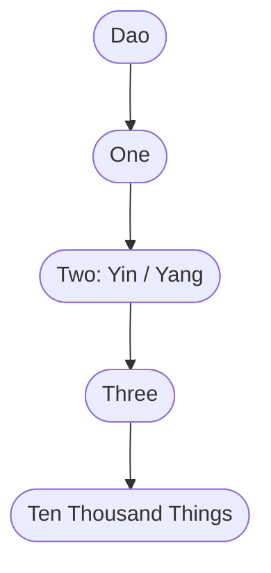

# The Dao and Creation

Chapter 42 of the [Daodejing](Daodejing.md) gives the most compressed statement of Daoist cosmogony: "Dao gives birth to One, One to Two, Two to Three, Three to the ten thousand things." The sequence runs from the utterly undifferentiated to the endlessly various. Later thinkers, especially the Song-dynasty philosopher Zhou Dunyi (1017-1073 CE), formalized the stages with names and a diagram, but the generative logic is already there in [Laozi](Laozi.md)'s text.

## The Sequence in Daodejing Chapter 42

The chapter does not describe creation in time. The Dao does not make things the way a craftsman makes a pot. What ch. 42 describes is ontological priority: each term in the sequence is less differentiated than the next and is what the next depends on.

**Dao** is the ground of everything and can be named only provisionally. Chapter 1 says the Dao that can be spoken is not the enduring Dao. It has no qualities that would make it a thing among other things.

**One** is the first wholeness that can be said to exist, the undivided plenum before any distinction appears. Some commentators read this as primordial [Qi](Qi.md), the undifferentiated stuff that will become everything.

**Two** is [Yin and Yang](YinYang.md), the first polarization. The undivided Qi separates into a lighter, ascending force (Yang) and a heavier, descending one (Yin). Chapter 42 continues: "The ten thousand things carry Yin on their backs and hold Yang in their arms." Every existing thing has both poles in some proportion.

**Three** has prompted more commentary than any other number in the sequence. The most common reading identifies it as Yin, Yang, and the harmonizing force between them, the middle term whose interaction produces actual things rather than pure abstractions. Other readings name it Heaven, Earth, and Humanity (the "three powers," san cai), or identify it as the productive mingling of Yin and Yang Qi that generates form. The key point is structural: Three is the threshold of real generativity. One and Two are logical prerequisites; Three is where actual things become possible.

**The ten thousand things** (wan wu) is the Chinese idiom for "everything that exists." The sequence does not end here in any final sense because the ten thousand things cycle back. Chapter 16 describes how all things return to their root, and the root is silence.

## Wuji and Taiji

These two terms are not in the Daodejing but became essential to later cosmological discussion, particularly after Zhou Dunyi wrote his Taijitu shuo (Explanation of the Diagram of the Supreme Ultimate) in the eleventh century.

**Wuji** - "without ultimate" or "limitless void" - names what precedes even the One. If Taiji is the first positive state of the cosmos, Wuji is the absence of any state at all. Zhou Dunyi's text opens: "Wuji and yet Taiji." The phrase is deliberately paradoxical. The limitless void does not transform into Taiji the way a caterpillar transforms into a butterfly; Taiji is the first moment at which anything can be said to be, and Wuji is what that moment has no background to emerge from.

**Taiji** - "Supreme Ultimate" - is the first differentiation within that void: the whole before it splits into Yin and Yang. The Taijitu (the circular diagram of interlocking dark and light) depicts Taiji as the total field from which [Yin and Yang](YinYang.md) rotate into definition. Zhou Dunyi's account then continues from Taiji through the [Five Phases](WuXing.md) to the ten thousand things, extending the ch. 42 sequence into a more elaborate cosmological system. His diagram became the standard visual reference for Neo-Confucian and Daoist thinkers alike.

## Qi as the Medium of Unfolding

The sequence is not purely abstract. [Qi](Qi.md) is the substance through which each stage generates the next. The One is undifferentiated Qi. When Qi separates by weight and movement, it becomes the Two. Lighter Qi rises and becomes Heaven (Yang); heavier Qi settles and becomes Earth (Yin). The interaction of Heaven and Earth produces the generative conditions for life, and from that generativity come the ten thousand things.

This means creation is continuous, not a one-time event. Qi is always condensing into forms and dispersing back. The [Zhuangzi](Zhuangzi.md) describes a sage contemplating this flux without anxiety: "When Qi condenses, there is life. When it disperses, there is death." The sequence in ch. 42 is a cross-section of a process that never stops.

## Cosmology or Metaphysics?

Scholars disagree about whether ch. 42 is meant literally or structurally. Roger Ames and David Hall argue that the Daodejing describes a field of immanent relations rather than a temporal origin story; the numbers name degrees of complexity, not moments in time. On this reading, the sequence is closer to a grammar of existence than a Genesis account.

Other scholars, including those emphasizing the religious Daoist tradition, read the sequence as genuinely cosmogonic. In the Celestial Masters and [Shangqing](ShangqingLingbao.md) traditions, the emanation of Qi from the Dao is the basis for liturgical cosmology: the Three Pure Ones ([San Qing](SanQing.md)) are the first three personified emanations of the Dao, corresponding to the three stages before multiplicity.

Both readings are consistent with the text. Chapter 42's numbers work equally well as a metaphysical hierarchy and as a cosmogonic sequence. The tradition used them both ways, often simultaneously. Zhou Dunyi's synthesis grafted the abstract structure onto a quasi-temporal unfolding that served Neo-Confucian ethics as much as Daoist cosmology.

The sequence ends at "ten thousand things," but chapter 25 of the Daodejing names four great things in the cosmos: the Dao, Heaven, Earth, and humanity. Humanity models itself on Earth, Earth on Heaven, Heaven on the Dao, and the Dao on its own nature (ziran). The cosmogonic sequence and the ethical sequence run in opposite directions through the same ontology.
