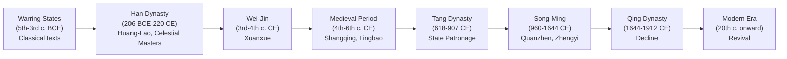

# A History of Daoism

Daoism spans more than two millennia, but it did not begin as a unified movement. Classical texts, organized religion, meditation lineages, and liturgical institutions each developed under different circumstances and then folded into one another over time. Understanding that history helps explain why Daoism can look so different from one context to the next.

## The Classical Period

The texts that anchor the whole tradition emerged during the Warring States period (475-221 BCE), a time of political fragmentation and fierce debate among competing schools of thought. [Laozi](Laozi.md), a figure of uncertain historicity, is traditionally credited with the [Daodejing](Daodejing.md), though most scholars now treat the text as a composite that took its received form over several generations. [Zhuangzi](Zhuangzi.md), who probably lived in the fourth century BCE, wrote at least the seven "inner chapters" that bear his name and is the more confidently historical figure of the two.

Neither Laozi nor Zhuangzi called themselves Daoists. The label _daojia_ ("Dao family" or "Dao school") was applied retrospectively by Han dynasty bibliographers. [Early Texts](EarlyTexts.md) like the [Liezi](Liezi.md) were also composed or compiled during this period, though the received _Liezi_ took its final form much later.

## Han Dynasty: Huang-Lao and the Celestial Masters

During the Han dynasty (206 BCE-220 CE), two distinct currents shaped Daoism's development. The first was [Huang-Lao](HuangLao.md), a synthesis named for the Yellow Emperor (Huangdi) and Laozi that adapted classical Daoist ideas into a framework for statecraft. Han rulers used it to justify minimal governance after the exhaustion of the Qin empire, and it drew heavily on [Yin-Yang](YinYang.md) cosmology and correlative thinking. The historian Sima Tan formally categorized _daojia_ around 110 BCE, giving the tradition its first explicit retrospective label.

The second development was institutional religion. In 142 CE, according to Celestial Masters tradition, the deified Laozi appeared to Zhang Daoling and established a covenant. Zhang's grandson Zhang Lu built an autonomous theocracy in Hanzhong organized around twenty-four administrative parishes, tracked births, deaths, and spiritual status through household registers, and governed without a conventional state apparatus. This movement became the [Celestial Masters](CelestialMasters.md), the first organized Daoist church, whose structures influenced every subsequent institutional form.

## Wei-Jin Xuanxue

When the Han collapsed, a generation of scholar-officials developed _xuanxue_ ("dark learning" or "mysterious learning"), a philosophical movement that read the classical Daoist texts alongside the _Yijing_. Wang Bi (226-249 CE) and Guo Xiang (d. 312 CE) wrote commentaries on the _Daodejing_ and _Zhuangzi_ respectively that defined how those texts were read for centuries. They were not religious Daoists in the institutional sense; their project was to reconcile classical Daoist ideas with Confucian governance under the slogan "sage within, king without." [Governance](Governance.md) questions remained central throughout this period.

## Medieval Revelations: Shangqing and Lingbao

In the fourth and fifth centuries, two new scriptural movements emerged in southern China and permanently reshaped the tradition. [Shangqing and Lingbao](ShangqingLingbao.md) both claimed direct revelation rather than transmission from earlier masters.

The Shangqing ("Highest Purity") corpus arrived through Yang Xi between 364 and 370 CE, reportedly dictated by celestial beings. It emphasized visualization of inner deities, [meditation](Meditation.md) practices, and individual cultivation over communal ritual. The Lingbao ("Numinous Treasure") scriptures, authored by Ge Chaofu around 397-402 CE, incorporated Buddhist concepts of universal salvation and centered on communal liturgy rather than private practice.

Lu Xiujing (406-477 CE) organized these competing corpora into a Three Caverns system that ranked Lingbao, Shangqing, and earlier Celestial Masters material into a hierarchy of scriptural authority. This classification scheme became the organizational principle of the [Daozang](Daozang.md), the Daoist canon.

## Tang Flourishing

The Tang dynasty (618-907 CE) brought Daoism closer to the state than at any other moment. The ruling Li clan claimed descent from Laozi's lineage, elevating the tradition to a quasi-official position. The imperially sponsored _Kaiyuan daozang_ compilation around 740 CE gathered Daoist scripture at scale. Shangqing lineages held particular favor at court. [Neidan](Neidan.md) (internal alchemy) developed substantially during this period, as practitioners reinterpreted earlier external alchemy texts as maps of inner cultivation rather than instructions for physical transmutation.

## Song-Ming Consolidation: Quanzhen and Zhengyi

Between the tenth and thirteenth centuries, new lineages emerged and the two forms of Daoism that persist to the present crystallized. Wang Zhe (1113-1170 CE) founded [Quanzhen](Quanzhen.md) ("Complete Perfection") in the 1160s, establishing a celibate monastic order that synthesized Daoist inner alchemy with Chan Buddhist meditation and Confucian ethics. His disciples spread the movement northward; the Longmen branch eventually became the dominant monastic lineage under Qing patronage.

The southern tradition consolidated around [Zhengyi](Zhengyi.md) ("Orthodox Unity"), a hereditary lineage descending from Zhang Daoling and the Celestial Masters. Zhengyi priests could marry, lived among laypeople, and performed communal ritual rather than pursuing individual monastic cultivation. The first complete printed _Daozang_ was assembled between 1408 and 1445 under Ming patronage, running to 5,305 volumes across 1,120 titles and drawing on the full range of Daoist scriptural traditions. The [Three Teachings](SanJiao.md) synthesis of this era treated Daoism, Buddhism, and Confucianism as complementary approaches to the same underlying reality.

## Qing Decline and the Modern Revival

The Manchu Qing dynasty (1644-1912) reduced the Celestial Masters' court authority and restricted formal institutional support. The Taiping Rebellion (1850-1864) destroyed temples at Dragon Tiger Mountain, the ancestral seat of the Celestial Masters lineage in Jiangxi. By 1926, only two copies of the complete _Daozang_ were known to exist. The Cultural Revolution (1966-1976) accelerated the damage, targeting masters, dissolving lineages, and destroying temples.

Recovery came from multiple directions. In Taiwan, the 63rd Celestial Master Zhang Enpu relocated with the Nationalist government in 1949, maintaining the Zhengyi line outside the mainland. Academic study of Daoism grew substantially in Europe, North America, and Japan from the mid-twentieth century onward. In the People's Republic, temples and monastic institutions have been rebuilt since the 1980s, and the Chinese Taoist Association has worked to reestablish training and ordination infrastructure. Daoist-adjacent practices including [Taijiquan](Taijiquan.md) and [Qigong](Qigong.md) spread globally through channels largely independent of the religious institutions, carrying elements of Daoist cosmology and body theory to audiences with no direct connection to the lineages.
