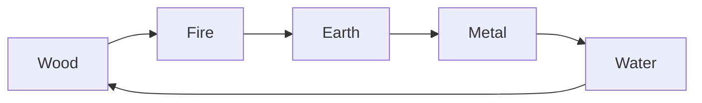
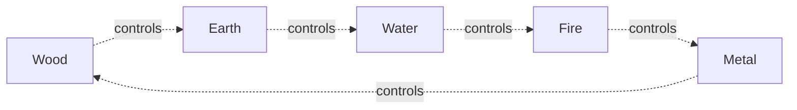

# Wu Xing

Wu Xing - Five Phases - is a framework of correlative cosmology that maps change across time into five categories: wood, fire, earth, metal, and water. Where [Yin and Yang](YinYang.md) describes polar rhythm, Wu Xing describes how five dynamic qualities succeed and regulate each other in any process. The framework was systematized by Zou Yan (c. 305-240 BCE) and shaped Daoist religious thought, internal alchemy, and cosmological speculation more than it shaped the earliest texts. The Daodejing and Zhuangzi rely primarily on [Qi](Qi.md) for their cosmological vocabulary; Wu Xing became central to the later correlative and religious traditions.

## The Five Phases

The Chinese word _xing_ means to walk or move, so "phases" or "agents" is more accurate than "elements." Each phase names a quality of process rather than a substance.

| Phase | Direction | Season      | Climate  | Color  |
| ----- | --------- | ----------- | -------- | ------ |
| Wood  | East      | Spring      | Wind     | Green  |
| Fire  | South     | Summer      | Heat     | Red    |
| Earth | Center    | Late Summer | Dampness | Yellow |
| Metal | West      | Autumn      | Dryness  | White  |
| Water | North     | Winter      | Cold     | Black  |

Correlative thinking extends the table further into sound, flavor, smell, and human affairs. The aim is coherence: any phenomenon in one column should harmonize with others in the same row. A practitioner reading climate, season, and direction together can anticipate which phase governs a given moment.

## The Generating Cycle (Sheng)

The sheng - generating - cycle describes a sequence of mutual production. Each phase nourishes the next: wood feeds fire, fire produces ash that enriches earth, earth yields metal ore, metal collects condensation to produce water, and water nourishes growing wood.

The cycle has no fixed beginning. Any phase can be read as parent or child depending on context. In [Neidan](Neidan.md) - internal alchemy - practitioners trace the sequence inward, identifying which phase governs each stage of refining essence into spirit.

## The Controlling Cycle (Ke)

The ke - controlling - cycle runs across the pentagon rather than around it. Each phase checks a phase two steps ahead: wood roots break up earth, earth absorbs water, water extinguishes fire, fire melts metal, and metal cuts wood.

Without the ke cycle, any phase that receives more than its share of generating support would dominate unchecked. The two cycles together form a self-regulating system: generation sustains, control limits. HuangLao Daoism, which applied this cosmological framework to statecraft, read the ke cycle as the structural basis for why no single power can remain dominant indefinitely. The [Han dynasty's](HuangLao.md) cosmologists argued each ruling house corresponded to a phase, and that history turned when a new phase overcame the old one.
