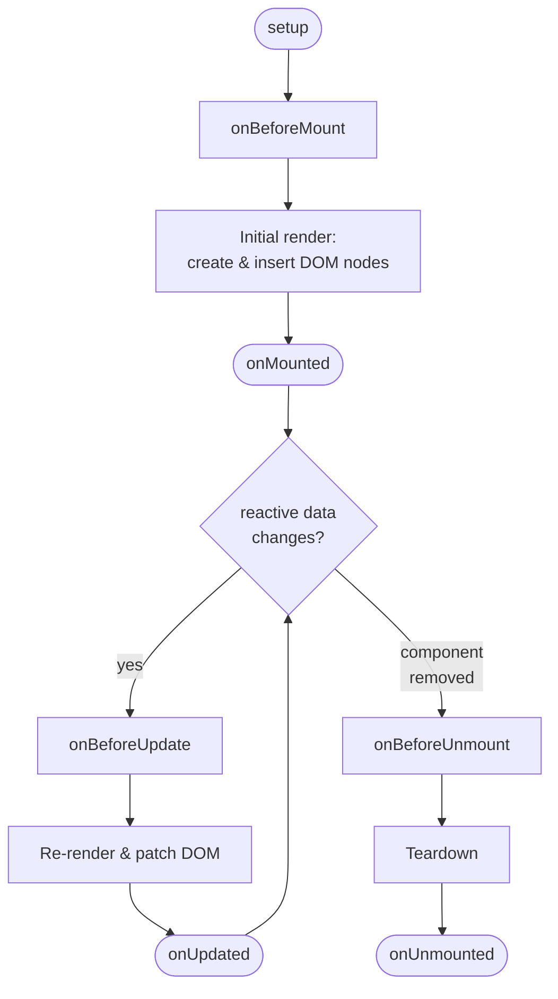

# Lifecycle Hooks

**Feature showcase: Mermaid diagram and `:::details` (collapsible section).**

Each Vue component instance goes through a series of initialization steps when it's created —
for example, it needs to set up data observation, compile the template, mount the instance to
the DOM, and update the DOM when data changes. Along the way, it runs functions called
**lifecycle hooks**, giving users the opportunity to add their own code at specific stages.

## The Lifecycle Diagram



## Registering Lifecycle Hooks

For example, the `onMounted` hook can be used to run code after the component has finished the
initial rendering and created the DOM nodes:

```vue
<script setup>
import { onMounted } from 'vue';

onMounted(() => {
  console.log(`the component is now mounted.`);
});
</script>
```

There are also other hooks which will be called at different stages of the instance's lifecycle,
with the most commonly used being `onMounted`, `onUpdated`, and `onUnmounted`.

All lifecycle hooks are called with their `this` context pointing to the current active instance
invoking it. Note this means you should avoid using arrow functions when declaring lifecycle hooks,
as you won't be able to access the component instance via `this` if you do so.

## `onMounted`

`onMounted` is called after the component has been mounted. A component is considered mounted after:

- All of its synchronous child components have been mounted (does not include async components or
  components inside `<Suspense>` trees).
- Its own DOM tree has been created and inserted into the parent container.

This hook is typically used for side effects that need access to the component's rendered DOM.

```vue
<script setup>
import { ref, onMounted } from 'vue';

const el = ref();

onMounted(() => {
  // access DOM directly after mount
  el.value.focus();
});
</script>

<template>
  <input ref="el" />
</template>
```

## `onUpdated`

`onUpdated` is called after the component has updated its DOM tree due to a reactive state change.

A parent component's updated hook is called after that of its child components.

```vue
<script setup>
import { ref, onUpdated } from 'vue';

const count = ref(0);

onUpdated(() => {
  // text content should be the same as current `count.value`
  console.log(document.getElementById('count').textContent);
});
</script>

<template>
  <button id="count" @click="count++">{{ count }}</button>
</template>
```

> [!WARNING]
> Do not mutate component state in the `onUpdated` hook — this will likely lead to an infinite
> update loop.

## `onUnmounted`

`onUnmounted` is called after the component has been unmounted. A component is considered
unmounted after:

- All of its child components have been unmounted.
- All of its associated reactive effects (render effect and computed / watchers created during
  `setup()`) have been stopped.

Use this hook to clean up manually created side effects such as timers, DOM event listeners,
or server connections.

```vue
<script setup>
import { onUnmounted } from 'vue';

const timer = setInterval(() => {
  /* ... */
}, 100);

onUnmounted(() => clearInterval(timer));
</script>
```

## `onBeforeMount` and `onBeforeUpdate`

These hooks are called just before the component mounts or updates respectively. They are less
frequently used but can be helpful for reading the current state of the DOM before Vue modifies it.

```js
import { onBeforeMount, onBeforeUpdate } from 'vue';

onBeforeMount(() => {
  console.log('component is about to mount');
});

onBeforeUpdate(() => {
  console.log('component is about to update');
});
```

:::details Options API equivalent lifecycle hook names

If you are coming from the Options API, the Composition API hook names differ slightly:

| Options API       | Composition API (`<script setup>`)  |
| ----------------- | ----------------------------------- |
| `beforeCreate`    | Not needed — use `setup()` directly |
| `created`         | Not needed — use `setup()` directly |
| `beforeMount`     | `onBeforeMount`                     |
| `mounted`         | `onMounted`                         |
| `beforeUpdate`    | `onBeforeUpdate`                    |
| `updated`         | `onUpdated`                         |
| `beforeUnmount`   | `onBeforeUnmount`                   |
| `unmounted`       | `onUnmounted`                       |
| `errorCaptured`   | `onErrorCaptured`                   |
| `renderTracked`   | `onRenderTracked` (dev only)        |
| `renderTriggered` | `onRenderTriggered` (dev only)      |
| `activated`       | `onActivated`                       |
| `deactivated`     | `onDeactivated`                     |
| `serverPrefetch`  | `onServerPrefetch`                  |

Note that `beforeCreate` and `created` have no Composition API equivalents because any code
that would run in those hooks can be placed directly in `setup()`.

:::

---

Related pages:

- [Component Basics](ComponentBasics.md) — component definition, props, and events
- [Computed Properties](ComputedProperties.md) — deriving state efficiently
