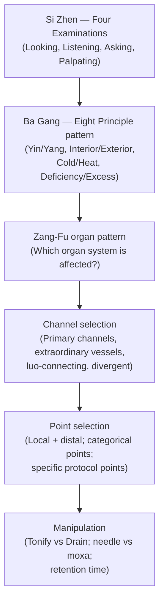

# Acupuncture & Moxibustion (針灸 - Zhēn Jiǔ)

## Overview

Acupuncture and moxibustion form the **first branch** of the [Five Branches of TCM Treatment](index.md#the-five-branches-of-tcm-treatment) and the modality most widely recognized outside China. Acupuncture inserts ultra-thin stainless-steel needles into acupoints along the [meridian network](Jingmai.md) to move [Qi](Qi.md) and [Blood](Xue.md); moxibustion burns compressed dried mugwort (_Ài Yè_, 艾葉) at those same points to add warmth and Yang. The compound character 針灸: 針 (_zhēn_) = needle, 灸 (_jiǔ_) = burn. The _Huangdi Neijing_ treats them as a single therapeutic system; most experienced clinicians still consider the two incomplete without each other.

The WHO estimates practice in over 180 countries. Among the five branches, acupuncture is the most thoroughly studied and the most contested. It translates most readily into a clinical trial framework.

## Acupuncture among the five branches of TCM

Acupuncture ranks first among the **[Five Branches of TCM Treatment](index.md#the-five-branches-of-tcm-treatment)**. The other four are **[Herbal Medicine](Herbs.md)**, **[Tui Na](TuiNa.md)**, **[Dietary Therapy](Dietary.md)**, and **[Qigong](Qigong.md)**.

## Historical origins and lineages

The earliest instruments were _biān_ stones (砭石), sharpened flint or jade used to lance abscesses and stimulate painful areas. Bronze needles appear by the Shang dynasty (c. 1600–1046 BCE). The foundational text is the _Huangdi Neijing_ (c. 300–100 BCE). Its _Sùwèn_ (Plain Questions) covers theory and the _Líng Shū_ (Spiritual Pivot, 靈樞) describes the nine classical needle types, twelve primary meridians, eight extraordinary vessels, the point categories, and needle manipulation technique. The _Zhēn Jiǔ Jiǎyǐ Jīng_ (282 CE) by Huangfu Mi synthesized earlier material and named 349 points; the Ming dynasty _Zhēn Jiǔ Dàchéng_ (1601 CE) by Yang Jizhou codified 365 points and became the primary transmission source.

Post-1949 standardization produced the **361 standard points** (WHO-approved 2006), the channel-abbreviation nomenclature (LU, LI, ST, SP, HT, SI, BL, KD, PC, SJ, GB, LR), and the textbooks defining "TCM-style" acupuncture globally.

Korea and Japan received the tradition through court exchanges by the 6th–7th centuries CE, diverging into distinct schools (see Major Schools). The French diplomat and physician **Georges Soulié de Morant** seeded European practice through early 20th-century texts. James Reston's **1971 _New York Times_ article** describing post-appendectomy pain management during Nixon's China visit generated more American public interest than decades of prior academic literature. This single journalistic account shaped Western engagement with acupuncture more than the accumulated academic work before it.

## How It Works - Points, Needles, and Technique

### Acupoint categories

- **Jing-well points** (_jǐng_, 井) - fingertips and toe tips; used for acute urgent conditions (loss of consciousness, high fever, seizure); pricked rather than retained.
- **Five-Shu transport points** (_wǔ-shū_, 五輸穴) - five points per channel from fingertip/toe tip to elbow/knee, mapping channel Qi from superficial to deep and corresponding to the Five Phases ([Wu Xing](WuXing.md)). Most classical combinations are built from five-shu pairings.
- **Yuan-source points** (_yuán_, 原穴) - one per Yin channel where Source Qi surfaces directly; diagnostic and tonifying. Historically used for pulse-based diagnosis.
- **Luo-connecting points** (_luò_, 絡穴) - connect coupled Yin-Yang pairs (e.g., Lung–Large Intestine); essential for excess-deficiency patterns split across paired organs.
- **Xi-cleft points** (_xì_, 郄穴) - where channel Qi accumulates; indicated for acute conditions and channel pain; strong immediate effect.
- **Back-shu points** (_bèi-shū_, 背俞穴) - twelve points on the Bladder channel's first lateral line, each corresponding to a [Zang-Fu](ZangFu.md) organ; used for chronic deficiency and organ-localization diagnosis. Tenderness at a shu point localizes the affected organ.
- **Front-mu points** (_mù_, 募穴) - twelve organ-specific points on the chest and abdomen; used for excess and acute conditions. Rule of thumb: back-shu for deficiency, front-mu for excess; frequently combined as "shu-mu pairs."
- **Eight influential points** (_bā huì_, 八會穴) - govern specific tissue categories: Qi, Blood, tendons, bones, marrow, Zang organs, Fu organs, vessels. LU 9 (Taiyuan) for vessels; LR 13 (Zhangmen) for Zang organs.
- **Eight extraordinary vessel confluent points** (_bā mài jiāo huì_, 八脈交會穴) - open the eight extraordinary meridians (Ren, Du, Chong, Dai, Yin/Yang Qiao, Yin/Yang Wei); combined in bilateral pairs for constitutional conditions the twelve primaries cannot fully address.

### De Qi and Needle Technique

The critical clinical event is **De Qi** (_dé qì_, 得氣 - "arrival of Qi"): heaviness, aching, distension, numbness, tingling, or channel-radiating sensation at the needled point. The practitioner feels De Qi as a "catching" under the needle, like a fish taking the hook. TCM considers it the prerequisite for therapeutic effect. fMRI studies show distinct limbic deactivation in subjects reporting De Qi versus those who do not, correlating with connective-tissue deformation and mechanoreceptor activation at the needling site.

Once De Qi arrives, manipulation determines whether the point is **tonified** (_bǔ_, 補) or **drained** (_xiè_, 瀉): tonifying uses insertion with channel flow, slow insertion / rapid withdrawal, small-amplitude rotation, longer retention, and hole closure after removal; draining reverses each parameter. **Lifting and thrusting** (_tí chā_, 提插) uses rhythmic vertical movement to amplify De Qi and direct it along the channel. **Twirling** (_niǎn zhuǎn_, 捻轉) uses rotational movement, large amplitude for draining and small for tonifying. An **even technique** is used where no clear excess or deficiency is present. Retention is typically 20–30 minutes. **Warming needle** (_wēn zhēn_, 溫針) attaches a moxa cone to the needle handle, bridging needling and moxibustion.

## Moxibustion

Moxibustion (_jiǔ fǎ_, 灸法) burns _ài_ (mugwort, _Artemisia argyi_ or _A. vulgaris_) processed into moxa wool (_àiróng_). Its bitter, acrid, warming properties penetrate the channels to expel Cold and Dampness and reinforce Yang Qi.

**Forms:**

- **Direct moxa** (_zhí jiǔ_) - cones burned on the skin. _Scarring moxa_: burned to completion, deliberately blistering; for severe chronic Cold conditions; now rare outside specialist contexts. _Non-scarring_: cone removed before skin contact.
- **Indirect moxa** (_jiàn jiǔ_) - insulating medium between moxa and skin. _Ginger moxa_ (_jiāng jiǔ_): fresh ginger slice; for Cold-type epigastric pain and vomiting. _Salt moxa_ (_yán jiǔ_): dried salt in the navel (CV 8); for Yang collapse and abdominal cold. _Garlic moxa_: for tuberculosis-pattern conditions.
- **Stick moxa** (_ài tiáo jiǔ_) - cigar-shaped roll held 1–3 cm above the point; circular, woodpecker, or sparrow-pecking motion. Most common in modern clinics.
- **Needle-head moxa** (_wēn zhēn_) - moxa on a retained needle handle; combines needling with local warming.
- **Moxa boxes** - wooden or metal boxes holding a moxa stick over a broad area; common for lumbosacral and abdominal warming.

**Contraindications:** Heat patterns, [Liu Yin](LiuYin.md) Wind-Heat invasion, full-Heat patterns, Yin-deficiency Empty Heat, and fever. Moxa aggravates all of these. Pregnancy-forbidden points (see Safety). Head and face points in sensitive patients (poor healing, scarring risk). Areas of skin breakdown, infection, or impaired sensation.

## Point Selection Logic

Point selection is a formal deductive process downstream of diagnosis:

**[Si Zhen](SiZhen.md)** generates the raw data; **[Ba Gang](BaGang.md)** organizes it into a pattern matrix; the pattern points to an organ system ([ZangFu.md](ZangFu.md)), which determines the channel, which determines the points.

A well-constructed prescription combines **local points** (in or near the symptom area), **distal points** (same channel, distant from the area, such as GB 41 on the foot for gallbladder-related temporal headache), **categorical points** (chosen for functional category; ST 36 Zusanli is the _hé_-sea point of the Stomach channel and a major Qi and Blood tonifier, added to almost any strengthening formula), and **constitutional points** (reflecting underlying Zang-Fu constitution). The principle "upper disease, treat below; lower disease, treat above; left disease, treat right" reflects classical channel polarity. LI 4 (Hegu) on the dorsum of the hand treats the face, head, and upper body from the hand.

## Major Schools

**TCM-style (Mainland standardized, post-1949).** The dominant global style. Emphasizes Eight Principle pattern diagnosis, the 361 standard points, and standardized point formulas reproducible enough for clinical trials. Sacrifices some classical complexity for teachability.

**Five-Element acupuncture (J.R. Worsley lineage).** Developed in the UK by J.R. Worsley (1923–2003). Prioritizes the causative factor (CF), which is the constitutional element (Fire, Earth, Metal, Water, or Wood via [WuXing.md](WuXing.md)) underlying all the patient's presentations. Treatment uses five-shu points almost exclusively; fewer needles per treatment, often unilateral, with strong practitioner-patient focus.

**Japanese meridian therapy (_Keïrakuchi Ryôhô_).** Originated pre-war by Sorei Yanagiya. Very fine, shallow needling (0.12–0.16 mm vs. 0.2–0.25 mm TCM-style); often no De Qi sought. Twelve-position Nanjing-style pulse reading; root treatment (constitutional deficiency first) followed by branch treatment (symptomatic points).

**Korean Saam acupuncture.** Developed by the 17th-century Korean monk Saam. Uses only five-shu transport points organized around Five-Phase generation and control cycle relationships ([WuXing.md](WuXing.md#the-generation-and-control-cycles)). Each channel is treated by tonifying two and sedating two points in a fixed pattern of four points per organ.

**Master Tung's extraordinary points.** Developed by Tung Ching-Chang (1916–1975), a Taiwanese acupuncturist from a private family tradition. Extra-canonical points concentrated on the hands, feet, and lateral limbs; few needles (often 2–4), immediate strong effect; "holographic" zone imaging logic. Richard Tan's Balance Method is a related Western synthesis.

**French auriculotherapy / Nogier points.** Paul Nogier proposed in the 1950s that the ear maps the entire body in an inverted fetal position. Auricular acupuncture is adopted in military medicine (Battlefield Acupuncture) and addiction recovery (NADA protocol). The ear-homunculus evidential basis is weak, but auricular points activate distinct pathways via the auricular branch of the vagus nerve (cranial nerve X).

**Battlefield Acupuncture (BFA).** Developed by Col. Richard Niemtzow, USAF. Five specific semi-permanent auricular points (cingulate gyrus, thalamus, omega 2, point zero, shenmen) bilaterally, using small gold ASP needles retained for days. Adopted across multiple US military branches after studies showed reduced opioid use in acute post-op and trauma pain. The clearest example of acupuncture penetrating mainstream Western institutional medicine.

## Specialized Protocols

**NADA five-point ear protocol.** Originated by H.L. Wen for heroin withdrawal; systematized by Michael Smith with the National Acupuncture Detoxification Association (NADA) in the 1970s at Lincoln Hospital, Bronx. Five auricular points bilaterally (Shenmen, Sympathetic, Kidney, Liver, Lung), retained 30–45 minutes in a group setting without individual diagnosis. Supported for substance use disorder, PTSD symptom reduction, and anxiety. Its scalability (group delivery, no diagnosis required) is distinctive.

**Scalp acupuncture.** Multiple systems (Zhu's, Yamamoto's YNSA, Chinese Standard Scalp Lines). The dominant Chinese system needles zones corresponding to motor and sensory cortex regions from neuroanatomy rather than meridian theory. Strongest evidence is for post-stroke motor rehabilitation: motor area zone needled with active exercise of the affected limb during retention.

**Electroacupuncture (EA).** Electrical stimulus delivered through retained needle handles. Low frequency (2–4 Hz) preferentially releases enkephalins and beta-endorphins; high frequency (80–100 Hz) releases dynorphins. This frequency-dependent opioid mechanism is confirmed in animal models. The most thoroughly studied stimulation form; used in pain management, chemotherapy-induced nausea (PC 6), and post-stroke rehabilitation.

**Wrist-ankle acupuncture (WAA).** Developed by Zhang Xinshu at Shanghai Second Military Medical University. Six points around each wrist and six around each ankle, inserted subcutaneously at a shallow angle with no De Qi and no manipulation. Point selection based purely on which horizontal body zone is affected. No classical theoretical basis; positive evidence for pain conditions.

**Bo's abdominal acupuncture (_fù zhēn_, 腹針).** Developed by Bo Zhiyun in the 1990s. Treats abdomen points (particularly around the navel) as a complete micro-system based on prenatal development logic. Very fine needles, shallow depth. Early but growing evidence, particularly for neck and shoulder pain.

## Scientific Research

### Well-Supported Outcomes

The Acupuncture Trialists' Collaboration individual patient data meta-analysis (2018, >17,000 patients, >20 trials) found acupuncture significantly superior to sham and no-treatment for **chronic low back pain**, neck pain, shoulder pain, and **chronic headache/migraine prevention**. Effect sizes are roughly equivalent to NSAIDs and durable at 12-month follow-up.

**CINV:** PC 6 (Neiguan) stimulation, the _luo_-connecting point of the Pericardium channel and most-studied single point in the literature, has been studied in over 40 randomized trials; the 2006 Cochrane review concluded acupuncture reduces acute vomiting and nausea.

**Headache prevention:** the 2022 Cochrane update found acupuncture at least as effective as prophylactic drugs for episodic migraine and tension-type headache, with a better adverse-event profile. This represents the clearest cost-effectiveness case for acupuncture in Western healthcare.

**Knee osteoarthritis:** the 2018 Trialists' Collaboration finds effects above sham; functional benefit persists longer than expected from placebo.

### The Sham-Needle Problem

Sham controls (Streitberger retractable needles, non-acupoint shallow needling, non-specific-site penetrating needles) frequently outperform inert controls, sometimes nearly matching "real" acupuncture. Two interpretations follow. The skeptical view holds that acupuncture is a sophisticated placebo, where context is the active ingredient. The physiological view posits that needling anywhere activates overlapping mechanisms (gate control, connective-tissue signaling, endorphin release); acupoint vs. non-acupoint is continuous, not binary; sham is active low-dose, not inert. Both interpretations are consistent with current data. The critical point is that sham-controlled trials still find acupuncture superior to no treatment across the best-supported indications.

### Mechanism Candidates

- **Endogenous opioid release** - extensively documented for electroacupuncture; frequency-dependent (2 Hz releases met-enkephalin and beta-endorphin; 100 Hz releases dynorphin).
- **Gate-control analgesia** - A-delta and C-fiber stimulation at the needle site modulates dorsal horn gating. Likely accounts for local-point analgesic effects.
- **Connective-tissue / fascia-plane signaling** - Helene Langevin's group showed needle rotation winds collagen fibers, deforming fibroblasts along fascial planes that approximate classical channel pathways. A plausible transduction mechanism for De Qi.
- **Autonomic modulation** - acupuncture at ST 36 and PC 6 consistently shifts toward parasympathetic dominance; HRV studies confirm this.
- **Neuroimmune signaling** - needling releases adenosine locally and upregulates anti-inflammatory cytokines.

### Poorly Supported Claims

**Fertility enhancement:** randomized trials of acupuncture as IVF adjunct show inconsistent results with no clear benefit in best-designed studies. **Weight loss** protocols have not demonstrated meaningful controlled-trial results. **Qi emission** (external qigong via acupoints) and **non-contact acupuncture** lack controlled evidence. **Auricular point detection** by electrical resistance has not replicated reliably.

## Safety and Contraindications

Acupuncture has an excellent safety record with trained clinicians and single-use sterile disposable needles. German prospective safety studies (GERAC and ART trials, >250,000 patient sessions) report serious adverse events at roughly 1 per 10,000–100,000 insertions; the GERAC data found 0.013 serious events per 1,000 patients across 2+ million sessions. Minor adverse events (bruising, needle pain, fainting) occur in 3–10% of treatments.

**Serious Adverse Events** (rare but documented)

- _Pneumothorax_ - Puncture of the lung through thoracic points (LU 1, LU 2, BL 13 too deep, GB 21 angled incorrectly). This is the most serious preventable adverse event, avoided by correct depth limits and angling.
- _Infection_ - Eliminated by single-use disposable needle protocol. Shared needle reuse historically transmitted hepatitis B and C.
- _Broken needles_ - Prevented by quality single-use needles and never forcing against resistance. Do not forcibly remove a stuck needle; relax surrounding tissue first.
- _Cardiac tamponade_ - Extremely rare. CV 17 or nearby precordial points needled too deeply in patients with pericardial effusion or post cardiac surgery risk this complication.

**Pregnancy-Forbidden Points** - Absolutely contraindicated throughout pregnancy:

- **LI 4 (Hegu)** - strongest Qi-moving point; strong descending action; historically used to initiate labor.
- **SP 6 (Sanyinjiao)** - meeting of three Yin channels; strong Blood-moving action; used for labor induction.
- **GB 21 (Jianjing)** - descending action; also contraindicated for deep perpendicular needling (pneumothorax proximity).
- **BL 60 (Kunlun)** - moves Qi downward; traditionally used to facilitate delivery.
- **BL 67 (Zhiyin)** - _jing_-well point; classically used to turn breech via moxibustion (one of moxa's stronger evidence areas); contraindicated unless turning is the intent.
- **Lower abdominal and lumbosacral points** - broadly restricted in first trimester; restricted by clinical judgment later.

**Anticoagulants and bleeding disorders:** warfarin, heparin, direct oral anticoagulants, and known bleeding disorders require modified technique. Avoid points over major vessels, minimize needle count, and monitor for prolonged bleeding. This is not an absolute contraindication but requires clinical judgment.

**Implanted devices:** electroacupuncture is contraindicated with pacemakers or implanted defibrillators. Manual acupuncture without electrical stimulation is generally considered safe.

By comparison, NSAIDs carry 1–2% annual GI bleed risk and opioids carry addiction, overdose, and constipation burden. Acupuncture's risk profile is favorable for appropriate indications.
