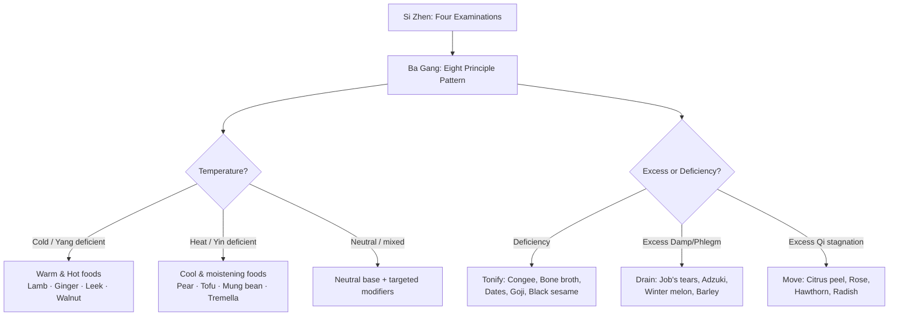

# Dietary Therapy (食療 — Shí Liáo)

## Overview

**Dietary therapy** (_Shí Liáo_, 食療) is the **fourth branch** of the Five Branches of TCM Treatment — food prescribed by constitution and pattern. In TCM the line between food and medicine is deliberately blurred: ginger (_shēng jiāng_), jujube (_dà zǎo_), goji (_gǒu qǐ_), cinnamon bark (_ròu guì_), and walnut (_hé táo rén_) all appear in both kitchen and pharmacy, classified along exactly the same axes. Every food has a temperature nature, a flavor, a channel affinity, and a functional action. Every meal is, in microcosm, a prescription.

What distinguishes dietary therapy from the other branches is frequency and agency. Acupuncture, herbal medicine, and Tui Na are applied by a practitioner, occasionally. Dietary therapy is applied by the patient, three times a day, for life. A cold, raw, dairy-heavy diet erodes Spleen Qi more reliably than any single pathogen; thirty years of warming congee and cooked vegetables rebuilds it just as steadily.

## Dietary therapy as a pillar of TCM

Dietary therapy stands among the **[Five Branches of TCM Treatment](index.md#the-five-branches-of-tcm-treatment)** alongside:

1. **[Acupuncture & Moxibustion](Acupuncture.md)** — needles and warmth at acupoints along the [meridian network](Jingmai.md).
2. **[Herbal Medicine](Herbs.md)** — formulas built from substances classified by temperature, flavor, and channel.
3. **[Tui Na](TuiNa.md)** — therapeutic massage along the meridian pathways.
4. **Dietary Therapy** — _this page_.
5. **[Qigong](Qigong.md)** — self-cultivated breath, posture, and movement practice.

Sun Simiao's _Qian Jin Yao Fang_ (千金要方, Tang dynasty, c. 652 CE) placed dietary prescription above pharmaceutical: _"A good doctor first treats with diet; only when diet fails does he reach for medicine."_ The doctrine _Yi Shi Tong Yuan_ (醫食同源) — "food and medicine share the same source" — is the philosophical foundation.

## Historical origins

The _Huangdi Neijing_ (c. 200 BCE) establishes the Five Flavors and organ correspondences with clinical precision: "Too much salt damages the Blood and the Heart; too much Bitter drains the Qi of the Spleen." Sun Simiao's _Qian Jin Yao Fang_ crystallized _Yi Shi Tong Yuan_ into a practical framework, listing foods by temperature, flavor, and action in the same format applied to medicinal herbs, and identifying postpartum and pediatric nutrition as specialized areas.

Hu Sihui's _Yin Shan Zheng Yao_ (飲膳正要, Yuan dynasty, 1330 CE) — the imperial nutrition manual commissioned for the Mongol court — is the first text to document seasonal eating protocols extensively and to connect ingredient quality (provenance, freshness, preparation) to therapeutic efficacy. Li Shizhen's _Ben Cao Gang Mu_ (本草綱目, Ming dynasty, 1578 CE) classifies hundreds of ordinary kitchen foods — grains, vegetables, fruits, meats, fish — each profiled with temperature, flavor, channel affinity, and clinical application; its food sections are the most consulted dietary therapy reference in modern TCM education.

## The temperature axis

The most clinically significant classification is **thermal nature** (_qì_, 氣), which has five bands — entirely independent of serving temperature: watermelon is Cold whether eaten warm or chilled; lamb is Warm whether served in cold broth or hot stew.

| Nature  | Pinyin | Clinical character                                                                         | Representative foods                                                                          |
| ------- | ------ | ------------------------------------------------------------------------------------------ | --------------------------------------------------------------------------------------------- |
| Hot     | Rè     | Strongly warming, disperses Cold, moves Qi and Blood; excess generates Heat and Dryness    | Chili pepper, black pepper, dried ginger, cinnamon bark, lamb (some classifications), alcohol |
| Warm    | Wēn    | Gently warming, tonifies Yang, invigorates circulation                                     | Fresh ginger, chicken, oats, walnuts, leek, garlic, lamb, lychee, longan, dates               |
| Neutral | Píng   | Balanced; suitable for all constitutions; predominates in staple grains                    | Rice, corn, beef, eggs, carrot, potato, cabbage, peanut, plum                                 |
| Cool    | Liáng  | Gently cooling, clears mild Heat, slightly drains                                          | Cucumber, spinach, tofu, pear, apple, celery, duck, yogurt                                    |
| Cold    | Hán    | Strongly cooling, clears Heat and Fire; generates Damp if overused; damages Yang if excess | Watermelon, crab, mung bean, banana, seaweed, clam, salt, bitter melon                        |

Warm and Cool are the working categories for most healthy people. Hot and Cold are used therapeutically and with caution — sustained Hot food intake produces interior Heat; sustained Cold intake damages Spleen and Stomach Yang and generates Damp accumulation (see [JinYe.md](JinYe.md)). Neutral foods form the backbone of any constitutional diet; the therapeutic pivot is adding Warm or Cool foods at the margins.

## The Five Flavors and Wu Xing phase mapping

The **Five Flavors** (_Wǔ Wèi_, 五味) map directly onto [Wu Xing](WuXing.md) phase correspondences. Each flavor has a physiological action, an organ pair it primarily enters and supports, and an organ pair it damages in excess.

| Flavor  | Pinyin | Phase | Organ pair              | Physiological action                             | Excess consequence                                        |
| ------- | ------ | ----- | ----------------------- | ------------------------------------------------ | --------------------------------------------------------- |
| Sour    | Suān   | Wood  | Liver / Gallbladder     | Astringes, gathers, prevents leakage             | Over-stresses Liver; damages Spleen (Wood overacts Earth) |
| Bitter  | Kǔ     | Fire  | Heart / Small Intestine | Drains downward, dries Damp, clears Heat         | Over-stimulates Heart; dries fluids; damages Qi           |
| Sweet   | Gān    | Earth | Spleen / Stomach        | Tonifies, harmonizes, moistens, slows            | Generates Damp and Phlegm; feeds Damp-Heat                |
| Pungent | Xīn    | Metal | Lung / Large Intestine  | Disperses outward and upward, moves Qi and Blood | Scatters Qi; depletes Body Fluids                         |
| Salty   | Xián   | Water | Kidney / Bladder        | Softens hardness, descends, draws inward         | Damages Kidney; thickens Blood; burdens Heart             |

A sixth flavor — **Bland** (_Dàn_) — lacks a phase assignment but drains Damp via the urinary route: winter melon (_dōng guā_), Job's tears (_yì yǐ rén_), Fu Ling (_poria_), and adzuki bean (_chì xiǎo dòu_). The classic excess warnings are clinically useful: too much salt (processed foods) damages Kidney and loads the cardiovascular system; too much Sweet (the modern default) generates Damp and Phlegm; too much Pungent (excess chili, alcohol) scatters Qi and depletes Yin. These align imperfectly but usefully with biomedical observations about sodium, refined carbohydrates, and alcohol.

## Channel affinity and energetic action

Beyond temperature and flavor, each food is profiled by **channel affinity** (_guī jīng_, 歸經) — which [organ system](ZangFu.md) it primarily enters — and by its **functional action**:

- **Tonify [Qi](Qi.md):** Rice congee (_zhōu_), oats, potato, chicken, beef, Chinese yam (_shān yào_), lotus seed, dates. Warm, Sweet, easily digestible; support Spleen and Stomach as the engine of Qi production.
- **Tonify [Blood](Xue.md):** Red dates (_dà zǎo_), goji berry (_gǒu qǐ_), black sesame (_hēi zhī ma_), liver (all animal livers), beetroot, longan (_lóng yǎn ròu_), mulberry. Cornerstone of postpartum and menstrual support.
- **Tonify Yin:** Pear (_lí_), tofu, lily bulb (_bǎi hé_), black sesame, tremella mushroom (_bái mù ěr_), duck, pig's kidney, honey, sesame oil, lotus root. Moistening and slightly Cool to Cool in nature.
- **Tonify Yang:** Lamb (_yáng ròu_), walnut (_hé táo rén_), black bean, garlic, leek, cinnamon, dried ginger, deer antler velvet. Warm to Hot; support Kidney Yang — the root fire of the entire system.
- **Move Qi stagnation:** Citrus peel (_chén pí_), rose petals, hawthorn (_shān zhā_), turnip, radish, small amounts of vinegar, fennel. Dispersing and aromatic; gently move Liver and Spleen.
- **Invigorate Blood:** Turmeric, hawthorn (_shān zhā_), vinegar, rose petals, crab (with caution — Cold natured), black fungus (_mù ěr_). Overlap with Qi-moving foods is significant because Qi is the commander of Blood.
- **Transform Damp / resolve Phlegm:** Job's tears (_yì yǐ rén_), adzuki bean, winter melon, barley (_dà mài_), Fu Ling (_poria_), tangerine peel, turnip, radish, seaweed (with care — Cold). Dietary counterpart to Damp-resolving herbal formulas.
- **Clear Heat:** Mung bean (_lǜ dòu_), cucumber, watermelon (especially the white rind — _xī guā cuì yī_), bitter melon, chrysanthemum flower, peppermint, lotus leaf.
- **Warm the interior / dispel Cold:** Fresh ginger, dried ginger, cinnamon, black pepper, leek, lamb, walnuts, galangal. Most useful in Cold-type Spleen and Stomach patterns.
- **Calm [Shen](Shen.md):** Lotus seed, lily bulb, longan, jujube, mulberry, wheat (_fú xiāo mài_ — floating wheat, specifically for night sweats and Heart deficiency). Overlap with Blood-tonifying foods is substantial because Shen is housed in the Blood.

## Cooking method as a modulator

The same ingredient occupies different positions on the temperature axis depending on preparation. Cooking method is part of the prescription.

- **Raw** is the coldest and most dispersing preparation. Appropriate for robust constitutions with Heat signs in summer; actively harmful for Spleen Qi deficient patients, Damp patterns, or anyone recovering from illness.
- **Steaming** preserves the food's inherent nature with minimal modification.
- **Boiling and simmering** shift thermal character slightly toward Neutral. Long-simmered congee breaks down cell walls and pre-digests starch, sharply reducing the Spleen's workload — which is why congee is the canonical food for illness recovery and Spleen deficiency.
- **Stir-frying** with ginger, garlic, or rice wine (_huáng jiǔ_) adds Warmth. A Cool vegetable (spinach, bok choy) stir-fried with ginger and garlic becomes appropriate for a Cool-natured patient.
- **Deep-frying** makes any ingredient more Heating and more Damp-producing — a double liability for chronic pattern management.
- **Fermenting** — vinegar (_cù_), fermented bean curd (_dòufu rǔ_), kimchi-style vegetables — has Sour, Warm character that warms the Spleen and supports digestion. The Sour astringent action is why fermented condiments are used in small quantities.
- **Long bone broth** is Yin- and Marrow-tonifying. Long simmering (12–24 hours) extracts the deepest nutritive essence — a kitchen analog to Kidney-tonifying herbs that replenish [Jing](Jing.md) and Marrow.

## Constitutional eating and the diagnostic flow

Pattern identification via [Ba Gang](BaGang.md) (Eight Principles) and [Si Zhen](SiZhen.md) (Four Examinations) drives the prescription. The meal plan is the downstream output.

**Spleen Qi deficiency** — the pattern most directly created and corrected by diet. Signs: fatigue after eating, bloating, loose stool, poor appetite, heavy limbs, pale complexion. _Eat:_ warm cooked food; congee with Chinese yam and lotus seed; chicken, beef, dates, oats. _Avoid:_ raw salads, iced drinks, dairy, sugar, excess fruit, cold leftovers. See [Spleen.md](Spleen.md).

**Yin deficiency** — afternoon Heat, night sweats, dry mouth and throat, thin body, flushed cheeks, restless sleep. _Eat:_ pear congee, lily bulb soup, black sesame paste, tofu, duck, tremella mushroom jelly, honey water. _Avoid:_ pungent/spicy foods, coffee, alcohol, excess lamb or ginger.

**Yang deficiency** — cold limbs, low libido, pale complexion, abundant clear urine, lower back cold and aching, fatigue worse in cold weather. _Eat:_ lamb stew with ginger and astragalus, walnut congee, garlic, leek, dried ginger tea. _Avoid:_ cold raw foods, iced drinks, excess bitter foods, watermelon.

**Damp accumulation** — heaviness, foggy thinking, sticky tongue coat, loose stool, weight gain, bloating. _Eat:_ Job's tears porridge, adzuki bean soup, winter melon, barley water. _Avoid:_ dairy, sugar, greasy/fried foods, alcohol, excess sweet fruit. Even Warm-natured Sweet foods (dates, longan) are restricted until Damp clears.

**Liver Qi stagnation** — distending flank pain, mood dysregulation, premenstrual tension, sighing, tight neck and shoulders. _Eat:_ rose petal tea, citrus peel, small amounts of vinegar, lightly pungent and sour foods in rotation. _Avoid:_ excess greasy, rich, or alcohol. See [Liver.md](Liver.md).

**Heat patterns** (Stomach Heat, Liver Fire, Yin deficiency Heat) — thirst, red face, yellow tongue coat, irritability, dark urine, constipation. _Eat:_ mung bean soup, cucumber, watermelon (not iced — thermally Cold but served at room temperature), bitter melon, chrysanthemum tea. _Avoid:_ spicy, fried, alcohol, lamb, coffee.

## Seasonal eating and circadian alignment

TCM dietary therapy prescribes a seasonally modulated diet anchored in [Wu Xing](WuXing.md) correspondences.

- **Spring (Wood / Liver):** Emphasize pungent and sour foods; sprouts, young greens, lightly cooked vegetables. Rose petal tea and lightly vinegared salads support Liver Qi circulation. Reduce heavy, rich, and salty foods.
- **Summer (Fire / Heart):** Slight cooling — mung bean soup, cucumber, watermelon rind, bitter melon — but not iced. Bitter foods support the [Heart](Heart.md). Avoid excess cold drinks and raw fruit, which damage Spleen Yang and generate post-summer Damp.
- **Late Summer (Earth / Spleen):** TCM's fifth season; Damp peaks and [Spleen](Spleen.md) is most vulnerable. Sweet and yellow foods dominate: millet, squash, pumpkin, yam, corn. Strictest season for Damp-prone constitutions.
- **Autumn (Metal / Lung):** Dryness arrives; [Lung](Lung.md) is vulnerable. Moistening prescription: pear, lotus root, tofu, white rice, lily bulb, honey, sesame oil, tremella mushroom, pear congee. Reduce pungent-dispersing foods.
- **Winter (Water / Kidney):** Maximum Yin; storing season. Black foods (black bean, black sesame, black fungus — Kidney-aligned by color), bone broth, walnut, lamb stew with goji and ginger. Winter is the season for rebuilding [Jing](Jing.md) — the reserve governing aging, fertility, and constitutional resilience.

**Circadian alignment:** The Stomach organ clock runs 7–9 AM, Spleen 9–11 AM — peak digestive capacity. Classical guidance: eat the largest, most nutritive meal in the morning or at midday at latest. Light, early dinners and a gap before sleep are the most consistently emphasized behavioral recommendations across the classical dietary texts, and align with modern chrono-nutrition research.

## Canonical therapeutic applications

**Medicinal congees (_yào zhōu_, 藥粥).** Congee (_zhōu_) — long-simmered rice — is the universal Spleen-supporting base; additional ingredients shift the indication:

- **Ginger congee** (_shēng jiāng zhōu_): warms Stomach, dispels Cold, alleviates nausea. Canonical for cold-type nausea, morning sickness, and post-viral stomach weakness.
- **Lotus seed and lily bulb congee:** calms the Heart, nourishes Yin, settles the Shen. Used for insomnia, anxiety, palpitations, and Heart-Kidney disharmony.
- **Red bean and Job's tears congee:** resolves Damp, supports Spleen, clears mild Heat-Damp. One of the most prescribed interventions for Damp-type fatigue, bloating, and edema.
- **Chinese yam and jujube congee:** tonifies Spleen Qi and nourishes Blood. Appropriate for post-illness recovery and pediatric poor appetite.
- **Walnut and black sesame congee:** tonifies Kidney Jing, supplements Yang, nourishes Marrow. Used in aging, hair loss, poor memory, lower back weakness.

**Postpartum — _Zuò Yuè Zi_ (坐月子).** "Sitting the month" is a 30-day dietary and behavioral confinement tradition practiced across East and Southeast Asia. Childbirth is a massive expenditure of [Qi](Qi.md), [Blood](Xue.md), and [Jing](Jing.md); the month postpartum is the window to rebuild before the constitutional baseline resets. The protocol is warming, Blood-tonifying, and Spleen-supporting: sesame oil chicken (_má yóu jī_) cooked in old ginger and rice wine is the canonical dish — rice wine moves Blood stasis (retained lochia), ginger warms the Stomach and dispels postpartum Cold, sesame oil moistens. Bone broth daily; organ meats (liver, kidney) address Blood deficiency directly. Cold, raw, and iced foods are prohibited. Modern TCM practitioners and obstetricians debate the tradition: the dietary components (warm, nutritious, Blood-tonifying; adequate protein and iron) align reasonably with biomedical postpartum nutritional guidance; the behavioral restrictions (no cold-water bathing, no leaving the house) have no biomedical support and can cause hypovitamin D and social isolation. The medicalization of _Zuò Yuè Zi_ into commercial confinement centres in Singapore, Taiwan, and Malaysia retains the dietary framework while modernizing the logistics.

**Pediatric dietary therapy.** Children's Spleen and Stomach are physiologically immature — not yet fully consolidated, easily overwhelmed. Food stagnation (_shí jī_, 食積) is the most common pediatric pattern: accumulated undigested food generates Heat and disturbs the Shen (fussiness, poor sleep, fever). Hawthorn berry (_shān zhā_) — Sour, slightly Warm, enters Spleen and Stomach — is the canonical food-medicine, sold as candied hawthorn rolls (_táng hú lú_) throughout China. For teething Heat, cooling foods apply. Pediatric principle: smaller, simpler, warmer meals; no excess sweets; no cold foods during illness. Recovery food: congee with Chinese yam (_shān yào_).

**Fertility support.** Kidney Yang and Jing-tonifying foods are used for both partners — the Kidney governs reproduction (see [Kidney.md](Kidney.md)), and Jing determines reproductive capacity. Bone broth, walnut, black sesame, lamb stew with goji and _dāng guī_ (angelica root, kitchen-medicine border zone), black bean, and oyster. For women, Blood-tonifying foods (dates, goji, longan, liver) address the cyclical Blood expenditure of menstruation.

**Convalescence.** Support the Spleen and Stomach first; everything else follows. After acute illness, digestive capacity must be rebuilt before Qi and Blood can be replenished. Prescription: small frequent meals; congee for the first days; graduated to soft, warm, easily digestible foods. Large meals during early convalescence are explicitly warned against in classical texts — they overwhelm a weakened Spleen.

## Modern integration and friction

TCM dietary therapy converges with biomedical guidance at several practical points. The Spleen Qi deficiency prescription — warm, cooked food, no iced drinks, no large raw vegetable loads — maps closely onto dietary advice for functional GI disorders like IBS-D and SIBO. Bone broth's Marrow/Jing framing parallels biomedical interest in collagen hydrolysates and mineral-dense stocks for gut lining and connective tissue. The Damp-Phlegm framing — excess Sweet and greasy foods accumulating as weight, brain fog, and sluggishness — functions as a useful clinical proxy for insulin resistance and metabolic syndrome: same foods, same trajectory, different mechanistic language. Circadian alignment (large warm breakfast, light early dinner) predates time-restricted feeding research by millennia and is increasingly validated by it.

Where the systems do not map: the temperature axis has no direct biomedical analog. Biomedical nutrition classifies foods by macronutrient profile, glycemic index, micronutrient content, and fiber — none align neatly with Hot/Warm/Neutral/Cool/Cold. A food can be metabolically beneficial while constitutionally inappropriate (lamb is nutrient-dense; it is also Hot and inappropriate for Fire constitutions or summer). Protein and fat do not equal Yang; carbohydrates do not equal Yin. These equivalences produce category errors in both directions.

The evidence base for TCM dietary therapy specifically — distinct from research on Asian or Mediterranean dietary patterns — is thin by controlled-trial standards. Existing studies suffer from high heterogeneity, short durations, and small samples. The honest position: TCM dietary therapy is a coherent internal system with plausible mechanisms and millennia of empirical refinement, but it has not been validated at the level of modern evidence-based medicine. It should be practiced alongside — not instead of — evidence-based nutritional management for serious metabolic or GI conditions.

## Contraindications and common pitfalls

**Overcorrection.** A patient correctly identifies Yang deficiency and eats exclusively warming foods for months; the result is interior Heat accumulation — the original Cold pattern replaced by its opposite. Dietary therapy requires recalibration as the pattern shifts.

**Confusing food sensitivities with TCM patterns.** A peanut allergy is immune-mediated, not a Spleen Qi deficiency pattern. Lactose intolerance may or may not coincide with a Damp pattern — they are independent findings that sometimes overlap. Allergy testing and TCM pattern prescription require separate assessment frameworks.

**The "everything is medicinal" trap.** When every meal becomes a therapeutic calculation, eating loses its social, hedonic, and cultural functions — all of which the classical literature considers necessary for Liver Qi circulation and Shen stability. The classical practitioner prescribed adjustments at the margins of an otherwise normal diet.

**Over-reliance on dietary therapy alone in active pathology.** Dietary therapy works best as an adjunct and worst as a monotherapy for established disease. A patient with active Damp-Heat jaundice, unrecovering Blood deficiency, or significant Yin deficiency with night sweats needs [acupuncture](Acupuncture.md) or [herbal medicine](Herbs.md) — or both — alongside dietary support. Dietary therapy alone is too slow and too gentle to resolve established pathology.

**Cultural appropriation and decontextualization.** The _Zuò Yuè Zi_ tradition has been adapted into Western wellness "postpartum cleanses" and "warming cleanses" that strip the constitutional assessment and apply warming foods universally — including to constitutions where they are contraindicated (pre-existing Heat, Yin deficiency, Damp-Heat). The "TCM detox" industry borrows Damp-resolving food lists without the diagnostic step that determines whether the patient has a Damp pattern.
