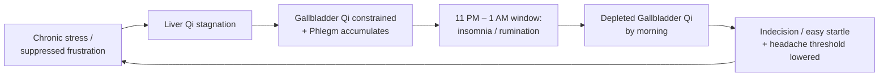

# Gallbladder (膽 — Dǎn)

## Overview

The Gallbladder in Traditional Chinese Medicine is far more than a bile sac. Capitalized as a TCM organ system, the **Gallbladder** is the **Decision-Maker** — the Fu organ paired with the [Liver](Liver.md) in the Wood phase of the [Five Phases](WuXing.md). Its partner plans; it acts. Without the Gallbladder's ability to translate assessment into decision, the [Liver's](Liver.md) careful strategy never leaves the drawing board.

One classical text states that **"all eleven organs depend on the Gallbladder"** — meaning that every organ in the body relies on the Gallbladder's quality of decisive, courageous action to carry out its function. The Gallbladder does not merely support digestion; it is the hinge on which purposeful living turns.

This page covers the Gallbladder as a TCM organ system first, then focuses on one of its most clinically visible signatures: the constellation of **chronic indecision, temporal migraines, and 11 PM – 1 AM insomnia** — collectively understood as Gallbladder Qi disturbance along its organ-clock window.

## Primary function

The Gallbladder's most visible physical role is to **store and excrete bile** — supporting the [Stomach](Stomach.md) and [Spleen](Spleen.md) in transforming and transporting food, particularly fats. Bile is secreted under the Liver's direction; the Gallbladder holds it until needed and then releases it at the right moment. Even here, timing and decisiveness appear: too little bile, released too hesitantly, and digestion falters.

### Storing and excreting bile

Unlike every other Fu organ, which transforms and passes _impure_ substances, the Gallbladder stores **bile — a clear, pure fluid**. The Nei Jing names bile a "clear essence" (_jing ye_). This exceptional purity is why later classical texts classify the Gallbladder among the **Extraordinary Fu** (_qi heng zhi fu_) — the six atypical organs that store essence-like substances rather than processing dregs. The Gallbladder straddles both worlds: anatomically a Fu, functionally approaching the Zang in purity. This dual nature is clinically significant — it means Gallbladder disorders can involve both the hollow-organ pathologies (Damp-Heat, bile obstruction) and the more spirit-like disturbances typical of Zang organs.

### Governing decision and courage

Every Zang organ houses an aspect of the psyche, but the Gallbladder — a Fu — carries the near-equivalent function of **governing decision-making and courage**. The [Liver](Liver.md) assesses a situation with its General's eye; the Gallbladder then provides the quality of _gan dan_ (膽氣) — Gallbladder Qi — that transforms assessment into decisive action.

When Gallbladder Qi is robust:

- Decisions are clear and come without excessive rumination.
- A person is bold without being reckless — courageous in the face of genuine risk.
- The spirit is calm; unexpected events do not produce excessive fright.

When Gallbladder Qi is deficient:

- The person becomes hesitant, easily startled, and unable to commit — the **"timid Gallbladder"** syndrome of classical TCM.
- Indecision loops without resolution; small choices feel overwhelming.
- Sleep is troubled with vivid, anxious dreams. The organ clock tells us this disturbance peaks at 11 PM – 1 AM — the Gallbladder's own window, when it should be consolidating and recharging.

## Position in the wider system

| Aspect             | Gallbladder                                                      |
| ------------------ | ---------------------------------------------------------------- |
| Wu Xing phase      | Wood (see [WuXing.md](WuXing.md))                                |
| Paired Zang organ  | [Liver](Liver.md)                                                |
| Channel type       | Foot Shaoyang (Yang)                                             |
| Sensory opening    | _(via paired [Liver](Liver.md) — eyes)_                          |
| Tissue             | _(via Liver — tendons and sinews)_                               |
| Associated emotion | Anger (via Liver); courage / decisiveness (Gallbladder-specific) |
| Organ clock        | 11 PM – 1 AM — see [Jingmai.md](Jingmai.md)                      |
| Season             | Spring (via Liver)                                               |
| Flavor             | Bitter (bile); sour via Liver                                    |

**The Liver-Gallbladder Wood-phase axis.** The Liver and Gallbladder are bound in a tight functional unit: inner Zang (Liver) and outer Fu (Gallbladder), Yin and Yang faces of the same Wood phase. The Liver stores [Xue (Blood)](Xue.md) and manufactures bile; the Gallbladder holds and times the release of both bile and decisive courage. Stagnation in one quickly becomes stagnation in the other — [Liver Qi stagnation](Liver.md) and Gallbladder Qi deficiency often present together.

**The Shaoyang pivot.** The Gallbladder channel (Foot Shaoyang) shares the **Shaoyang (少陽)** axis with the [San Jiao](SanJiao.md) (Hand Shaoyang). Shaoyang is classically described as the "pivot" between the exterior Taiyang and the interior Yangming — the half-in, half-out layer of the body. This is why **Shaoyang disorders** produce alternating symptoms: chills and fever, a feeling of being neither sick enough to lie down nor well enough to function. This Shaoyang pivot role connects the Gallbladder to regulation of [Jin-Ye (fluids)](JinYe.md) and thermal equilibration across the body.

## Common patterns

### Damp-Heat in the Gallbladder

The most commonly encountered Gallbladder pattern. Damp accumulates (often from diet or external [Liu Yin](LiuYin.md) invasion), combines with Heat, and congests the Gallbladder channel. Bile may overflow, producing **jaundice** (yellow skin and eyes), or the bile becomes concentrated and crystallized — the TCM correlate of gallstones. Key features: bitter taste in the mouth, hypochondriac pain and distention, nausea, yellow greasy tongue coat, dark urine. Often diagnosed alongside [Liver](Liver.md) Damp-Heat, since the organ pair shares the same channel system. Distinguishing from the [Eight Parameters (Ba Gang)](BaGang.md): this is an interior, excess, Hot, and Damp pattern. [Four Examinations (Si Zhen)](SiZhen.md) reveals a wiry, slippery pulse and the characteristic greasy coating.

### Gallbladder Qi deficiency (Timid Gallbladder)

The signature Gallbladder deficiency pattern. Gallbladder Qi fails to anchor the spirit and provide courageous action. The person presents with chronic indecision, hesitancy, excessive startle response, anxiety without obvious cause, and palpitations triggered by sudden sounds. Sleep is disturbed by **vivid, frightening dreams** — and the patient typically cannot fall asleep until well after the 11 PM threshold, lying in wakefulness through the Gallbladder's own clock window. The tongue is pale; the pulse is wiry and weak, especially in the Gallbladder position (right distal). This pattern is often seen alongside [Phlegm](JinYe.md) accumulation.

### Liver-Gallbladder Fire blazing upward

When [Liver Qi stagnation](Liver.md) is chronic and intense, frictional heat builds and cascades upward through the Liver-Gallbladder axis as Fire. The Gallbladder channel traverses the **temples, sides of the head, and outer corners of the eyes** — so Gallbladder Fire characteristically produces **temporal headaches and migraines**, eye redness, and a bitter taste. Rage and sudden outbursts accompany physical symptoms. This pattern overlaps significantly with Liver Fire but is distinguished by the specific temporal and lateral head distribution of pain, matching the Gallbladder channel's pathway. See [QiQing.md](QiQing.md) on emotional excess generating Heat.

### Phlegm-Heat harassing the Gallbladder

Phlegm and Heat combine to disturb the Gallbladder and, through it, the [Heart](Heart.md)-Shen (see [Shen.md](Shen.md)). The Gallbladder-Heart relationship is clinically important: the Gallbladder must be settled for the Heart to house the Shen stably. Phlegm-Heat disturbing the Gallbladder produces **insomnia with palpitations**, a sensation of oppression in the chest, nausea, bitter taste, dizziness, and anxiety. Tongue: red with greasy yellow coat. Pulse: slippery and rapid. This is the canonical indication for **Wen Dan Tang** — one of the most frequently used classical formulas in Chinese medicine. The [Eight Parameters](BaGang.md) classification: interior, excess, mixed Hot and Phlegm pattern.

### Shaoyang disorder

The Gallbladder's Shaoyang channel governs the body's intermediate layer. When a pathogen is neither fully exterior nor fully interior, it lodges in the Shaoyang, producing the characteristic **alternating chills and fever** — the patient feels chilly one moment, feverish the next. Accompanying features: fullness and discomfort below the ribs, bitter taste, dry throat, dizziness, and an unwillingness to eat. The pulse is characteristically **wiry**. This is the archetypal pattern treated by **Xiao Chai Hu Tang**, the anchor formula for Shaoyang disease from the _Shang Han Lun_. The [San Jiao](SanJiao.md) — Hand Shaoyang partner — may be involved when fluid metabolism is also disrupted.

## The TCM view of temporal migraines and Gallbladder insomnia

The Gallbladder's 11 PM – 1 AM organ-clock window and the course of its channel make it uniquely implicated in two interlinked presentations: **temporal migraines** and **sleep-onset insomnia at the 11 PM boundary**. Together they form a coherent Gallbladder disturbance signature that is frequently encountered in clinical practice.

### Why the Gallbladder is "ground zero"

The Gallbladder meridian (see [Jingmai.md](Jingmai.md)) begins at the outer corner of the eye, **zigzags across the side of the head** (temples, sides of the skull, behind the ear), continues over the shoulder, down the ribs and flanks, along the outer leg, and terminates at the fourth toe. This course makes the Gallbladder channel the primary pathway traversing exactly where migraine pain appears — the temples, the orbit, and the lateral head — regardless of whether the underlying mechanism is Fire blazing upward, Phlegm-Heat, or Liver-Gallbladder Qi stagnation.

The 11 PM – 1 AM window is the Gallbladder's period of maximum Qi flow. In health, this is when Gallbladder Qi consolidates, bile is refreshed, and the spirit-adjacent function of decisiveness is quietly replenished during sleep. When the Gallbladder is disturbed, this window is precisely when the patient cannot fall asleep, lies ruminating, or experiences the onset of a migraine.

### The cycle

**Phase 1 — The stagnation builds.** Prolonged stress, suppressed anger, and overthinking stagnate [Liver Qi](Liver.md) and, downstream, constrain Gallbladder Qi. Bile production and release become irregular.

**Phase 2 — Phlegm forms.** When Qi no longer moves fluids freely, [Jin-Ye](JinYe.md) congeal into Phlegm. The Gallbladder becomes burdened with Phlegm-Heat. The mind begins to circle — the rumination loop that characterizes both pre-sleep anxiety and the prodrome of a migraine attack.

**Phase 3 — The clock window erupts.** Between 11 PM and 1 AM, the Gallbladder is at peak activity. Instead of smoothly replenishing, a disturbed Gallbladder "over-activates," driving the mind into hyperarousal. The patient cannot surrender to sleep; or, if sleep comes, it is fractured by vivid, distressing dreams. Some patients feel the initial throb of a migraine precisely at this hour.

**Phase 4 — Morning depletion.** A night of disturbed Gallbladder activity leaves Qi depleted by morning. The person wakes unrefreshed, more indecisive and more easily startled than the day before. The threshold for the next migraine is lower. The cycle perpetuates.

### Cross-organ consequences

**Gallbladder → Liver (the Wood intra-axis).** In a healthy Wood-phase pair, [Liver](Liver.md) and Gallbladder regulate each other. Chronic Gallbladder Qi deficiency removes the execution arm from the Liver's planning function, leaving the Liver in a state of perpetual frustration — classic Liver Qi stagnation follows, which in turn worsens Gallbladder constraint. The two organs destabilize in a mutual feedback loop.

**Gallbladder → Heart (the Gallbladder-Heart corridor).** The Gallbladder-Heart relationship is not a standard Five Phases connection, but it is one of the most clinically observable linkages in TCM. Phlegm-Heat in the Gallbladder harasses the [Heart](Heart.md), disturbing the [Shen](Shen.md) that the Heart houses. The result: insomnia with palpitations, anxiety that arrives without obvious trigger, and a sense that something is about to go wrong — the constitutional pattern of the "timid Gallbladder" extending into Heart-territory restlessness.

**Gallbladder → Spleen (Wood overacting on Earth).** Like the Liver, the Gallbladder channel traverses the flanks and ribs. Gallbladder Damp-Heat or Fire puts lateral pressure on the [Spleen](Spleen.md)'s domain, disrupting the transformation and transportation of food. Nausea, loss of appetite, and alternating bowel irregularity accompany migraine episodes in many patients — not incidentally, but as part of the same Wood-on-Earth dynamic. The [Wu Xing overaction cycle](WuXing.md) explains the propagation.

**The Shaoyang pivot collapses.** The Gallbladder as Shaoyang pivot mediates between interior and exterior, between active and resting states. When this pivot fails, the body loses its ability to transition smoothly — from day to night (insomnia), from interior to exterior (impaired [Wei Qi](Qi.md) at the surface, susceptibility to external pathogens), and from decision to action (the "frozen" quality of chronic indecision). The pivot metaphor is precise: without the Gallbladder working smoothly, nothing quite opens or closes at the right time.

### The migraine cascade

Not every temporal headache in TCM is a Gallbladder migraine, but the **Gallbladder channel distribution** is the diagnostic anchor. A migraine that:

- begins at the outer corner of the eye or temple,
- spreads to the side of the skull or behind the ear,
- is accompanied by light and sound sensitivity (Liver Fire component),
- is preceded or accompanied by nausea (Spleen involvement),
- tends to cluster in the premenstrual week (Liver Blood and Qi cycling),

…presents a TCM picture dominated by the Gallbladder meridian. Treatment distinguishes between acute (typically Liver-Gallbladder Fire or Phlegm-Heat — clear and descend) and chronic (typically Qi and Blood deficiency underlying the recurrent attacks — tonify and move).

## TCM treatment of temporal migraines and Gallbladder insomnia

Because the Gallbladder is both the seat of the imbalance and a key pathway for treatment, the strategy centers on: settling Gallbladder Qi, clearing Phlegm-Heat from the channel, smoothing Liver-Gallbladder Qi flow, and restoring the rhythm of the 11 PM window.

### Acupuncture

| Point                | Location                       | Key action                                                                                                        |
| -------------------- | ------------------------------ | ----------------------------------------------------------------------------------------------------------------- |
| GB 20 (Fengchi)      | Nape, at the base of the skull | Eliminates Wind, clears the head and eyes; the principal point for any headache along the Gallbladder channel     |
| GB 34 (Yanglingquan) | Lateral knee                   | Influential point for sinews; principal point of the Gallbladder channel; clears Damp-Heat, calms the Gallbladder |
| GB 40 (Qiuxu)        | Lateral ankle (Source point)   | Source point of the Gallbladder; regulates Gallbladder Qi, opens the chest, calms indecision                      |
| GB 41 (Zulinqi)      | Dorsum of the foot             | Luo-connecting point to San Jiao; opens the Dai Mai (Girdling Vessel); treats lateral head pain                   |
| LV 3 (Taichong)      | Dorsum of the foot             | Source point of the Liver; smooths Liver-Gallbladder Qi, descends excess to the feet                              |
| Yintang (M-HN-3)     | Between the eyebrows           | Calms the Shen; quiets the mind at sleep onset; reduces pre-sleep rumination                                      |

**GB 34 + LV 3 together** (the "Four Gates" variation using the Gallbladder axis) is one of the most effective combinations for Liver-Gallbladder Qi stagnation with headache. **GB 20** is nearly always included in temporal migraine protocols. See [Acupuncture.md](Acupuncture.md) for broader treatment principles.

### Herbal medicine

- **Wen Dan Tang** (Warm the Gallbladder Decoction) — The classical formula for **Phlegm-Heat harassing the Gallbladder**, with insomnia, palpitations, anxiety, and nausea. Its name is counterintuitive — "warm" refers to restoring the Gallbladder's normal functional warmth, not to heating the pattern. This is the most widely used formula specifically targeting the Gallbladder organ. See [Herbs.md](Herbs.md) for individual herb functions.
- **Xiao Chai Hu Tang** (Minor Bupleurum Decoction) — The archetypal **Shaoyang formula** from the _Shang Han Lun_. Harmonizes Shaoyang, resolves alternating presentations, and moves constrained Liver-Gallbladder Qi. Widely used for recurrent headaches with the Shaoyang signature.
- **Long Dan Xie Gan Tang** (Gentian Drain the Liver Decoction) — Clears **Liver-Gallbladder Fire and Damp-Heat**; the principal formula for acute temporal migraines with Fire signs (red eyes, bitter taste, rage, dark urine). Potent and purging — used for acute excess states, not long-term tonification.
- **Chai Hu Jia Long Gu Mu Li Tang** (Bupleurum, Dragon Bone, Oyster Shell Decoction) — Regulates Shaoyang Qi while heavy minerals and shell substances anchor a restless, frightened spirit. Well suited for the "timid Gallbladder" constellation of insomnia, palpitations, and chronic anxiety.

### Lifestyle

- **Respect the 11 PM threshold.** The single most impactful change for Gallbladder-pattern insomnia is being in bed before 11 PM — allowing the Gallbladder's peak window to do its replenishing work undisturbed. Consistently staying up past this window gradually depletes Gallbladder Qi and progressively worsens the decisiveness and sleep-onset problems.
- **Address decisions before bedtime.** Rumination at the 11 PM window is often triggered by unresolved choices from the day. A brief journaling practice or explicit "close-out" ritual — deciding what cannot be decided now — can reduce the Gallbladder's overactivation at sleep onset.
- **Lateral-body stretching and Qigong.** The Gallbladder channel runs the full lateral surface of the body. Side stretches, lateral twists, and Wood-phase Qigong forms open the flanks and keep Gallbladder Qi moving. See [Qigong.md](Qigong.md).
- **Dietary support.** Reduce greasy, fried, and overly rich foods that generate Damp-Heat in the Gallbladder. Mild bitters (dandelion greens, radicchio, turmeric) support bile flow. See [Dietary.md](Dietary.md).
- **TuiNa and self-massage along GB 20.** Regular massage at the nape (GB 20 area) releases chronic tension in the Gallbladder channel and reduces migraine frequency. See [TuiNa.md](TuiNa.md).

### The holistic perspective

From a TCM standpoint, the person waking at midnight unable to fall asleep, paralyzed by tomorrow's decisions and vulnerable to a familiar migraine on the side of the head, is not experiencing three separate problems. They are experiencing **one Gallbladder system under strain** — a pivot organ that can no longer pivot cleanly. Its bile flow is sluggish, its courageous Qi has been eroded by chronic indecision loops, and its 11 PM window of renewal has become an 11 PM window of disturbance. Treatment that settles the Phlegm-Heat, smooths the Liver-Gallbladder axis, clears the channel pathway, and — critically — reclaims the organ-clock window is not simply symptom management. It is restoring the organism's capacity to transition: from day to night, from deliberation to decision, from contraction to expansion. The Gallbladder is small in anatomy and enormous in function; when it works, everything can move forward.
