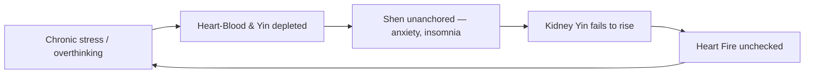

# Heart (心 - Xīn)

## Overview

The Heart in Traditional Chinese Medicine is not the muscular pump of Western physiology. Capitalized to distinguish it from its biological counterpart, the **Heart** is the **Emperor** (Huáng Dì) of the body. The supreme organ-system's stability dictates the stability of the whole. It governs the circulation of [Xue (Blood)](Xue.md) and houses the [Shen (Spirit/mind)](Shen.md). When the Emperor is settled, the kingdom is orderly; when the Emperor is agitated, the kingdom descends into chaos.

This document covers the Heart as a TCM organ system first, then turns to one of its most consequential clinical applications: the TCM framing of anxiety, insomnia, and Shen disturbance. Western medicine locates these problems in the brain's chemistry: neurotransmitters, sleep architecture, the amygdala. TCM locates them in the Heart: its Blood, its Yin, its Fire, and its communication with the [Kidney](Kidney.md) below.

## Primary function

The Heart must propel Blood through the vessels and provide the stable residence where the Shen can dwell. The classical phrase from the _Huangdi Neijing_ distills this: _the Heart rules the Blood and stores the Shen_.

### Governing the Blood and vessels

The Heart propels [Xue (Blood)](Xue.md) through the entire vessel network. In health, Blood circulates smoothly, and the face is ruddy and warm, the pulse is even and regular, and every tissue receives nourishment. Heart Qi is the force behind each beat; Heart Blood is the substance filling the vessels. A pale face, weak or irregular pulse, and easy fatigue are the immediate signs when either the force or the substance falls short.

Because [JinYe (Body Fluids)](JinYe.md) and Blood share a common origin and can transform into each other, fluid metabolism is also entangled here. Extreme sweating depletes Blood, and Heart pathology can surface as disordered sweating. The tongue, as the Heart's sensory opening, reflects the state of Heart-Blood directly: pale for deficiency, red or red-tipped for Heat, bluish for Blood stasis.

### Housing the Shen

Every Zang organ houses a specific aspect of the psyche (see [Shen.md](Shen.md) for the full Five Shen framework). The Heart houses **Shen** proper: supreme consciousness, cognition, emotional tone, and the quality of sleep. During the day, Shen guides thought and action; at night it retreats into the Blood and Yin of the Heart to rest and consolidate. This is why the Heart's condition is inseparable from sleep: when Heart-Blood or Heart-Yin is rich, the Shen is anchored and sleep is deep; when either runs thin, the Shen becomes homeless and sleep becomes restless, dream-disturbed, or impossible.

The Emperor analogy is clinical, not decorative. If the Emperor is unstable, agitated by Fire, starved of Blood, or unmoored by Yin deficiency, then every subordinate organ minister suffers. No pattern in TCM is more central than a disturbed Shen, and every treatment ultimately asks: is the Emperor settled?

## Position in the wider system

| Aspect             | Heart                                                       |
| ------------------ | ----------------------------------------------------------- |
| Wu Xing phase      | Fire (see [WuXing.md](WuXing.md))                           |
| Paired Fu organ    | [Small Intestine](SmallIntestine.md)                        |
| Sensory opening    | Tongue                                                      |
| Tissue             | Vessels                                                     |
| Associated emotion | Joy (excess: agitation, mania) - see [QiQing.md](QiQing.md) |
| Organ clock        | 11 AM – 1 PM - see [Jingmai.md](Jingmai.md)                 |
| Season             | Summer                                                      |
| Flavor             | Bitter                                                      |

Surface pathway: the Heart channel runs from the chest, down the inner arm, to the little finger. This is why HT 7 at the wrist crease is the primary Shen-calming point.

**The Heart-Kidney axis.** A foundational TCM teaching holds that Heart (Fire) and [Kidney](Kidney.md) (Water) must communicate continuously. In health, Kidney Yin rises to cool and moisten the Heart; Heart Yang descends to warm the Kidneys. This dialogue is called _xīn shèn xiāng jiāo_ ("Heart-Kidney mutual interaction"). When Kidney Yin is too depleted to ascend, Heart Fire runs unchecked: the classic presentation is insomnia, palpitations, low-grade restlessness, night sweats, and anxiety that worsens after midnight. The two-organ axis is documented fully in [ZangFu.md](ZangFu.md#the-heart-kidney-axis).

## Common patterns

These are the canonical Heart pathologies a practitioner differentiates first. They are not mutually exclusive; deficiency patterns especially tend to nest and compound.

### Heart Fire blazing

Excess Heat builds in the Heart from emotional frustration, from [Liver Fire](Liver.md#liver-fire-blazing-upward) traveling upward along the Wood-feeds-Fire pathway, or from prolonged mental overstimulation. Heat agitates the Shen directly. Symptoms: palpitations, a rapid and forceful pulse, vivid and disturbing dreams, mouth and tongue sores, scorching or dark urine (Heart Fire pouring down into the [Small Intestine](SmallIntestine.md) channel), red tongue tip, agitation, and insomnia characterized by difficulty falling asleep. In severe presentations the Shen is fully "expelled": acute mania, incoherent speech, or irrational behavior.

### Heart Blood deficiency

The vessels and the Shen's residence are both underfilled. This pattern commonly co-arises with [Spleen](Spleen.md) Qi deficiency, because the Spleen is the primary factory for Blood production. The combined picture is Heart-Spleen Blood deficiency, documented in [ZangFu.md](ZangFu.md#common-combined-patterns). Symptoms: difficulty falling asleep or maintaining sleep, vivid but non-threatening dreams, mild anxiety, poor memory, palpitations on exertion, pale or sallow face, pale tongue, and a fine or choppy pulse. The Shen is not so much agitated as untethered: a low, diffuse anxiety rather than acute panic.

### Heart Yin deficiency

A deeper depletion of the cooling, moistening substance. The difference from Blood deficiency is a distinctive hollow Heat: the Shen is restless specifically after midnight, when Yin should be at its peak. Symptoms: "hollow" palpitations, low-grade afternoon or night-time fever, night sweats, a dry mouth, a red tongue with little or no coating, and a fine and rapid pulse. This pattern is the most common driver of the Heart-Kidney axis failure: as Heart Yin depletes, it can no longer receive the rising Kidney Yin, and the whole Water-Fire dialogue collapses.

### Heart Qi deficiency

The animating force behind circulation runs thin. Symptoms are prominently physical: shortness of breath on exertion, spontaneous sweating, a weak and pale face, palpitations provoked by exertion or strong emotion, fatigue, and a weak pulse. The Shen is not dramatically disturbed but becomes flat: low mood, poor motivation, a vague sense that the "lights are dim." Heart Qi deficiency is often the early-stage presentation that, with time or further depletion, deepens into Blood or Yang deficiency.

### Heart Yang deficiency

Yang Qi insufficient to both warm and propel. This is Heart Qi deficiency taken further. Now Cold signs appear alongside the weakness: a pale or dusky complexion, cold hands, a dragging fatigue, and a slow or knotted pulse. In extreme presentations the Yang collapses (Heart Yang collapse / _xin yang bao tuo_), producing profuse cold sweating, cyanotic lips, and shock. Shorter of that crisis, a chronically Yang-deficient Heart produces chronic palpitations, a cold chest, timidity, and a Shen that has "gone dim" rather than agitated.

### Phlegm misting the Heart

When [JinYe (Body Fluids)](JinYe.md) are poorly transformed, often because Spleen Qi is weak or because accumulated Heat thickens fluids into Phlegm, the resulting Phlegm can "mist the Heart orifices," obscuring the clarity the Shen requires. The milder picture: muddled thinking, poor concentration, a stifling sensation in the chest, and a heavy or foggy mood. Phlegm-Fire (hot Phlegm + Heart Fire together) produces a more acute picture: incoherent or pressured speech, emotional lability, agitation, and in severe cases, psychotic symptoms. The tongue is swollen with a greasy coat; the pulse is slippery or slippery-rapid.

## The TCM view of anxiety, insomnia, and Shen disturbance

Anxiety and insomnia are the single most common cluster of complaints in modern TCM clinical practice. Western psychiatry maps them onto GABA, serotonin, norepinephrine, cortisol, and sleep-cycle architecture; TCM maps them onto the Heart: its Blood, its Yin, its Fire, and its dialogue with the Kidney below.

### Why the Heart is "ground zero"

The logic follows directly from the Heart's job: Shen must reside in the Heart, anchored by Blood and Yin, to produce consciousness during the day and rest at night. Anything that depletes the Blood, scorches the Yin, or inflames the Fire disrupts that residence. Modern life provides the trifecta: chronic overthinking (which exhausts Heart-Blood), irregular sleep and late nights (which drain Yin and fail to give Kidney-Water time to rise), and emotional reactivity (which fans Heart Fire). The Heart is the physiological site of both anxiety and insomnia, not incidentally involved.

### The cycle

**Phase 1 - Depletion.** Prolonged mental effort, worry, and emotional reactivity consume Heart-Blood and Yin faster than the [Spleen](Spleen.md) can replenish them and the [Kidney](Kidney.md) can supply them from below. The Shen begins to lose its mooring: concentration slips, sleep onset is harder, and a baseline low-level anxiety takes hold.

**Phase 2 - The Homeless Shen.** With insufficient Blood and Yin, the Shen cannot "rest in its room" at night. Sleep becomes light and dream-filled; the person wakes easily and lies awake especially in the early-morning hours. Daytime anxiety intensifies. The Emperor is now ruling from the street, exposed to every passing disturbance.

**Phase 3 - Fire Without Water.** As Kidney Yin drops (depleted by overwork, irregular life, or age), it can no longer ascend to cool the Heart. Heart Fire, normally regulated by this rising coolness, blazes unchecked. The result is palpitations, the 3 AM waking of Heart-Kidney axis failure, night sweats, and a persistent anxiety that feels urgent and physical, as if the "racing heart in a quiet room."

### Cross-organ consequences

Because [WuXing (Five Phases)](WuXing.md) cycles propagate dysfunction through neighbors, a Heart centered in anxiety-insomnia dysregulation rarely stays contained.

**Heart → Liver (Fire agitating Wood).** Unchecked Heart Fire can reverse-act on the [Liver](Liver.md), driving Liver Yang rising. This produces headaches, neck tension, irritability, and vivid anger layered on top of the anxiety. The [QiQing (Seven Emotions)](QiQing.md) model treats this as a mutually reinforcing spiral: anxiety (Heart) and frustration (Liver) compound each other, especially in people whose anxiety has a pronounced angry or agitated edge.

**Heart → Spleen (Fire weakens Earth).** Anxiety and worry, which is the [Spleen's](Spleen.md) associated emotion, deplete Spleen Qi directly. A weakened Spleen produces less Blood, which further starves the Heart-Shen. The combined Heart-Spleen Blood deficiency is one of the most common patterns in anxiety clinics: palpitations, worry, poor appetite, bloating, pale face, and insomnia all arising together.

**Heart → Kidney (Fire-Water axis failure).** The Heart-Kidney axis is the central axis of this entire cluster. When the dialogue between Fire and Water breaks down, neither organ can complete its function: the Heart cannot deliver warmth and transformation downward; the Kidney cannot deliver cool, anchoring Yin upward. The [BaGang (Eight Principles)](BaGang.md) framing here is Yin deficiency with relative Yang excess. This is not true Fire excess, but rather Fire unchecked by insufficient Water.

**The Shen in [Pericardium](Pericardium.md).** In the six-organ meridian framework, the Pericardium absorbs the first wave of emotional and external attack before it reaches the Heart proper. Chronic anxiety can exhaust the Pericardium's buffering capacity, after which the Heart is directly exposed. Practitioners often treat PC 6 (Neiguan) alongside HT 7 specifically for anxiety with palpitations and chest oppression because the Pericardium takes the burden the Heart should not bear alone.

### Acute presentation in clinical practice

Two distinct insomnia presentations point to different Heart-centered patterns and demand different treatments.

The **Blood-deficient type** cannot fall asleep: the mind is thin and busy at bedtime, the heart flutters, and the person feels vaguely anxious without a clear object of worry. If they do fall asleep, they dream constantly. This is Shen untethered by deficiency. The room is cold and dim, not burning.

The **Yin-deficient, Fire type** falls asleep but wakes between midnight and 3 AM, precisely when Yin should be maximal and Heart-Kidney communication optimal. They lie awake with a racing heart, a hot or restless feeling, and thoughts that feel urgent and circular. This is Shen ejected by Heat. The room is on fire.

Distinguishing these two (and the Phlegm-misting type, which presents with foggy, depressed, or detached insomnia rather than either agitation or thinness) is the practical application of [SiZhen (Four Examinations)](SiZhen.md) to a single chief complaint.

## TCM treatment of anxiety, insomnia, and Shen disturbance

Because the Heart is the root of the imbalance, treatment strategies converge on nourishing Blood and Yin, clearing or directing Fire downward, and re-anchoring the Shen.

### Acupuncture

Shen-calming acupuncture works along the Heart channel primarily, supported by points on the Kidney, Pericardium, and Governing Vessel. See [Acupuncture.md](Acupuncture.md) for the broader point-selection framework.

| Point             | Location                         | Primary function in Shen disturbance                                  |
| ----------------- | -------------------------------- | --------------------------------------------------------------------- |
| HT 7 - Shen Men   | Ulnar wrist crease               | Source point; nourishes Heart Blood, clears Heart Heat, calms Shen    |
| HT 5 - Tong Li    | 1 cun above HT 7                 | Luo-connecting point; Heart-mind communication, quiets palpitations   |
| PC 6 - Nei Guan   | Inner forearm, 2 cun above wrist | Pericardium Luo; opens the chest, calms the mind, treats palpitations |
| KD 3 - Tai Xi     | Medial ankle                     | Source of Kidney Yin and Yang; anchors Heart Fire from below          |
| KD 6 - Zhao Hai   | Below medial malleolus           | Opens the Yin Qiao vessel; specifically indicated for insomnia        |
| Yin Tang          | Between the eyebrows             | Extra point; rapid Shen-calming, quiets overthinking                  |
| An Mian           | Behind the ear                   | Extra point; empirically reliable for sleep-onset anxiety             |
| DU 24 - Shen Ting | Anterior hairline                | Organizes and calms the mind from above; scattered-thinking, anxiety  |

### Herbal medicine

Classical formulas target specific pattern types within the anxiety-insomnia cluster.

- **Tian Wang Bu Xin Dan** (Emperor of Heaven's Special Pill to Tonify the Heart) - Flagship formula for Heart-Kidney axis failure. Nourishes Heart and Kidney Yin, tonifies Blood, clears deficiency-Heat, and calms the Shen. Classical indications are insomnia with 3 AM waking, night sweats, palpitations, poor memory, and a red tongue with thin coating. Contains the Shen-calming mineral Zhu Sha (cinnabar), though modern preparations often substitute or omit it for safety.
- **Suan Zao Ren Tang** (Sour Jujube Seed Decoction) - Classic formula for Liver-Blood deficiency failing to nourish Heart-Shen. The chief herb, sour jujube seed (_Suan Zao Ren_), is specifically indicated for insomnia with anxiety, palpitations, and night sweating. Paired with Zhi Mu and Chuan Xiong to gently clear heat and move Blood.
- **Gui Pi Tang** (Restore the Spleen Decoction) - For Heart-Spleen Blood deficiency: simultaneous Spleen tonification and Heart-Blood nourishment. The target presentation is palpitations, worry, poor appetite, fatigue, pale tongue, and an inability to fall or stay asleep. Canonical for overwork-induced anxiety in people who are also losing weight and appetite.
- **Huang Lian E Jiao Tang** (Coptis and Ejiao Decoction) - For true Heart-Yin deficiency with Fire. The bitter cold of Huang Lian directly clears Heart Fire while E Jiao (Donkey-hide gelatin) nourishes Blood and Yin. Classical indication is severe insomnia with agitation, a dry mouth at night, and a red tongue with scanty coating.
- **Bai Zi Yang Xin Wan** (Arborvitae Seed Pill to Nourish the Heart) - Gentler than Tian Wang Bu Xin Dan; suited for milder Heart-Blood deficiency insomnia, forgetfulness, and palpitations in patients who are constitutionally weak or elderly.

### Lifestyle

The Shen is cultivated daily; herbal and acupuncture protocols gain traction only when lifestyle patterns stop actively depleting what treatment is trying to build.

- **Sleep before midnight.** The Heart's organ-clock peak is 11 AM – 1 PM; the gallbladder (which initiates the descent into deep sleep) peaks 11 PM – 1 AM. Lying down before midnight allows the Kidney-Water time to rise and cool the Heart before the transition into deep Yin hours. See [Jingmai.md](Jingmai.md) for the full organ-clock.
- **Qigong and meditation.** Sitting practice allows the Shen to descend from the agitated surface into the quiet Heart. Moving Qigong, especially forms that open the chest and stretch the Heart meridian along the inner arm, directly circulates Heart-Qi and Blood. See [Qigong.md](Qigong.md).
- **Dietary support.** Foods that build Heart-Blood and calm the Shen without creating Dampness: longan fruit (_Long Yan Rou_), red dates (_Da Zao_), lotus seed (_Lian Zi_, which uniquely connects Heart Fire to the Kidney), and sour jujube seed in warm tea before sleep. Avoid alcohol and spicy food, which agitate Heart Fire upward. See [Dietary.md](Dietary.md).
- **Reduce mental overstimulation.** TCM has always treated excessive thinking as a consumptive force that exhausts [Qi](Qi.md) and depletes Heart-Blood. Evening screen time, late-night problem-solving, and the modern habit of stimulation-at-rest all act as the direct energetic equivalent of overwork.
- **Emotional expression.** The [QiQing (Seven Emotions)](QiQing.md) model holds that suppressed emotion generates stagnation which converts to Fire. Healthy movement of emotion through conversation, writing, or somatic release prevents the Heat accumulation that drives the anxiety-insomnia cycle from the inside out.

### The holistic perspective

From a TCM standpoint, a person struggling with chronic anxiety and insomnia is not dealing with a chemical deficiency in isolation and is not failing at a lifestyle habit. They are experiencing a depletion of the material basis of consciousness: Heart-Blood and Yin. This combines with a failure of the Water-Fire dialogue that keeps the Emperor settled at night. Healing involves replenishing the Blood, nourishing the Yin, restoring the Kidney-Heart communication, and teaching the Shen to trust its home again. Needles, herbs, food, movement, and time each contribute a layer; no single intervention is sufficient, and none is more fundamental than understanding that the mind and the Heart are, in TCM, the same system.
