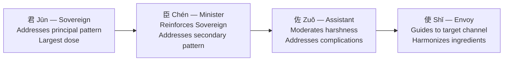

# Herbal Medicine (中藥 - Zhōng Yào)

## Overview

Herbal medicine is the **second branch** of the Five Branches of TCM Treatment and the broadest, most systematically documented body of knowledge in the tradition. Where acupuncture manipulates Qi through the needle, herbal medicine works internally. Substances carrying specific energetic qualities enter the channels they have affinity with and shift the body's thermal and fluid balance from within.

The modern materia medica (_bĕn căo_) lists roughly 2,000 substances in clinical use. Most are plant-derived; others include mineral materials (gypsum, magnetite, oyster shell) and animal materials (earthworm, scorpion, cicada molt). They are almost never used alone. The fundamental unit is the **formula** (_fāng jì_), a precision blend in which every ingredient carries a defined role and the aggregate action addresses a diagnosed [Zang-Fu](ZangFu.md) pattern more accurately than any single herb could. A practitioner reaches for a formula because a [Ba Gang](BaGang.md) diagnosis has identified the pattern; the formula is the conclusion of a clinical argument, not an empirical remedy for a symptom.

## Herbal medicine as a pillar of TCM

Herbal medicine is the second in the canonical listing of the **[Five Branches of TCM Treatment](index.md#the-five-branches-of-tcm-treatment)**:

1. **[Acupuncture & Moxibustion](Acupuncture.md)** - needles and warmth at acupoints along the [meridian network](Jingmai.md).
2. **Herbal Medicine** - _this page_.
3. **[Tui Na](TuiNa.md)** - therapeutic massage along the meridian pathways.
4. **[Dietary Therapy](Dietary.md)** - food prescribed by constitution and pattern.
5. **[Qigong](Qigong.md)** - self-cultivated breath, movement, and intention.

In East Asian clinical practice today, herbal prescription is the most-used treatment modality by volume. In China, roughly 40% of all outpatient visits involve a herbal prescription alongside or in place of biomedical pharmaceuticals.

## Historical origins and the classical canon

**Shennong Bĕn Căo Jīng** (神農本草經). Compiled in the early Han dynasty (c. 100–200 CE), the foundational text describes 365 substances divided into three grades: upper-grade tonics for prolonged use, mid-grade therapeutics, and lower-grade strong-action herbs for short-term use only.

**Shāng Hán Lùn** (傷寒論, "Treatise on Cold Damage"). Compiled by _Zhāng Zhòngjǐng_ (张仲景) around 200 CE. Organizes disease progression through the Six Channels framework; Guì Zhī Tāng and Má Huáng Tāng come directly from this text. The companion text **Jīn Guì Yào Lüè** (金匱要略) covers chronic and internal medicine conditions outside the cold-damage framework. Together they are the clinical bedrock of Chinese herbal practice.

**Wēn Bìng school** (溫病學派). Emerging in the Ming and reaching full development in the Qīng (17th–19th c.), the Wen Bing school addressed epidemic febrile illness poorly suited to the Six-Channel model. Three essential figures: _Wú Yòuxìng_ (吳又可), who proposed the concept of epidemic pestilential Qi; _Yè Tiānshì_ (葉天士), who developed the four-level (_wèi, qì, yíng, xuè_) progression model; and _Wú Jútōng_ (吳鞠通), whose _Wēn Bìng Tiáo Biàn_ contains Yín Qiáo Sǎn and Sāng Jú Yǐn.

**Lǐ Shízhēn's Bĕn Căo Gāng Mù** (本草綱目). Published posthumously in 1596, this encyclopedic Ming work catalogues 1,892 substances with preparation, dosage, properties, and interactions. The largest single-author contribution to the materia medica tradition.

**Modern standardization**. The _Chinese Pharmacopoeia_ (_Zhōngguó Yàodiǎn_), first issued in 1953 and updated regularly, specifies identity, quality, assay, and dosage standards for all officially recognized substances and forms the legal baseline for manufactured products sold in China.

## The four properties (四性 - Sì Xìng)

Every herb carries one of five thermal classifications: Hot, Warm, Neutral, Cool, or Cold. These describe the directional energetic change a substance produces, not its ambient temperature. Cold patterns ([BaGang](BaGang.md) diagnosis: interior Cold, Yang deficiency) call for Hot or Warm herbs; Heat patterns call for Cool or Cold herbs. Neutral herbs tonify without a thermal shift.

Representative examples:

- **Hot** (_rè_) - _Fù Zǐ_ (附子, aconite root) rescues Yang in collapse, warms Kidney and Heart, dispels extreme Cold Bi. Must be processed (_zhì fù zǐ_) to reduce aconitine toxicity.
- **Warm** (_wēn_) - _Shēng Jiāng_ (生薑, fresh ginger) warms the Middle Burner, releases the exterior for mild Wind-Cold. Also _Ròu Guì_ (肉桂, cinnamon bark) is warm-to-hot, warms channels, invigorates Blood.
- **Neutral** (_píng_) - _Gān Căo_ (甘草, licorice root) tonifies Qi, harmonizes formulas, moderates toxicity of harsh herbs. The single most commonly used herb in the materia medica.
- **Cool** (_liáng_) - _Bò Hé_ (薄荷, field mint) disperses Wind-Heat from the surface and head, clears the Liver.
- **Cold** (_hán_) - _Shí Gāo_ (石膏, gypsum) clears blazing Stomach and Lung Heat; _Huáng Lián_ (黃連, coptis) is bitter-cold, the definitive herb for damp-Heat in the Middle Burner and Heart Fire.

A diagnosis of mixed Hot-Cold (upper Heat, lower Cold) calls for formulas that blend thermal directions deliberately.

## The Five Flavors and the Wu Xing mapping

The Five Flavors (_Wǔ Wèi_ - 五味) are energetic vectors predicting how a substance acts on organs and [Qi](Qi.md) dynamics:

| Flavor                     | Organ Pair              | Primary Action                                         | Example Herbs                                                           |
| -------------------------- | ----------------------- | ------------------------------------------------------ | ----------------------------------------------------------------------- |
| Sour (_suān_ 酸)           | Liver / Gallbladder     | Astringes, consolidates, prevents leakage              | Shān Zhū Yú (cornus), Wū Méi (mume plum)                                |
| Bitter (_kǔ_ 苦)           | Heart / Small Intestine | Drains downward, dries Damp, clears Heat               | Huáng Lián (coptis), Huáng Bǎi (phellodendron), Dà Huáng (rhubarb root) |
| Sweet (_gān_ 甘)           | Spleen / Stomach        | Tonifies, nourishes, moderates, relaxes                | Gān Căo (licorice), Dǎng Shēn (codonopsis), Shú Dì Huáng (rehmannia)    |
| Pungent / Acrid (_xīn_ 辛) | Lung / Large Intestine  | Disperses, promotes circulation, releases the exterior | Bò Hé (mint), Guì Zhī (cinnamon twig), Chuān Xiōng (ligusticum)         |
| Salty (_xián_ 咸)          | Kidney / Bladder        | Softens hardness, disperses nodules, purges downward   | Máng Xiāo (mirabilite), Mǔ Lì (oyster shell), Biē Jiǎ (turtle plastron) |

A sixth flavor, **Bland** (_dàn_ 淡), drains Damp and promotes urination; _Fú Líng_ (茯苓, poria) is the paradigmatic example. Most herbs carry multiple flavors; _Gān Căo_ is both Sweet and slightly Bitter, which allows it to harmonize without pushing toward either extreme. For the theoretical grounding of these correspondences, see [WuXing.md](WuXing.md); the flavor-organ mapping is shared with [Dietary Therapy](Dietary.md).

## Channel-entering and directionality (歸經 - Guī Jīng)

Every herb is assigned the [meridian channels](Jingmai.md) it enters (_guī jīng_; channel affinity), acting primarily on those organs and body regions. Most herbs enter two to four channels simultaneously.

**Directionality** (_shēng jiàng fú chén_) describes the vertical tendency of an herb: ascending, descending, floating, or sinking.

- **Ascending / Floating** - move Qi upward and outward. Pungent and Sweet herbs tend here. Useful for raising sunken Spleen Qi or releasing pathogens from the exterior.
- **Descending / Sinking** - move Qi downward and inward. Bitter, Sour, and Salty herbs tend here. Useful for directing rebellious [Lung](Lung.md) Qi downward or calming Liver Yang rising.

Flower and leaf materials tend to float; seeds, minerals, and roots tend to sink. Processing shifts tendency: stir-frying with wine lifts; stir-frying with salt descends.

**Guide herbs** (_yǐn jīng yào_) lead the formula to the intended target channel: _Jié Gĕng_ (桔梗, platycodon) to the Lung; _Niú Xī_ (牛膝, achyranthes) downward to the Kidney, Liver, and lower limbs; _Chái Hú_ (柴胡, bupleurum) to the Shào Yáng (Liver/Gallbladder). Small in dose, precise in function.

## Formula architecture (君臣佐使 - Jūn Chén Zuǒ Shǐ)

The sovereign-minister-assistant-envoy framework is the structural grammar of Chinese herbal formulation:

**Sì Jūn Zǐ Tāng** (四君子湯) addresses Spleen-Stomach Qi deficiency and makes the role structure transparent: **Jūn** _Rén Shēn_ (ginseng) tonifies Spleen Qi at the largest dose; **Chén** _Bái Zhú_ (atractylodes) reinforces and dries Damp; **Zuǒ** _Fú Líng_ (poria) leaches Damp and prevents stagnation from tonification; **Shǐ** _Zhì Gān Căo_ (honey-fried licorice) harmonizes.

Formulas are modified (_jiā jiǎn_) for the individual: _Gān Jiāng_ (dry ginger) for concurrent Cold; _Chén Pí_ (tangerine peel) for Phlegm obstruction.

## Categories of herbs

**Release-the-exterior** (_jiě biǎo yào_) opens the pores and expels Wind from the surface. Warm-acrid (Wind-Cold): _Guì Zhī_ (cinnamon twig), _Má Huáng_ (ephedra). Cool-acrid (Wind-Heat): _Bò Hé_ (mint), _Chái Hú_ (bupleurum), _Jú Huā_ (chrysanthemum).

**Clear-Heat** (_qīng rè yào_) drains interior Heat across subtypes: _Shí Gāo_ (gypsum, Qi-level Stomach and Lung Heat); _Huáng Lián_ (coptis, damp-Heat); _Shēng Dì Huáng_ (raw rehmannia, cools Blood, nourishes Yin).

**Downward-draining** (_xiè xià yào_) promotes bowel movement and purges Heat or Cold accumulation. _Dà Huáng_ (rhubarb root) is bitter-cold and strongly purgative; it also clears Heat and invigorates Blood. _Máng Xiāo_ (mirabilite) softens hardness and moistens dryness, paired with Dà Huáng in purgative formulas.

**Dispel-Damp** (_qū shī yào_) addresses Damp obstruction: _Fú Líng_ (poria, drains Damp, calms Shen); _Yì Yǐ Rén_ (Job's tears, drains Damp-Heat, Bi syndrome); _Cāng Zhú_ (atractylodes, dries Middle Burner Damp).

**Transform-Phlegm** (_huà tán yào_) addresses Cold-Phlegm and Hot-Phlegm. _Bàn Xià_ (pinellia) is warm, dries Damp, transforms Cold-Phlegm, and descends rebellious Lung and Stomach Qi. _Chuān Bèi Mǔ_ (Sichuan fritillaria) is cool, transforms Hot-Phlegm, and moistens Lung Yin.

**Regulate Qi** (_lǐ qì yào_) moves stagnant or descends rebellious Qi: _Chái Hú_ (bupleurum, disperses constrained Liver Qi); _Chén Pí_ (tangerine peel, Middle Burner Qi, dries Damp); _Xiāng Fù_ (cyperus, Liver Qi stagnation in gynecology).

**Invigorate Blood / stop bleeding** (_huó xuè zhǐ xuè yào_) moves [Xue](Xue.md) stasis or arrests hemorrhage: _Dān Shēn_ (salvia, invigorates Blood, cools Blood-Heat, calms Shen); _Chuān Xiōng_ (ligusticum, upper-body Blood, headache); _Sān Qī_ (notoginseng, invigorates Blood and stops bleeding simultaneously; the principal trauma herb).

**Tonify** (_bǔ yào_) replenishes deficient Qi, Blood, Yin, or Yang. Qi tonics: _Rén Shēn_ (ginseng), _Dǎng Shēn_ (codonopsis), _Huáng Qí_ (astragalus). Blood tonics: _Shú Dì Huáng_ (processed rehmannia), _Dāng Guī_ (angelica root), _Bái Sháo_ (white peony). Yin tonics: _Mài Dōng_ (ophiopogon), _Nǚ Zhēn Zǐ_ (privet fruit), _Guī Bǎn_ (turtle plastron). Yang tonics: _Ròu Cōng Róng_ (cistanche), _Dù Zhòng_ (eucommia bark), _Lù Jiǎo Jiāo_ (deer antler gelatin).

**Astringent** (_shōu sè yào_) consolidates leakage from sweating, spermatorrhea, chronic diarrhea, and uterine bleeding: _Wū Méi_ (mume plum, astringes intestines, generates fluid); _Shān Zhū Yú_ (cornus fruit, stabilizes Kidney and Liver, stops leakage); _Lián Zǐ_ (lotus seed, astringes Heart, Spleen, Kidney).

**Calm the Shen** (_ān shén yào_) settles [Shen](Shen.md) and treats insomnia, palpitations, and anxiety: _Suān Zǎo Rén_ (sour jujube seed, Liver Blood deficiency insomnia); _Yuǎn Zhì_ (polygala, opens orifices, calms Shen, transforms Phlegm misting the Heart); _Lóng Gǔ_ (dragon bone, anchors Shen, astringes).

## Canonical formulas every reader should know

- **Guì Zhī Tāng** (桂枝湯) addresses Wind-Cold with sweating (Tài Yáng deficiency). Guì Zhī releases the surface; Bái Sháo astringes the interior; Shēng Jiāng and Dà Zǎo harmonize Yíng and Wèi Qi.
- **Má Huáng Tāng** (麻黃湯) addresses Wind-Cold without sweating (Tài Yáng excess). Má Huáng forcibly opens pores; Guì Zhī warms; Xìng Rén (apricot kernel) descends Lung Qi; Gān Căo harmonizes. Reserved for robust constitutions.
- **Yín Qiáo Sǎn** (銀翹散) addresses Wind-Heat (sore throat, fever, yellow discharge). Jīn Yín Huā and Lián Qiáo clear Heat-toxin; Bò Hé and Jīng Jiè disperse Wind; Lú Gēn (reed root) generates fluid. From Wú Jútōng's Wen Bing tradition. See [LiuYin.md](LiuYin.md).
- **Xiǎo Yáo Sǎn** (逍遙散) addresses Liver Qi stagnation with [Blood](Xue.md) deficiency and Spleen weakness; it is the most-used formula in Chinese gynecological practice. Chái Hú courses the Liver; Bái Sháo and Dāng Guī nourish Liver Blood; Bái Zhú and Fú Líng support the Spleen. See [Liver.md](Liver.md).
- **Guī Pí Tāng** (歸脾湯) treats Heart-Spleen Blood deficiency (palpitations, insomnia, fatigue). Rén Shēn, Huáng Qí, and Bái Zhú tonify Spleen Qi to generate Blood; Lóng Yǎn Ròu, Dāng Guī, Suān Zǎo Rén, and Yuǎn Zhì nourish Blood and anchor Shen. See [Heart.md](Heart.md), [Spleen.md](Spleen.md).
- **Liù Wèi Dì Huáng Wán** (六味地黃丸) treats Kidney-Liver Yin deficiency and is the most-recognized formula in the tradition outside China. Shú Dì Huáng (Sovereign) tonifies Kidney Yin; Shān Yào and Shān Zhū Yú tonify Liver and Spleen; Zé Xiè, Mǔ Dān Pí, and Fú Líng drain residual Damp, Fire, and excess (three tonifying, three draining: _sān bǔ sān xiè_). See [Kidney.md](Kidney.md).
- **Bǔ Zhōng Yì Qì Tāng** (補中益氣湯) treats Spleen Qi sinking (chronic fatigue, prolapsed organs). Huáng Qí (Sovereign), Rén Shēn, and Bái Zhú reinforce; Chái Hú and Shēng Má (cimicifuga) lift sunken Qi. This directional action distinguishes the formula from simple Qi tonics.
- **Sì Wù Tāng** (四物湯) addresses Blood deficiency and Blood stasis in gynecology. Shú Dì Huáng tonifies Blood; Dāng Guī tonifies and moves Blood; Bái Sháo nourishes Blood and Liver Yin; Chuān Xiōng invigorates Blood and moves Qi. Combined with Sì Jūn Zǐ Tāng it becomes **Bā Zhēn Tāng** (Eight Treasures), addressing Qi and Blood deficiency simultaneously.
- **Sì Jūn Zǐ Tāng** (四君子湯) treats Spleen-Stomach Qi deficiency. See the formula architecture section above for full analysis.
- **Huáng Lián Jiě Dú Tāng** / **Liáng Gé Sǎn** drains blazing Fire-toxin across three burners (high fever, agitation, bleeding, boils). Huáng Lián, Huáng Qín, Huáng Bǎi, and Zhī Zǐ (gardenia) drain Fire across all three burners. This aggressively cold formula is reserved for clearly excess-Heat presentations.

## Modern preparation forms

The classical format is the water decoction (_tāng_ 湯): raw dried herbs are simmered and the liquid is consumed. This remains the gold standard for potency and individual modification; the trade-offs are compliance and sourcing burden.

- **Granules** (_kē lì_ 顆粒) are dried powdered extracts reconstituted in hot water. They offer convenience and consistency, though potency is modestly reduced from raw decoction.
- **Patent pills and tablets** (_chéng yào_ 成藥) are fixed-formula manufactured products. Liù Wèi Dì Huáng Wán is available OTC across East Asia. They offer convenience for stable chronic conditions; the trade-off is inability to modify for the individual.
- **Tinctures** (_dīng jī_ 酊劑) are alcohol extracts used in Western integrative practice, particularly for immune-modulating and adaptogenic herbs.
- **Topical applications** (_wài yòng_ 外用) include herbal plasters (_gāo yào_), soaks, and liniments. _Yún Nán Bái Yào_ (the Sān Qī-based trauma formula) is the most globally recognized. Channel-entering logic applies: topical herbs penetrate through skin into the underlying channel and joint space.

Experienced practitioners favor raw decoction in serious acute or complex chronic illness; modern forms are an appropriate trade-off in stable maintenance care where compliance over months matters more than maximum potency.

## Safety, regulation, and ethics

**Herb-drug interactions.** Several are clinically significant:

- _Dān Shēn_ (salvia) inhibits CYP2C9 and potentiates warfarin. This combination has caused serious hemorrhagic events.
- _Gān Căo_ (licorice) potentiates corticosteroids via cortisol metabolism inhibition, raising the risk of Cushing-like effects. Its mineralocorticoid effect also elevates blood pressure with prolonged high-dose use.
- _Má Huáng_ (ephedra) contains ephedrine and pseudoephedrine, sympathomimetics that interact with MAO inhibitors and are cardiotoxic at high dose. It was banned for weight-loss products in the US since 2004 after multiple cardiac events.
- _Hóng Huā_ (safflower) and _Táo Rén_ (peach kernel) strongly invigorate Blood and are contraindicated in pregnancy and with anticoagulant therapy.

**Toxic herbs requiring processing:**

- _Fù Zǐ_ (aconite) requires prolonged boiling (_zhì fù zǐ_) to hydrolyze aconitine to less-toxic benzoylaconine. Raw or undercooked aconite has caused multiple fatalities.
- _Bàn Xià_ (pinellia, raw) is strongly irritating and mildly neurotoxic. Processing with ginger (_jiāng bàn xià_) or alum reduces this. It is always used processed in internal formulas.
- _Mǎ Qián Zǐ_ (nux vomica) contains strychnine and brucine with a narrow therapeutic-toxic margin. When processed (_zhì mǎ qián zǐ_), it is used at specified small doses for Bi syndrome.

**Aristolochic acid nephropathy.** The most significant herb-related public health event of the modern era. In the early 1990s, a Belgian weight-loss clinic administered capsules containing _Guǎng Fáng Jǐ_ (Aristolochia fangchi), incorrectly substituted for the unrelated _Fáng Jǐ_ (Stephania tetrandra) due to name overlap. Aristolochic acid caused rapidly progressive renal fibrosis in over 100 patients; dozens required dialysis or transplant, with elevated urothelial cancer rates following. The acid works by covalent DNA adduct formation, a mechanism now well characterized. Aristolochia species are banned in most Western jurisdictions. The incident accelerated the move toward botanical Latin-name standardization.

**Endangered species and CITES restrictions.** Traditional formulas historically used rhinoceros horn, tiger bone, pangolin scales, and bear bile, all CITES-listed or critically endangered. Rhinoceros horn and tiger bone are now illegal in commerce in China and internationally. Codified substitutions: _Shuǐ Niú Jiǎo_ (water buffalo horn) for rhinoceros horn; _Gǒu Gǔ_ (dog bone) or large animal bone for tiger bone. Pangolin scales remain on the Chinese Pharmacopoeia in an ethically and legally contested position.

**Heavy metal contamination.** Some patent pills have tested positive for lead, mercury, and arsenic above safe limits, particularly those manufactured in China and Southeast Asia. This is partly intentional (some traditional uses include processed cinnabar and realgar) and partly a quality-control failure. Third-party certificates of analysis are standard for reputable manufacturers.

**Regulatory landscape.** In China, products are regulated under the NMPA. In the US, herbal products fall under DSHEA as dietary supplements and are not evaluated for efficacy or safety prior to sale. The EU's Traditional Herbal Medicinal Products Directive requires evidence of 30 years of traditional use (15 in the EU) for registration. Australia's TGA maintains a two-tier listed/registered system. Product quality varies enormously by jurisdiction; pharmacopeial-compliant quality marks are meaningful.
