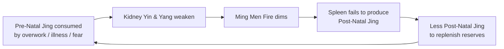

# Kidney (腎 — Shèn)

## Overview

The Kidney in Traditional Chinese Medicine is the **Root of Life** — the constitutional reservoir that all other organ systems ultimately draw from. Capitalized to distinguish it from its Western anatomical counterpart, the **Kidney** stores Pre-Natal [Jing (Essence)](Jing.md) inherited at conception, governs growth and reproduction, drives water metabolism, produces marrow that fills bones and brain, and seats **Zhi** (志, willpower). Kidney Yin is the mother of all bodily Yin; Kidney Yang is the source of all bodily Yang — every other organ's capacity to warm or cool borrows from the Kidney's reserves.

_Note: "Shen" here is the Kidney organ (腎); a different Chinese character with the same pinyin spelling refers to Spirit-Shen (神), covered in [Shen.md](Shen.md). See the [pinyin glossary](index.md#pinyin-disambiguation)._

This page covers the Kidney as a TCM organ system first, then turns to one of its most consequential clinical domains: the TCM view of aging, Jing depletion, and constitutional decline — a framework that reframes chronic fatigue, infertility, low back pain, premature gray hair, hearing loss, and existential fear as facets of one underlying process.

## Primary function

The Kidney's work is foundational rather than immediate. It operates at the deepest layer of the body's energetic economy.

### Storing Jing (Essence)

The Kidney stores both **Pre-Natal Jing** — the constitutional endowment inherited from one's parents — and the refined surplus of **Post-Natal Jing** distilled from food and breath by the Spleen and Lung. Pre-Natal Jing is finite, a trust fund spent by life itself and consumed faster by overwork, chronic illness, and prolonged fear; Post-Natal Jing is a checking account whose daily deposits slow the draw on the deeper reserve. The relationship is explored fully in [Jing.md](Jing.md). The Kidney's stewardship of Jing anchors the _Huangdi Neijing_'s 7-year (women) and 8-year (men) life cycles that track puberty, peak vitality, and constitutional decline.

### Governing water metabolism

The Kidney separates clear [JinYe (Body Fluids)](JinYe.md) from turbid waste. Clean fluid rises and recirculates; turbid fluid descends to the [Bladder](Bladder.md) as urine. Kidney Yang drives this separation; Kidney Yin is the moist substrate that keeps the process from drying out. When Yang falters, copious clear urine or edema follows; when Yin is depleted, urine becomes scanty and dark.

### Grasping Qi

The [Lung](Lung.md) governs inhalation and sends Qi downward; the Kidney **grasps** it and anchors it in the lower Dantian. When Kidney Yang or Jing is insufficient, Qi floats: breathlessness worse on exertion, unsatisfying inhalation, the sense that breath never quite reaches the lower abdomen. This Lung-Kidney coordination failure underlies many chronic asthmas in elderly or constitutionally depleted patients. See [ZangFu.md](ZangFu.md#common-combined-patterns).

### Housing the Zhi

Every Zang organ houses a specific aspect of the psyche (see [Shen.md](Shen.md)). The Kidney houses **Zhi** (志) — willpower and the determination to persist through difficulty. Abundant Jing means strong Zhi: focus, resilience, long-term resolve. Depleted Jing collapses Zhi: motivation evaporates and the person cannot hold to commitments. The associated emotion — **fear** — is both symptom and cause: acute terror scatters Kidney Qi; chronic anxiety consumes it slowly. See [QiQing.md](QiQing.md).

## Position in the wider system

| Aspect             | Kidney                                                          |
| ------------------ | --------------------------------------------------------------- |
| Wu Xing phase      | Water (see [WuXing.md](WuXing.md))                              |
| Paired Fu organ    | [Bladder](Bladder.md)                                           |
| Sensory opening    | Ears                                                            |
| Tissue             | Bones (and marrow, which fills the brain — the "Sea of Marrow") |
| Associated emotion | Fear — see [QiQing.md](QiQing.md)                               |
| Organ clock        | 5 PM – 7 PM — see [Jingmai.md](Jingmai.md)                      |
| Season             | Winter                                                          |
| Flavor             | Salty                                                           |

Surface pathway: the Kidney channel (足少陰腎經) runs from the sole of the foot up the inner leg and abdomen to the chest — which explains why foot-level acupoints (KD 1, KD 3) have such a wide systemic reach.

**The Liver-Kidney shared root.** TCM teaches that _"Liver and Kidney share the same root"_ (肝腎同源). The Kidney stores [Jing](Jing.md); the [Liver](Liver.md) stores [Xue (Blood)](Xue.md). These two substances inter-convert: sufficient Jing generates Blood, and sufficient Blood protects Jing from over-spend. Chronic Liver Blood deficiency drags down Kidney Jing; Kidney Yin deficiency fails to nourish Liver Yin, freeing Liver Yang to rise unanchored.

**The Heart-Kidney axis.** Heart is Fire; Kidney is Water. In health, Kidney Yin rises to cool the Heart and Heart Yang descends to warm the Kidneys — _xīn shèn xiāng jiāo_ (心腎相交). When Kidney Yin is too depleted to ascend, Heart Fire runs unchecked: insomnia, palpitations, night sweats, and anxiety that worsens after midnight. Explored from the Heart side in [Heart.md](Heart.md); synthesized at [ZangFu.md](ZangFu.md#the-heart-kidney-axis).

## Common patterns

These are the canonical Kidney pathologies a practitioner differentiates first. Deficiency patterns are the dominant theme; the Kidney rarely presents with excess.

### Kidney Yin deficiency

The cooling, moistening substrate is exhausted. Symptoms: low back ache, "five-palm heat" (heat in the palms, soles, and sternum), afternoon flushing, night sweats, scanty dark urine, tinnitus, dizziness, dry eyes, and a red tongue with little coating. Because Kidney Yin is the root of all Yin, downstream effects cascade to Liver (Yang rising) and Heart (Shen agitation, insomnia). See [YinYang.md](YinYang.md).

### Kidney Yang deficiency

The warming fire is insufficient — a "cold" deficiency at the body's deepest level. Symptoms: profound fatigue in the lower back and knees, cold extremities below the waist, copious clear urine, nocturia or incontinence, dawn diarrhea, low libido, and a pale swollen tongue with a wet white coat. Because Kidney Yang is the source of all bodily Yang, deficiency ripples upward through the Spleen and Heart as digestive weakness and collapsed drive. The underlying concept is **Ming Men Fire** (命門 — the constitutional spark between the kidneys).

### Kidney Essence depletion (Jing Xu)

The deepest deficiency pattern, presenting slowly: premature aging, infertility, early sexual dysfunction, premature graying, loose teeth, brittle bones, tinnitus, cognitive decline, and developmental delays in children. Because Jing produces Marrow — the substance filling the spinal cord and the brain — neurological symptoms are hallmarks of advanced depletion. Treatment is long-term by nature. See [Jing.md](Jing.md) for the full clinical picture.

### Kidney Qi not firm (Kidney Qi deficiency)

A milder, often early-stage pattern: Kidney Qi fails to hold and consolidate. Symptoms include urinary frequency or incontinence, premature ejaculation, excessive thin vaginal discharge, low back soreness improved by rest, and easy fatigue. Common in the young and in early aging, before the deeper Yin/Yang split emerges.

### Heart-Kidney axis failure

When Kidney Yin fails to communicate with the Heart, Heart Fire rises unchecked. Classic picture: insomnia, vivid disturbing dreams, palpitations, low-grade anxiety, and night sweats — with a red tongue and rapid fine pulse. Chronic overwork and late-night screen exposure are modern antecedents. Documented in [ZangFu.md](ZangFu.md#the-heart-kidney-axis).

### Kidney failing to grasp Qi

Kidney Yang or Jing cannot anchor Lung inhalation. Symptoms: chronic breathlessness worse on exertion, inhalation that never feels deep enough, low back weakness accompanying respiratory difficulty, pale tongue, and a deep weak pulse. Common in elderly patients and after prolonged illness. See [ZangFu.md](ZangFu.md#common-combined-patterns) and [Lung.md](Lung.md).

## The TCM view of aging and Jing depletion

Aging in TCM is not a mystery — it is the foreseeable result of a finite resource being spent. The Kidney's Pre-Natal Jing is the body's constitutional trust fund; the question is not whether it will eventually empty, but how quickly, and whether Post-Natal Jing deposits can slow the draw.

### Why the Kidney is "ground zero"

Where Western medicine frames aging as cellular senescence and cumulative oxidative damage, TCM frames it as the progressive depletion of Kidney Jing and the waning of Ming Men Fire. Every Western aging domain — hormonal decline, bone loss, cognitive sharpening, reproductive capacity, hearing — maps onto the Kidney-Jing trajectory. The _Suwen_ chapter 1 life-cycle model (7-year cycles for women, 8-year for men) is the classical formalization of this decline; see [Jing.md](Jing.md#the-physiological-cycle-of-jing).

The clinical implication: low back pain, infertility, chronic fatigue, tinnitus, and premature gray hair are not separate problems — they are facets of the Kidney's reserves running low. Addressing symptoms without the root is, in TCM terms, plugging leaks without bailing the boat.

### The cycle

**Phase 1 — The draw begins.** Chronic overwork, poor sleep, prolonged illness, and unresolved fear accelerate the spend rate of Pre-Natal Jing. Early signs are subtle: a low back that tires more easily, faint tinnitus, and a whisper of fatigue that sleep does not fully resolve.

**Phase 2 — Yin and Yang split.** As Jing dwindles, each person's constitution reveals its weaker side. A Yin-deficient person runs hot — afternoon flushing, night sweats, restless sleep. A Yang-deficient person runs cold — deep fatigue, cold knees, dawn diarrhea, low libido.

**Phase 3 — Ming Men dims.** As Kidney Yang weakens, the constitutional fire between the kidneys — Ming Men (命門) — loses intensity. It warms the Spleen for digestion and provides the motivational heat for Zhi. When it dims, digestion weakens, Post-Natal Jing production falls, and the body loses its main buffer against Pre-Natal depletion.

**Phase 4 — The closed loop.** Diminished Spleen output means less Post-Natal Jing reaches the Kidney storehouse. The draw accelerates. This is the self-reinforcing spiral of constitutional decline that TCM's longevity tradition (_Yang Sheng_) aims to interrupt as early as possible.

### Cross-organ consequences

Because the Kidney is the foundation, its decline propagates through every other organ via the [Wu Xing](WuXing.md) cycles.

**Kidney → Liver (Water fails to nourish Wood).** As Kidney Yin depletes, it fails to root Liver Yin. Liver Yang rises unanchored — dizziness, tinnitus, headaches, irritability, and hypertension patterns that worsen with fatigue. Kidney-Liver Yin deficiency is one of the most common combined patterns in middle age and beyond. See [Liver.md](Liver.md#liver-yin-deficiency) and the Liver-Kidney axis discussion above.

**Kidney → Heart (Water fails to cool Fire).** Depleted Kidney Yin cannot rise to cool the Heart. Insomnia deepens, anxiety becomes constitutional, and the [Shen](Shen.md) loses daytime clarity — brain fog, forgetfulness, disconnection. In advanced Jing depletion, cognitive decline is the end-stage of this axis failure. See [Heart.md](Heart.md#the-heart-kidney-axis).

**Kidney → Lung (Root fails to grasp the stem).** As Kidney Yang weakens, the grasping function fails and [Lung](Lung.md) Qi floats — shallow, unsatisfying breathing that worsens on exertion. [Qigong](Qigong.md) practices of deep abdominal breathing actively counter this failure by consciously driving inhalation to the lower Dantian.

**Zhi and existential fear.** As Jing depletes, Zhi weakens and **fear** intensifies — not a fear of a specific thing, but a generalized groundlessness, a loss of the sense that one can persist. Fear is both a symptom of Kidney depletion and, when chronic, an accelerant of it. See [QiQing.md](QiQing.md) for how emotions injure organ systems.

### Diagnosis: recognizing premature depletion

When infertility, deep low back pain, premature graying, early-onset hearing loss, and constitutional fatigue present together before the expected life-cycle stage, TCM reads this as a cluster — not coincidence. The [BaGang](BaGang.md) (Eight Principles) framework and [SiZhen](SiZhen.md) (Four Examinations) map which layer of deficiency dominates — Qi, Yin, Yang, or Jing — before treatment is designed.

## TCM treatment of aging and Jing depletion

Because Jing is the root, treatment focuses first on slowing depletion, then on replenishing reserves — from above (Post-Natal Jing via Spleen and Lung) and below (directly tonifying the Kidney storehouse). Results are measured in months and years, not sessions and weeks.

### Acupuncture

Key points for Kidney deficiency:

- **KD 3 (Taixi)** — Source point at the medial malleolus; tonifies Kidney Yin and Yang. The foundational point in virtually every Kidney protocol.
- **KD 1 (Yongquan)** — "Bubbling Spring" on the sole; grounds floating energy and calms existential fear.
- **Du 4 (Mingmen)** — Spine between the kidneys; rekindles Ming Men Fire. Moxibustion is frequently added for Yang deficiency.
- **Ren 4 (Guanyuan)** — Lower abdomen over the Dantian; fortifies Original Qi and Jing.
- **BL 23 (Shenshu)** — Back Shu of the Kidney; dorsal access point used in almost every Kidney protocol.

See [Acupuncture.md](Acupuncture.md) and [Jingmai.md](Jingmai.md) for technique and channel anatomy.

### Herbal medicine

Herbalism is often the primary choice for Jing depletion because tonifying herbs provide a physical substance to rebuild a physical deficit.

- **Liu Wei Di Huang Wan** (Six-Ingredient Rehmannia Pill) — The canonical Kidney Yin tonic. Nourishes Kidney and Liver Yin, gently clears Empty Heat. Used for afternoon flushing, night sweats, tinnitus, and low back ache. The foundational formula from which many variations derive.
- **Jin Gui Shen Qi Wan** (Kidney Qi Pill from the Golden Cabinet) — The canonical Kidney Yang tonic. Adds Aconite and Cinnamon to Liu Wei Di Huang Wan to rekindle Ming Men Fire. Used for the cold, fatigued, copious-clear-urine pattern.
- **Zuo Gui Wan** (Restore the Left Pill) — A heavier, deeper Yin and Jing tonic. Used when Jing deficiency dominates alongside Yin deficiency.
- **You Gui Wan** (Restore the Right Pill) — Yang-and-Jing counterpart to Zuo Gui Wan; for profound constitutional cold with reproductive decline.
- **Er Xian Tang** (Two Immortals Decoction) — For mixed Kidney Yin-and-Yang deficiency with Liver Yang rising — the menopausal pattern of hot flashes coexisting with fatigue and low back weakness.

See [Herbs.md](Herbs.md) for the materia medica framework.

### Lifestyle

Without reducing the rate of spend, no herb or needle can outpace the drain. Lifestyle is primary in Jing depletion.

- **Sleep before 11 PM.** Chronic late nights burn Jing faster than almost any other modern habit.
- **Qigong and Tai Chi.** Internal practices that cultivate and store Jing rather than spend it. Abdominal breathing exercises the Kidney's grasping function. See [Qigong.md](Qigong.md).
- **Dietary support.** Warm, cooked, nutrient-dense foods — bone broth, black beans, black sesame, walnuts, seafood — support Spleen function and optimize Post-Natal Jing production. See [Dietary.md](Dietary.md).
- **Moderate sexual activity.** A calibration, not a prohibition. Over-expenditure at any life stage accelerates depletion; the threshold lowers with age.
- **Address chronic fear and overwork.** Both burn Jing directly. [TuiNa.md](TuiNa.md) and practices that promote deep rest serve Kidney restoration.

### The holistic perspective

Aging in TCM is not a failure — it is a finite endowment moving through phases of life. The goal is not to reverse it but to traverse it with vitality. A person who conserves Jing wisely, nourishes Post-Natal Qi through digestion and breath, and maintains equanimity against chronic fear can remain sharp, mobile, and clear-minded well beyond the calendar's prediction. The Kidney is the anchor of this project — the deep reservoir whose health sets the ceiling for everything above it.
