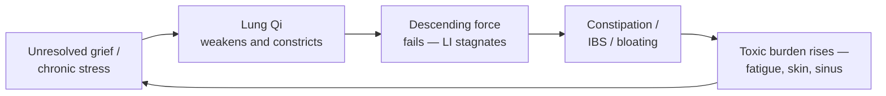

# Large Intestine (大腸 — Dà Cháng)

## Overview

The Large Intestine in Traditional Chinese Medicine is not simply the anatomical colon. Capitalized to mark the distinction, the **Large Intestine** is the body's great **Drainage** organ — the final Fu in the digestive sequence. It receives the turbid solid residue passed down by the [Small Intestine](SmallIntestine.md), reabsorbs the last usable water, and eliminates what the body no longer needs. Where most organs generate and circulate, the Large Intestine exists specifically to let go.

This document covers the Large Intestine as a TCM organ system first, then turns to one of its most persistent clinical challenges: constipation, IBS, and the "inability to let go" — a condition the Metal phase teaches us to read simultaneously on the physical and emotional planes. Unprocessed grief (the [Lung](Lung.md)'s emotion) and chronically held stress do not evaporate; they physicalize in the bowel as stagnation, dryness, or spasm.

## Primary function

The Large Intestine's central job is to **receive, transform, and transmit** — to take what the digestive process has finished with and expel it cleanly. When function is healthy, stools form easily, pass once daily without strain, and the body is free of the burden of its own waste. When function fails, one of two failure modes emerges: retention (constipation, bloating, stagnation) or excessive loss (diarrhea, prolapse, fluid depletion).

### Receiving turbid from the Small Intestine and forming waste

The [Small Intestine](SmallIntestine.md) sorts incoming food into pure and turbid streams: pure essence ascends to the [Spleen](Spleen.md) for [Qi](Qi.md) and [Xue](Xue.md) production; turbid liquid descends to the [Bladder](Bladder.md); turbid solid passes to the Large Intestine. Here, the residue is **compacted and formed** into stool, a process that requires adequate moisture, Qi propulsion, and warmth. If any of these three inputs fails, formation fails — and the pattern of failure determines the TCM diagnosis.

### Transmitting and transforming waste

The Large Intestine **moves the formed waste downward and outward** — a function TCM calls _chuán huà_ (transmit and transform). This is the organ's emotional signature as well as its physical one. Just as the [Lung](Lung.md) lets go of the exhaled breath, the Large Intestine lets go of physical residue. In the Metal-phase framework (see [WuXing.md](WuXing.md)), the ability to release — whether a breath, a grief, or a stool — is the defining virtue of the entire phase. Impairment of this transmitting function is the root pattern shared by most constipation, IBS, and bloating presentations in TCM.

### Generating fluids (absorbing water from waste)

The Large Intestine is an underappreciated player in [Jin Ye (body fluid)](JinYe.md) metabolism. It reabsorbs a significant portion of water from the residue it receives — this recovered fluid re-enters general circulation and supports the body's overall moisture. When the Large Intestine itself is fluid-deficient (or when Heat inside the organ scorches those fluids), the stool becomes dry and pellet-like, and passage requires straining. This mechanism explains why chronic illness, fever, aging, or heavy sweating can all produce the same constipation picture: each scenario depletes Jin Ye and leaves the bowel without adequate lubrication.

## Position in the wider system

| Aspect             | Large Intestine                                                  |
| ------------------ | ---------------------------------------------------------------- |
| Wu Xing phase      | Metal (see [WuXing.md](WuXing.md))                               |
| Paired Zang organ  | [Lung](Lung.md)                                                  |
| Sensory opening    | _(via paired [Lung](Lung.md) — nose)_                            |
| Tissue             | _(via Lung — skin and body hair)_                                |
| Associated emotion | Grief / sadness — theme: letting go (see [QiQing.md](QiQing.md)) |
| Organ clock        | 5 AM – 7 AM — see [Jingmai.md](Jingmai.md)                       |
| Season             | Autumn (via Lung)                                                |
| Flavor             | Pungent (via Lung)                                               |

Surface pathway: the Large Intestine channel runs from the index finger up the outer arm and shoulder, across the neck, to the side of the nose (LI 20, _Ying Xiang_). This explains why LI 4 (Hegu), located between thumb and index finger, can address both bowel function and facial-sinus conditions — the same channel links them.

**The Lung–Large Intestine axis.** This pairing is one of the most clinically consequential interior-exterior relationships in [Zang-Fu](ZangFu.md) medicine. The Lung descends Qi downward; without that descending force, the Large Intestine has no propulsion. Chronic Lung Qi deficiency is therefore a root cause of atonic constipation. Conversely, a bowel impacted with Heat generates rising turbid Qi that can worsen Lung symptoms — practitioners have long observed that chronic constipation correlates with skin problems, sinusitis, and susceptibility to respiratory infection, conditions rooted in the Metal organ pair. Grief (Bei, see [QiQing.md](QiQing.md)) consumes Lung Qi; depleted Lung Qi fails to descend; the Large Intestine stagnates. The entire letting-go arc — exhale the breath, release the grief, pass the stool — is Metal's single teaching on three levels.

## Common patterns

These patterns recur throughout clinical practice, both in bowel presentations and in the emotional-physical presentations they accompany.

### Damp-Heat in the Large Intestine

The most acute Large Intestine pattern. Pathogenic Heat and Damp combine in the lower jiao (see [BaGang.md](BaGang.md)) to produce inflammatory bowel symptoms: urgent diarrhea, burning sensations in the rectum, mucus or blood in the stool, foul odor, abdominal cramping, fever or sensation of heat, and dark scanty urine. Tongue coating is typically yellow and greasy; pulse is rapid and slippery. This corresponds broadly to acute dysentery, colitis flares, or bacterial gastroenteritis. Treatment: clear Heat, drain Damp, cool the blood. Formula: **Bai Tou Weng Tang** or **Ge Gen Qin Lian Tang**.

### Large Intestine fluid deficiency (dry constipation)

Insufficient [Jin Ye](JinYe.md) in the Large Intestine leaves the stool dry, hard, and difficult to pass. No urgency — the stool simply fails to form a lubricated bolus. Common in the elderly (declining Yin and fluid reserves), post-febrile illness (Heat burned the fluids), chronic overwork, or anyone who sweats heavily without replenishing fluids. Tongue is dry with thin or absent coating; pulse is thin and dry. Treatment: moisten the intestine, nourish Yin, generate fluids. Formula: **Ma Zi Ren Wan** (Hemp Seed Pill — the classical formula for this exact pattern, combining fatty seeds with Rhubarb to moisten and gently move) or **Run Chang Wan** for milder presentations.

### Large Intestine Qi stagnation (functional constipation, IBS)

Qi fails to move the bowel. The stool is not dry and the urge to defecate may be present, but the body cannot expel. Bloating, alternating constipation and diarrhea, passing gas with temporary relief, distension that worsens with emotional stress — this is the IBS picture. The root is usually [Liver](Liver.md) Qi stagnation spreading to the Large Intestine, or chronic stress/held emotion (grief, worry) paralyzing the organ's transmitting function. Pulse is wiry; tongue may show purple or dusky sides. Treatment: move Qi, course the Liver, relieve stagnation. Formula: **Si Ni San** base or combined formulas targeting Liver-Qi-invading-the-intestine.

### Cold-Damp in the Large Intestine (chronic diarrhea)

Cold (internal or external — see [LiuYin.md](LiuYin.md)) impairs the Large Intestine's transforming action. The stool becomes loose, watery, or contains undigested food; cramping is relieved by warmth and pressure; the abdomen feels cold to the touch. This pattern often overlaps with [Spleen](Spleen.md) Yang deficiency — when the Spleen fails to warm and transform, both the small and large intestines suffer. Tongue is pale with a white wet coating; pulse is deep and slow. Treatment: warm the interior, dry Damp, fortify Spleen Yang.

### Heat bound in the Large Intestine (acute constipation, fever)

Excess Yang or febrile disease generates intense interior Heat that dries the stool and immobilizes it completely. Abdominal fullness and pain, constipation for days, high fever or tidal fever in the afternoon, irritability or even delirium in severe cases, a dry yellow or black tongue coat. This is the pattern of classical "Yang Ming bowel excess" — the organ is bound. Treatment: purge downward, clear Heat, break the binding. Formula: **Da Cheng Qi Tang** (Major Order the Qi Decoction — rhubarb, magnolia bark, unripe bitter orange, mirabilitum), one of the most powerful purging formulas in the classical canon. Used only for excess presentations; contraindicated in deficiency patterns or pregnancy.

### Spleen Qi deficiency with Large Intestine prolapse

Chronic Spleen Qi deficiency (see [Spleen.md](Spleen.md)) allows the Middle Qi to sink. The descending and holding functions both fail: the bowel becomes lax, stools are loose or poorly formed, and in more advanced cases the rectum itself prolapses. Hemorrhoids from chronic straining or bearing-down, a dragging rectal sensation after stool, fatigue, and a pale swollen tongue are characteristic. Treatment: raise Spleen Qi, hold what is sinking. Formula: **Bu Zhong Yi Qi Tang** (Tonify the Middle and Augment Qi Decoction — the classical raising formula containing Huang Qi, Ren Shen, Chai Hu, and Sheng Ma) lifts and holds the prolapsed tissue.

## The TCM view of constipation, IBS, and the "inability to let go"

Of all Large Intestine presentations, the cluster of chronic constipation, IBS, and the held-and-rigid bowel is the one that most clearly expresses the Metal-phase pathology. Western medicine frames these as motility disorders, gut-brain axis dysfunction, or microbiome disruption. TCM frames them as the body's literal enactment of what the mind and spirit cannot release — and treats both levels simultaneously.

### Why the Large Intestine is "ground zero"

Metal governs boundaries, structure, and the wisdom to know what must be kept versus what must be let go. The Lung (exhale) and Large Intestine (defecation) are its two great organs of release. When grief is not grieved, when stress is chronically held, when the emotion of loss goes unprocessed — Metal cannot perform its releasing function at any level. Practitioners observe this clinically: patients with long histories of held grief or emotional suppression disproportionately present with bowel dysfunction. The bowel is not the cause of the emotion, nor the emotion the cause of the bowel problem; they arise together from the same root blockage of the Metal phase's releasing capacity.

### The cycle

**The grief-to-bowel link.** Grief (Bei) is the emotion of Metal. The [Neijing](QiQing.md) states that grief dissolves and consumes Qi — specifically Lung Qi. When Lung Qi is repeatedly depleted by unresolved loss, its descending action weakens. The Large Intestine loses the propulsive force that Lung Qi normally provides from above. Peristalsis becomes sluggish; stools compact; the bowel stagnates. The patient experiences this as constipation, but the root is upstream — in the chest and in what went unprocessed emotionally.

**The stress-to-IBS link.** Chronic life stress and emotional suppression create [Liver](Liver.md) Qi stagnation — the Wood organ pressing on the Earth and Metal below it. The irregular, cramping, alternating-constipation-and-diarrhea pattern of IBS maps almost perfectly onto Liver Qi invading the Spleen and Large Intestine: the bowel oscillates between stagnation (Qi bound, no movement) and sudden release (Qi forces through suddenly), never settling into a rhythmic daily function. The emotional holding and releasing pattern mirrors the physical one.

### Cross-organ consequences

Because [Zang-Fu](ZangFu.md) medicine is relational, a stagnant Large Intestine cascades outward.

**Lung → Large Intestine.** The most direct relationship. Chronic Lung Qi deficiency (from grief, from respiratory illness, from shallow breathing — see [Lung.md](Lung.md)) removes the descending propulsion the Large Intestine relies on. This is atonic constipation at its root. Practitioners who address the Lung and the grief alongside the bowel see sustained resolution; those who only treat the bowel see recurrence.

**Liver → Large Intestine.** [Liver](Liver.md) Qi stagnation, whether from suppressed anger, chronic stress, or frustrated life-direction, invades the Large Intestine and creates spasmodic constipation or IBS. The Liver is supposed to ensure smooth flow; when it knots, everything it influences — including bowel peristalsis — knots with it. Treating the Liver (smoothing Qi, resolving emotional stagnation) is frequently the only way to permanently resolve the IBS pattern.

**Spleen → Large Intestine.** The [Spleen](Spleen.md) generates [Jin Ye](JinYe.md) and propels Middle Qi upward. When Spleen Qi is weak, fluid production slows and the Large Intestine becomes insufficiently moistened; when Spleen Yang is deficient, the entire digestive system loses warmth and Cold-Damp accumulates. Both routes produce bowel dysfunction — dryness from one root, loose stools or prolapse from the other.

**Kidney → Large Intestine.** The [Kidney](Kidney.md) governs the two lower orifices (urethra and anus) and provides the constitutional fluids and warmth that the entire lower jiao depends on. Kidney Yin deficiency starves the bowel of moisture in chronic deficiency patterns (especially elderly constipation and post-menopausal dryness); Kidney Yang deficiency removes the warmth that sustains peristalsis, producing early-morning ("cock-crow") diarrhea and chronically cold abdominal presentations.

### The chronic-holding cycle

When the Large Intestine retains waste beyond its natural transit time, toxins — what TCM calls _fu qi_ (turbid Qi) — rise upward through the system. The practitioner observes this in the skin (acne, eczema, dull complexion), the lungs (susceptibility to respiratory infections — the Metal pair reverberating), the sinuses, and in the patient's mental clarity. There is a downstream toxicity of non-elimination that TCM recognized long before Western medicine's gut-brain axis research: the bowel that cannot let go makes the whole person feel held, burdened, and unable to move forward. This circularity — emotional holding → bowel holding → systemic burden → reinforced emotional heaviness → more holding — is the chronic constipation cycle in its Metal-phase fullness.

## TCM treatment of constipation, IBS, and the "letting go" pattern

Treatment must match the pattern. Moistening fluids into a Heat-bound bowel does nothing; purging a fluid-deficient elderly patient causes harm. The first task is always differential diagnosis.

### Acupuncture

Key acupoints for Large Intestine and bowel regulation:

| Point                  | Location                                | Key action                                                                                  |
| ---------------------- | --------------------------------------- | ------------------------------------------------------------------------------------------- |
| **LI 4 (Hegu)**        | Dorsum of hand, between metacarpals 1-2 | Source point; moves Qi throughout the LI channel; regulates bowel, clears Heat              |
| **LI 11 (Quchi)**      | Lateral elbow crease                    | Clears Heat and Damp-Heat from the Large Intestine; used in acute diarrhea and skin         |
| **ST 25 (Tianshu)**    | 2 cun lateral to the navel              | Front-mu of Large Intestine; regulates bowel in both directions (constipation and diarrhea) |
| **ST 37 (Shangjuxu)**  | Lower leg, below ST 36                  | Lower he-sea point of Large Intestine; the most direct point for any LI disorder            |
| **BL 25 (Dachangshu)** | Back-shu of Large Intestine             | Back-shu; pairs with ST 25 as the front-back mu-shu combination for strong LI effect        |
| **LU 7 (Lieque)**      | Radial wrist                            | Connects to Lung-LI axis; descends Lung Qi to support LI propulsion                         |

For the emotional-holding dimension: **LU 7** (Lung Luo-connecting point, grief and release), **PC 6** (calms the chest, resolves emotional constriction), **HT 7 Shen Men** (grounds an agitated or grieving Shen), and **LV 3 Taichong** (smooths Liver Qi when Qi stagnation is driving the IBS pattern). See [Acupuncture.md](Acupuncture.md) for point location and needling guidance.

### Herbal medicine

Formula selection is entirely pattern-dependent:

- **Ma Zi Ren Wan** (Hemp Seed Pill) — the canonical formula for fluid-deficient constipation. Moistens the intestine, gently downbears, suitable for elderly or post-illness patients. Safe enough for long-term use.
- **Da Cheng Qi Tang** (Major Order the Qi Decoction) — the powerful purging formula for Heat-bound excess constipation. Clears Yang Ming excess, breaks the binding, drains Heat. Reserved for robust excess presentations; not for the deficient.
- **Run Chang Wan** (Moisten the Intestines Pill) — a gentler moistening formula for mild-to-moderate dry constipation; broader use than Da Cheng Qi Tang.
- **Bai Tou Weng Tang** (Pulsatilla Decoction) — for Damp-Heat dysentery with blood and mucus in the stool; strongly clears Heat-toxin and cools Blood in the intestines.
- **Bu Zhong Yi Qi Tang** (Tonify the Middle and Augment Qi Decoction) — for Spleen-deficient sinking patterns with prolapse and atonic bowel; lifts the Middle Qi rather than purging.

See [Herbs.md](Herbs.md) for detailed materia medica. Classical formulas should not be self-prescribed; matching the formula to the precise pattern is central to efficacy and safety.

### Lifestyle

- **Fiber and fluids first.** Chronic constipation in TCM always begins with "are the basic Jin Ye inputs adequate?" — see [Dietary.md](Dietary.md). Warm cooked foods, adequate water, fiber from vegetables and seeds (sesame, hemp, flax), and reducing drying foods (caffeine, alcohol, raw cold foods) constitute the foundation.
- **The 5–7 AM window.** The Large Intestine's organ-clock peak falls between 5 and 7 AM. Waking at a consistent time and sitting on the toilet within this window (even without urgency) trains the organ in its natural rhythm. See [Jingmai.md](Jingmai.md) for the full organ-clock framework.
- **Movement to move Qi.** [Qigong.md](Qigong.md) and [TuiNa.md](TuiNa.md) abdominal massage (clockwise, following bowel direction) both stimulate Qi circulation in the lower jiao. Sedentary modern life is a major driver of Qi stagnation constipation.
- **Grief as medicine.** For patients whose bowel dysfunction correlates clearly with emotional holding, naming and processing grief is not ancillary — it is treatment. A TCM physician may recommend journaling, appropriate emotional expression, or bodywork that supports the Metal-phase releasing cycle alongside acupuncture and herbs.
- **Avoid prolonged cold.** Cold foods, cold environments, and excessive consumption of raw food burden the Spleen and Large Intestine's warming function, generating Cold-Damp and slowing transit.

### The holistic perspective

From a TCM standpoint, a patient with chronic constipation or IBS is not simply experiencing a motility disorder or a microbiome imbalance, though both may be present. They are experiencing a failure of the Metal phase's fundamental intelligence: the ability to distinguish what is nourishing from what is finished, hold on to the first, and release the second. When that intelligence fails — in the lungs that cannot fully exhale, in the psyche that cannot process a loss, in the bowel that cannot eliminate — the treatment is the same at every level: restore the flow, moisten what is dry, warm what is cold, move what is stuck, and teach the system — body and spirit together — that it is safe to let go.
