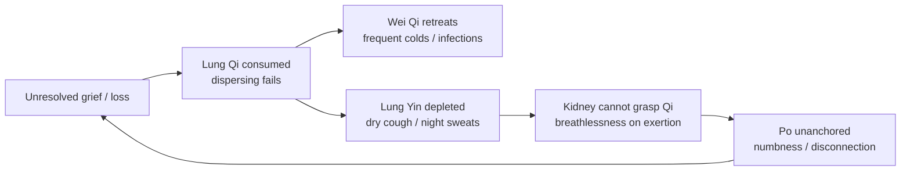

# Lung (肺 - Fèi)

## Overview

The Lung in Traditional Chinese Medicine is not limited to gas exchange. Capitalized to mark the distinction from its anatomical counterpart, the **Lung** is the **Prime Minister**, second only to the [Heart](Heart.md) in the imperial metaphor of the body. It governs the body's primary interface with the outside world. It controls respiration, generates **Wei Qi (衛氣, Defensive Qi)** in partnership with the [Spleen](Spleen.md), rules the skin and body hair as the outermost boundary, and houses the **Po (魄, Corporeal Soul)**.

The Lung as a TCM organ system is explored first, followed by the relationship between grief, unresolved loss, and chronic respiratory illness. Where Western medicine frames asthma and recurrent colds as physiological dysfunction, TCM frames them as the body's record of emotion. Grief that was never fully released inhabits the Lung, the organ whose entire purpose is to release it.

## Primary Function

The Lung's central role is governing the body's Qi and respiration. All [Qi](Qi.md) passes through the Lung; every inhale draws in fresh Qi from heaven, every exhale releases the spent. When the Lung functions well:

- The breath is full, even, and unhurried.
- Wei Qi holds the pores closed against Wind and cold; the immune surface is intact.
- Qi and fluids descend smoothly to the [Kidney](Kidney.md), which grasps and stores them.

When the Lung fails, the consequences spread upward (cough, wheeze, stuffy nose) and downward (edema, Kidney's inability to grasp Qi, chronic asthma on exertion).

### Governing Qi and Respiration

The Lung is the master of **Zong Qi (宗氣, Gathering Qi)**, the Qi formed by combining inhaled air with the Food Qi (_Gu Qi_) sent upward by the [Spleen](Spleen.md). Zong Qi gathers in the chest (the "Sea of Qi") and governs both respiration and the heartbeat's rhythm. This is why Lung dysfunction and Heart dysfunction often present together; they share the same energetic workspace. The [Heart](Heart.md) governs Blood; the Lung governs Qi; Qi moves Blood, and Blood carries Qi. Their cooperation in the chest is the engine of circulation.

### Dispersing and Descending

The Lung's Qi moves in two complementary directions simultaneously:

- **Dispersing (宣發, xuān fā):** Lung Qi spreads outward and upward, distributing Wei Qi to the skin, moistening the body surface, opening and closing the pores. Failure of dispersing = exterior weakness, spontaneous sweating, frequent colds, nasal congestion.
- **Descending (肅降, sù jiàng):** Lung Qi sends Qi and Body Fluids ([JinYe](JinYe.md)) downward to the [Kidney](Kidney.md) and Bladder. Failure of descending = Qi rebels upward, producing cough, wheezing, and fluid accumulation in the upper body.

These two functions are inseparable. Classical texts describe the Lung as the "canopy" of the organs, occupying the highest position in the body. From there it both spreads protection outward and sends nourishment downward.

### Housing the Po

Every Zang organ houses a specific aspect of the psyche (see [Shen.md](Shen.md)). The Lung houses the **Po (魄, Corporeal Soul)**, the most body-bound of the five spirits. The Po governs:

- Bodily sensation, instinct, and automatic physical responses
- The visceral, pre-cognitive "animal" awareness, including the feeling of aliveness in the body
- The somatic imprint of emotion, where grief, shock, and trauma register physically before the mind has words for them

The Po is mortal: it lives in the body and returns to earth at death, unlike the [Liver](Liver.md)'s Hun (Ethereal Soul), which can survive the body. When the Lung is depleted or congested by unresolved grief, the Po becomes unanchored. The person loses sensory pleasure, feels disconnected from their physical self, and experiences a kind of deadness or numbness that is distinct from mere sadness.

## Position in the Wider System

| Aspect             | Lung                                                                     |
| ------------------ | ------------------------------------------------------------------------ |
| Wu Xing phase      | Metal (see [WuXing.md](WuXing.md))                                       |
| Paired Fu organ    | [Large Intestine](LargeIntestine.md)                                     |
| Sensory opening    | Nose                                                                     |
| Tissue             | Skin and body hair                                                       |
| Associated emotion | Grief / sadness (see [QiQing.md](QiQing.md))                             |
| Organ clock        | 3 AM – 5 AM (Large Intestine: 5 AM – 7 AM); see [Jingmai.md](Jingmai.md) |
| Season             | Autumn                                                                   |
| Flavor             | Pungent                                                                  |
| Housed spirit      | Po (魄, Corporeal Soul)                                                  |

**The Lung-Kidney axis.** A foundational teaching in TCM: the Lung sends Qi down; the Kidney grasps and holds it. Healthy breathing requires both organs. In chronic asthma or in the elderly, Kidney Yang or Jing has often faltered, so Qi floats upward and cannot be anchored (a pattern called "Lung-Kidney failing to grasp Qi," described in [ZangFu.md](ZangFu.md)). The Lung is the "mother" of the Kidney in one clinical interpretation; Metal (Lung) generates Water (Kidney) in the [Wu Xing](WuXing.md) generating cycle.

**The Spleen-Lung phlegm axis.** The [Spleen](Spleen.md) is the source of Phlegm production; the Lung is where Phlegm is stored. When Spleen Qi fails to metabolize [JinYe (Body Fluids)](JinYe.md), Damp congeals into Phlegm, which rises into the Lung and obstructs its function. The classical phrase: _"the Spleen is the source of Phlegm; the Lung is the vessel that holds it."_ Treating chronic Phlegm in the Lung always requires strengthening the Spleen simultaneously.

## Common Patterns

These patterns represent the core Lung pathologies a practitioner screens for first. They are not limited to respiratory complaints; the Lung's reach extends to the skin, the emotional terrain of grief, and immunity.

### Lung Qi Deficiency

The most common Lung pattern. Insufficient Qi to disperse Wei Qi and hold the pores. Signs: weak or soft voice, spontaneous daytime sweating (pores uncontrolled), frequent colds and susceptibility to Wind, shortness of breath on mild exertion, fatigue, pale tongue with thin white coat. Chronic grief is a primary cause; so is prolonged illness, overwork, or constitutional weakness.

### Lung Yin Deficiency

The Lung's cooling, moistening substance is exhausted. Signs: dry unproductive cough, dry sore throat especially in the evening, hoarse voice, night sweats, red-edged tongue with little or no coating. Typical after chronic smoking, prolonged exposure to Dryness, or febrile illness that burned fluids. The Lung is described as the "tender organ" (娇脏, jiāo zàng): it is the only Zang organ directly exposed to the outside world via the nose, making it uniquely vulnerable to both Heat and Dryness depleting its Yin.

### Phlegm in the Lung

Phlegm patterns are stratified by nature and by temperature:

- **Cold-Phlegm / Damp-Phlegm:** Abundant white or clear sputum, easy expectoration, stuffy chest, worse in cold damp weather. Tongue: white greasy coat. Root in Spleen Yang deficiency.
- **Phlegm-Heat (Hot Phlegm):** Thick yellow or green sputum, cough with fever, thirst, red tongue with yellow greasy coat. Often an acute stage or a Cold-Phlegm pattern that has transformed with Heat.

### Wind Invasion - Exterior Attack

The Lung's surface exposure makes Wind the most common invader. Both present as acute onset (see [LiuYin.md](LiuYin.md) for the external pathogen framework):

- **Wind-Cold:** Sudden chills more than fever, absence of sweating, occipital stiffness, watery nasal discharge, tight floating pulse.
- **Wind-Heat:** Fever more than chills, sore throat, slightly yellow nasal discharge, floating rapid pulse.

Both resolve at the Lung-surface level if treated promptly; if they penetrate deeper, they can transform into Heat patterns or injure Lung Yin.

### Dryness Invading the Lung

Autumn's dominant pathogen matches the Lung's vulnerability. Dryness, often arriving with cold or heat depending on the season, attacks the Lung's moisture. Signs: dry cough with scanty or no sputum, dry nose and throat, dry cracked lips, thirst. Distinct from Lung Yin deficiency in that it is externally caused and shorter in duration.

## The TCM View of Grief and Chronic Respiratory Illness

Whether the precipitating loss is a death, a divorce, a severance from identity, or a prolonged accumulation of smaller griefs, TCM tracks the path from emotion to physiology with unusual precision. The Lung is the body's organ of release; the exhale is its defining act. Unresolved grief is precisely what happens when release fails.

### Why the Lung Is "Ground Zero"

Grief (悲, bēi) is the emotion of the Lung. In the [Seven Emotions framework](QiQing.md), grief actively depletes Qi through consumption and dissolution. Acute grief produces the signature: a tight constricted chest, involuntary sighing (a semi-automatic attempt to move Qi that has become stuck), shallow breathing, and an overwhelming heaviness. This is not metaphor; it is TCM physiology. The Lung's dispersing function collapses inward; the pores close; Wei Qi retreats from the surface. The body becomes vulnerable.

Prolonged grief, whether unfelt, bypassed, or simply never given enough space, does not dissolve on its own. It settles in the Lung, where it continues to consume Qi and, over time, depletes Lung Yin. The clinical picture shifts from acute to chronic: recurrent colds, a cough that never quite resolves, shallow habitual breathing, and eventually asthma or other chronic respiratory illness.

### The cycle

#### Phase 1: The Stuck Exhale

Fresh grief produces a physiological holding pattern: the chest locks, breathing becomes shallow, and the person literally cannot "let go." Wei Qi pulls back from the surface as the body goes inward. This is the window when a cold "going around" will land hardest on the grieving person.

#### Phase 2: Depletion Sets In

If the grief is processed (wept fully, spoken aloud, moved through the body), Lung Qi recovers. If it is suppressed or simply outlasts the person's resources, Qi deficiency becomes the baseline. The voice softens, the posture rounds, and every respiratory infection goes deeper and takes longer to resolve.

#### Phase 3: Yin Burns Off

Qi deficiency eventually depletes the Yin that supports it. The dry unproductive cough at night, the throat that is always slightly raw, the wasting quality that appears in long-term illness mark the transition from Qi deficiency to Yin deficiency. The 3–5 AM Organ Clock window (the Lung's peak hour) begins producing pre-dawn coughing fits or wakefulness.

### Cross-Organ Consequences

Because [Wu Xing](WuXing.md) cycles propagate dysfunction, a compromised Lung touches every other organ system.

**Lung → Kidney (Metal generates Water).** The Lung sends Qi downward for the Kidney to grasp. As chronic grief depletes Lung Qi, less Qi arrives at the Kidney. The Kidney's grasping function weakens; inhalation becomes unsatisfying in a specific way: the patient breathes in but the breath doesn't reach. This is the pattern in chronic asthma with a constitutional root: not just bronchial hypersensitivity but a Kidney failure to hold the inhale. Clinically, these patients describe breathlessness worse on exertion, better at rest, with a low-back ache and cold feet.

**Lung → Large Intestine (Metal Pairing - Letting Go)** The [Large Intestine](LargeIntestine.md) and Lung share the Metal phase and the theme of release. Chronic grief that stagnates the Lung's dispersing function often simultaneously disrupts the Large Intestine's elimination. Constipation (inability to release) in a person with known unresolved grief is a Lung-Large Intestine pattern, not merely a dietary problem. The "letting go" axis runs both directions: working to restore bowel regularity sometimes softens Lung grief simultaneously.

**Spleen → Lung (Earth Generates Metal).** The [Spleen](Spleen.md) is the "mother" of the Lung in the generating cycle. When Spleen Qi is weakened by prolonged pensiveness, poor diet, or damp climate, it fails to send sufficient Food Qi upward to the Lung and produces pathological Phlegm that congests the Lung. Many post-grief patients develop this combined Spleen-Lung deficiency: they stop eating well, digestion becomes sluggish, and Phlegm builds in the chest, compounding the respiratory vulnerability.

**Lung → Liver (Metal controls Wood).** The Lung controls the [Liver](Liver.md) through the controlling cycle, wherein Metal restrains Wood. A depleted Lung fails in this restraining function; Liver Qi can then become unruly, rising unchecked. The clinical picture shows chronic grief combined with irritability, rib-side tension, and sighing, indicating that the Lung is so depleted it can no longer hold the Liver's Wood energy in check.

### The Chronic Griever's Pattern

Years of unprocessed loss accumulate a recognizable picture: pale sunken complexion; a voice that softens and breaks; posture that collapses the chest; a low-grade cough every autumn; a heaviness the patient often cannot name as grief. The Po is present but muted; sensory experience has dimmed, pleasure in the body has retreated. Many of these patients say they cried at the time and thought they were finished.

TCM recognizes that grief has a time-course the surrounding culture rarely allows. The Lung's Autumn correspondence (the season when things fall) is the most natural window for grief to surface and move. Working with grief in Autumn, felt fully and supported by Lung Qigong and appropriate herbs, often produces significant respiratory improvement even from patterns years in the making.

## TCM Treatment of Grief and Chronic Respiratory Illness

Because the Lung is both the organ depleted by grief and the medium through which release happens, treatment protocols work simultaneously to restore Lung Qi, clear accumulated Phlegm, and create the conditions for the Po to become present again.

### Acupuncture

Key points in a Lung-grief protocol (see [Acupuncture.md](Acupuncture.md) for point-location conventions):

- **LU 1 (Zhongfu)** - Front-Mu point; releases chest constraint. Often exquisitely tender in grief; held gently, it can trigger the somatic release the patient has been unable to reach.
- **LU 7 (Lieque)** - Luo-connecting point; opens the chest, benefits the nose and throat, releases exterior Wind.
- **LU 9 (Taiyuan)** - Source point; primary tonic for Lung Qi and Yin deficiency.
- **BL 13 (Feishu)** - Back-Shu of the Lung; nourishes the organ directly; often paired with LU 1 front-back.
- **LI 4 (Hegu)** - Source point of the Large Intestine; releases the exterior and supports the Metal "letting go" axis.
- **PC 6 (Neiguan)** - Opens the chest, calms the Shen; addresses chest-tightness and grief-carried palpitations.
- **KD 3 (Taixi)** - Source point of the Kidney; tonifies Yin and the grasping function; essential in Lung-Kidney axis patterns.

### Herbal Medicine

Different formulas target different stages of the Lung-grief trajectory:

- **Yu Ping Feng San** (Jade Windscreen Powder) - the classic Wei Qi tonic. Strengthens Lung Qi and the exterior defense; used for frequent colds, spontaneous sweating, and recurrent respiratory infections from Lung Qi deficiency. Prevention-focused, not acute-treatment.
- **Bai He Gu Jin Tang** (Lily Bulb to Consolidate the Metal) - the primary formula for Lung Yin deficiency. Nourishes Lung and Kidney Yin, moistens the throat, stops the dry nonproductive cough. Named for the lily bulb (_bai he_) that consolidates Metal-Lung. Classical for the chronic dry cough of grief-depleted Yin.
- **Qing Zao Jiu Fei Tang** (Eliminate Dryness and Rescue the Lung Decoction) - for externally contracted Dryness with intense Yin injury: parched throat, dry cough with scanty sputum, fever, red tongue with dry coat.
- **Ma Huang Tang** (Ephedra Decoction) - the strong exterior-releasing formula for Wind-Cold with no sweating; acute, not for deficient patients.
- **Sang Ju Yin** (Mulberry Leaf and Chrysanthemum Drink) - lighter exterior-releasing formula for Wind-Heat with sore throat and mild cough; the everyday Wind-Heat formula.

See [Herbs.md](Herbs.md) for the classical herbal framework.

### Lifestyle

Recovery from a Lung-grief pattern is not solely a clinical matter. The Lung requires active participation in the release it exists to perform:

- **Breathwork.** The single most direct Lung intervention. Slow diaphragmatic breathing, extended exhales, and grief-releasing practices such as sighing deliberately and fully (not suppressing but completing them) directly restore Lung Qi movement. The extended exhale is the Lung's defining act of letting go. See [Qigong.md](Qigong.md) for formal practice.
- **Qigong's Lung-specific forms.** The Six Healing Sounds system (六字訣, liù zì jué) includes the Lung sound (pronounced _sss_) specifically to release and nourish the Lung. Autumn is the traditional season for Lung Qigong practice. Expanding the chest in standing postures physically counters the collapse of chronic grief.
- **Seasonal alignment.** Autumn is the Lung's season. Using Autumn as the intentional time to sit with loss (perhaps in nature, watching things fall) aligns personal process with the larger rhythmic support the season offers.
- **Dietary support.** White and pungent foods nourish the Lung in the Wu Xing flavor scheme: daikon radish, pears (especially for Lung Yin dryness), white fungus (tremella), almonds, lily bulb, and ginger (warm-pungent for dispersing). Dairy and cold raw foods can increase Phlegm and are typically reduced. See [Dietary.md](Dietary.md).
- **Protecting the exterior.** Patients with Lung Qi deficiency must guard against Wind exposure by covering the back of the neck in windy or cold weather and dressing in layers in autumn. This is not superstition; it is recognition that a weakened Wei Qi surface makes Wind invasion almost inevitable.

### The Holistic Perspective

From a TCM standpoint, a person suffering from chronic respiratory illness is not merely dealing with bronchial hyperreactivity or impaired mucus clearance. They may be living in a body that has accumulated the physical record of grief that was never fully exhaled. The Lung is the organ of release: of breath, of skin-surface exchange, of the Po's direct encounter with being alive. Treating it means creating the conditions for release to happen: through needles that open the chest and restore Qi flow, through formulas that moisten what grief has dried out, through movement that teaches the body again how to let go. When the Lung is restored, patients frequently report not just easier breathing but a sense of lightness they hadn't realized they were missing.
