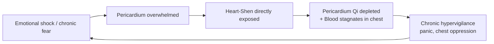

# Pericardium (心包 - Xīn Bāo)

## Overview

The **Pericardium**, _Xīn Bāo_ (心包), literally "Heart Wrapper," is the [Heart](Heart.md)'s devoted protector. Where every other Zang organ governs its own domain, the Pericardium exists specifically to serve the Emperor: it is the outer shell, the buffer, the first line of defense so that the Heart (and the [Shen](Shen.md) it houses) is never directly struck by emotional shock or pathogenic invasion.

This document covers the Pericardium as a TCM organ system first, then turns to one of its most clinically important applications: the TCM framing of emotional trauma, panic attacks, and chest oppression. Western medicine maps these experiences onto the amygdala, HPA axis, and autonomic nervous system; TCM maps them onto the Pericardium, whose function is to absorb the shocks that the Heart must not bear alone.

## Primary function

The Pericardium's central charge is **protection**: to buffer the Emperor against every force (physical, energetic, or emotional) that might destabilize the Shen. When the Pericardium functions well, the Heart remains calm regardless of external turbulence. When the Pericardium is overwhelmed, what reaches the Heart reaches the Shen, and the kingdom falls into chaos.

### Protecting the Heart and its Shen

The _Huangdi Neijing_ places the Pericardium in the role of the Heart's outer fortress. Classical literature uses the term _xīn bāo luò_ (心包絡), meaning the network of wrappings around the Heart. The foundational teaching: **pathogens attacking the Heart are intercepted by the Pericardium first**. The wen bing (溫病, warm-disease) school systematized this doctrine: febrile illnesses that progress to delirium, coma, or convulsions are diagnosed as Heat invading the Pericardium, not the Heart itself, because the Pericardium is the actual gate. The Emperor is protected by his chamberlain absorbing the blow.

Emotionally, this translates directly. Sudden shock, overwhelming grief, acute panic, prolonged fear, or traumatic events strike the Pericardium before they reach the Heart. A strong Pericardium absorbs and metabolizes the impact; a depleted or overwhelmed Pericardium fails to buffer, and the Heart-Shen is directly destabilized. This is why [PC 6 (Neiguan)](Acupuncture.md) is among the most used acupoints in all of clinical TCM. It opens the Pericardium's channel and restores the buffer.

### Circulating the Heart's commands

The Pericardium does not merely defend passively. As the Heart's outer envelope, it participates in the distribution of Heart-[Qi](Qi.md) and Heart-[Xue (Blood)](Xue.md) outward to the chest and vessels. The Pericardium channel (_Jue Yin_ hand channel) runs from the chest down the middle of the inner arm to the middle finger, and its points are frequently used to regulate chest Qi, calm palpitations, and open the chest when oppression signals that the heart's outward circulation is impeded. Smooth circulation of the Heart's commands (through the vessels, through consciousness, through emotion) depends on the Pericardium keeping the envelope intact and permeable in the right direction.

## Position in the wider system

| Aspect             | Pericardium                                                   |
| ------------------ | ------------------------------------------------------------- |
| Wu Xing phase      | Fire (minister fire) - see [WuXing.md](WuXing.md)             |
| Paired Fu organ    | [San Jiao (Triple Burner)](SanJiao.md)                        |
| Sensory opening    | _(via the [Heart](Heart.md) it shields)_                      |
| Tissue             | _(via the Heart - vessels)_                                   |
| Associated emotion | _(via the Heart - joy/agitation; see [QiQing.md](QiQing.md))_ |
| Organ clock        | 7 PM – 9 PM - see [Jingmai.md](Jingmai.md)                    |
| Season             | _(no independent seasonal correspondence)_                    |
| Flavor             | _(via the Heart - bitter)_                                    |

**Minister fire and the Pericardium–San Jiao axis.** The Heart holds _sovereign fire_ (jūn huǒ), the imperial warmth at the center of the system. The Pericardium and its paired Fu organ, the [San Jiao](SanJiao.md), together hold _minister fire_ (xiāng huǒ), the administrative warmth that circulates the Emperor's vitality to the periphery. The minister fire carries the Heat of life to the three body cavities (Upper, Middle, Lower Burner), warms the organs, and assists [Kidney](Kidney.md) Yang in its functions from below. Minister fire becomes pathologically hyperactive when it arises from chronic emotional turbulence, wen bing Heat invasion, or Yin deficiency failing to contain it. When this occurs, it agitates the Pericardium and scorches upward toward the Heart.

**A peculiar member of the 12.** Classical texts reveal an old debate. The _Nan Jing_ periodically treats the Pericardium not as a fully independent Zang but as an extension of the Heart: an outermost wrapping rather than a separate organ with its own spirit and constitution. Modern TCM has settled this pragmatically: the Pericardium is counted among the 12 organ systems (completing the symmetry of the [Jingmai](Jingmai.md) channel network alongside the San Jiao), it is treated in clinical practice as a functional unit, and its channel carries its own points with distinct therapeutic actions. But it has no independent spirit (no hun, po, yi, or zhi of its own) and no independent seasonal correspondence. Its identity is inseparable from the Heart it serves. See the [ZangFu](ZangFu.md) overview for the 5-vs-6 Zang reconciliation.

## Common patterns

Although the Pericardium shares much of its pattern repertoire with the Heart, several presentations are specifically associated with the Pericardium as the primary target.

### Heat invading the Pericardium

The defining wen bing pattern. External Heat (or Warm pathogen) penetrates through successive defense levels (Wei, Qi, Ying, Xue in the wen bing hierarchy) and reaches the Pericardium. The result is dramatic: **high fever, delirium, incoherent speech, a rigid or unconscious patient**. Because the Pericardium is the Emperor's gate, heat at this level is a medical emergency in TCM terms: the Shen is being overwhelmed. The three famous wen bing "treasure formulas" are deployed at this stage. See [LiuYin.md](LiuYin.md) for the external pathogen framework.

### Phlegm-Heat misting the Pericardium

When turbid Heat combines with Phlegm (from an overtaxed Spleen or from wen bing pathogen brewing), the Phlegm-Heat complex rises and "mists" the Pericardium orifices, preventing clear Shen expression. Symptoms include **mania, incoherent or pressured speech, seizures, or dementia-type clouding of consciousness**. Unlike pure Heat which produces agitation, Phlegm adds a thick turbidity that obscures the mind, not merely agitates it. This pattern overlaps with [Heart.md](Heart.md)'s "Phlegm misting the Heart" because, at this depth, the boundary between Pericardium and Heart becomes clinically irrelevant.

### Pericardium Blood stasis

Chronic emotional trauma, prolonged grief, or unresolved shock can congest the Pericardium's Blood-circulating function, producing **Blood stasis in the chest**. Symptoms: a dull or fixed stabbing sensation in the chest, palpitations worse at night, a purplish or dusky complexion, a choppy pulse, and a purple-tinged tongue. This pattern often underlies what Western medicine diagnoses as post-traumatic chest tightness, chronic stress-related cardiovascular changes, or "broken heart syndrome" (Takotsubo cardiomyopathy). The Pericardium is the first structure affected; a prolonged stasis eventually reaches the Heart itself.

### Pericardium Qi deficiency

When the Pericardium's buffering capacity is chronically taxed (by emotional hypervigilance, prolonged anxiety, or recurrent shock), the Qi maintaining the outer envelope thins. Symptoms: **chronic anxiety with palpitations**, a diffuse and easily triggered fear response, fatigue, a weak or irregular pulse, and a susceptibility to emotional overwhelm from even minor stimuli. This pattern is the Pericardium equivalent of Heart Qi deficiency, and the two often co-exist. The chest feels defended but exhausted, like a warrior too long at the wall.

### Cold congealing the Pericardium

Cold pathogen (or cold from Yang deficiency) can constrict the Pericardium and the chest vessels, producing **acute chest bi (blockage) pain**: a tight, cold, constricting chest pain that worsens in cold weather, eases with warmth, and may radiate. The Cold contracts and blocks the free movement of Qi and Blood through the chest. This presentation maps closely to angina in modern terms and is treated urgently in TCM with formulas that warm the chest and dispel Cold-stagnation.

## The TCM view of emotional trauma, panic attacks, and chest oppression

Panic disorder, PTSD-like patterns, and persistent chest tightness following emotional shock are, in TCM, fundamentally disorders of the Pericardium's buffering function. The Pericardium is the clinical ground zero for emotional protection, not merely a conceptual metaphor. When the buffer is overwhelmed, emotional experience reaches the Heart-Shen directly, and the Emperor can no longer govern.

### Why the Pericardium is "ground zero"

The logic follows from its anatomy of function. The Heart must remain stable because Shen is housed there. When Shen is repeatedly destabilized, every downstream organ (Liver, Spleen, Kidney, Lung) loses its regulatory reference. The Pericardium evolved, in the TCM model, precisely to prevent this. But the Pericardium has limits: a single overwhelming shock (acute trauma), sustained emotional battering (chronic abuse, unrelenting grief), or a sudden violent fright can breach its walls. Once breached, the Heart is exposed. In subsequent events (even minor ones), the damaged Pericardium triggers premature alarm: the body pattern-matches to the original threat and initiates a full emergency response to a non-emergency stimulus. This is the TCM physiology underlying what Western medicine calls the hyper-vigilant amygdala of PTSD, or the sensitized autonomic nervous system of panic disorder.

### The cycle

**Phase 1 - The breach.** Overwhelming emotional experience (a sudden fright, prolonged terror, unprocessed grief, or accumulated relational trauma) exceeds what the Pericardium can absorb. The Shen is directly struck.

**Phase 2 - Destabilization.** Once the Heart-Shen is repeatedly exposed, it cannot return fully to rest. Qi stagnates in the chest (producing tightness, constriction, a sensation of "armor" over the sternum), and Blood begins to stagnate where it cannot circulate freely. The person experiences hypervigilance: a startled response that stays activated, sleep that never fully descends into depth, a persistent low-grade alarm.

**Phase 3 - The depleted guardian.** The effort of maintaining even a weakened buffer exhausts Pericardium Qi. Now even mild emotional stimuli (a harsh word, a raised voice, an unexpected situation) break through. Panic attacks arise not from dramatic threat but from a sensitized, underpowered Pericardium tripping its alarm at low threshold. The chest tightens, the heart races, the Shen floods upward: the classic acute panic presentation.

### Cross-organ consequences

Because TCM sees all organs as interconnected, a chronically destabilized Pericardium propagates dysfunction outward through the system.

**Pericardium → Heart (the Emperor directly exposed).** What begins as Pericardium Qi deficiency, if unaddressed, leaves the Heart-Shen increasingly vulnerable. The Heart develops its own Blood or Yin deficiency as it works to self-stabilize without adequate protection. The pattern in [Heart.md](Heart.md) of Heart Blood deficiency or Heart Yin deficiency is often the downstream consequence of a Pericardium that failed its primary function years earlier.

**Liver Qi stagnation feeding chest oppression.** The [Liver](Liver.md) governs smooth flow of Qi through the entire system. When the Pericardium is tight with Blood stasis and Qi stagnation, the Liver's coursing function is impeded, especially through the chest and flanks. The reverse is also true: chronic [Liver Qi stagnation](Liver.md#liver-qi-stagnation) from suppressed anger or frustration creates a sustained compression in the chest that weakens the Pericardium's own movement. The two reinforce each other. This is why trauma presentations so often carry both the tightened chest of Pericardium stasis and the irritability and flank pain of Liver Qi blockage.

**The Kidney-Pericardium (Water-Fire) relationship.** [Kidney](Kidney.md) Yin normally ascends to anchor the minister fire of the Pericardium-San Jiao axis (just as it anchors Heart sovereign fire). When Kidney Yin is depleted (from chronic fear, sexual depletion, or constitutional insufficiency), the minister fire runs unchecked. The result is an agitated Pericardium that cannot stay calm: the buffer itself becomes hot and reactive. Nighttime panic attacks, waking with a racing heart, and a persistent underlying dread all point to this Kidney-Pericardium Yin-deficiency-Fire dynamic.

**The Lung as chest cavity neighbor.** The [Lung](Lung.md) governs the chest and the Corporeal Soul (Po). Grief, the Lung's associated emotion, is often at the root of post-traumatic chest oppression. When Lung Qi is depressed by grief and Pericardium Qi is stagnant from shock, the entire chest becomes a compressed field. Practitioners frequently treat both channels together by opening the chest via Ren 17 (Shanzhong) and using both Lung and Pericardium points to address grief-and-shock-layered chest tightness.

### Acute panic dynamics

A panic attack, in TCM terms, is a rapid cascade: a trigger (real or perceived) causes a sudden surge of emotion that the depleted Pericardium cannot absorb. Qi rebels upward, rushing toward the head and throat instead of circulating smoothly outward from the Heart. Simultaneously, Phlegm (often present as a pre-existing accumulation from Spleen weakness and worry) can rise with the rebellious Qi, producing the characteristic sensation of a lump in the throat, choking, difficulty breathing, and a smothering feeling in the chest. The [Seven Emotions (QiQing)](QiQing.md) model is directly visible here: fright scatters Qi, fear makes Qi descend and then rebound, and unresolved grief constricts the Lung's opening. A panic attack is not one emotion but several simultaneously overwhelming the body's regulatory capacity.

## TCM treatment of emotional trauma, panic attacks, and chest oppression

Because the Pericardium is the site of the imbalance, treatment focuses on rebuilding the buffer: tonifying Pericardium Qi, moving stagnant Qi and Blood in the chest, clearing any Heat or Phlegm obstructing the Pericardium's orifices, and re-anchoring the Shen so that the Emperor and therefore all the organ ministers can return to stability.

### Acupuncture

The Pericardium channel offers some of the most clinically versatile and well-researched points in the entire acupuncture system. See [Acupuncture.md](Acupuncture.md) for the broader needling framework.

| Point               | Location                                      | Primary function                                                                                       |
| ------------------- | --------------------------------------------- | ------------------------------------------------------------------------------------------------------ |
| PC 6 - Nei Guan     | Inner forearm, 2 cun above wrist crease       | Opens the chest, calms Shen, treats palpitations, nausea, panic; confluent point of the Yin Wei vessel |
| PC 7 - Da Ling      | Center of the wrist crease                    | Source point; clears Heart-Pericardium Heat, calms Shen, treats mania and agitation                    |
| PC 8 - Lao Gong     | Center of the palm                            | Clears intense Heat from the Pericardium; used for high fever with delirium; calms Shen urgently       |
| PC 3 - Qu Ze        | Elbow crease, ulnar to the biceps tendon      | He-sea point; clears Heat and Blood toxins from the Pericardium; used in wen bing patterns             |
| Ren 17 - Shan Zhong | Center of the sternum, level with the 4th rib | Opens the chest, descends rebellious Qi, regulates all chest Qi; the master point for chest oppression |

**PC 6 (Neiguan) in modern research.** PC 6 is among the most studied acupoints in clinical research, with documented efficacy in chemotherapy-induced nausea (recognized by multiple systematic reviews), post-operative nausea and vomiting, motion sickness, anxiety, palpitations, and cardiac arrhythmia. Its ancient classification as the confluent (master) point of the Yin Wei Mai (the vessel that "binds the Yin") gives it the ability to regulate the entire emotional interior of the body, not just the Pericardium channel alone.

### Herbal medicine

Different herbal formulas address different Pericardium presentations.

- **An Gong Niu Huang Wan** (Calm the Palace Pill with Cattle Gallstone) - The most famous emergency formula for Heat invading the Pericardium (wen bing). Clears blazing Heat and Phlegm from the Pericardium, opens the orifices, and revives consciousness in high-fever delirium and coma. One of the "Three Treasures" formulas of the wen bing school, alongside Zi Xue Dan (Purple Snow Pellet) and Zhi Bao Dan (Greatest Treasure Special Pill); all three are indicated for different degrees of Heat-and-Phlegm obstructing the Pericardium.
- **Qing Ying Tang** (Clear the Nutritive Level Decoction) - For Heat at the Ying (nutritive) level, the clinical stage just before the Pericardium is fully invaded. Clears deep Heat, protects Yin, and prevents further penetration toward the Heart.
- **Wen Dan Tang** (Warm the Gallbladder Decoction) - For Phlegm-Heat disturbing the Pericardium and Shen: palpitations, insomnia with vivid disturbing dreams, a stifling chest, nausea, and mental restlessness. Transforms Phlegm, clears Heat, calms the Shen. A workhorse formula for anxiety-with-Phlegm presentations.
- **Gua Lou Xie Bai Bai Jiu Tang** (Trichosanthes, Chinese Chive, and White Wine Decoction) - The classical formula for Cold-type chest bi: opens the chest, expels Cold and Phlegm from the chest cavity, and moves stagnant Yang Qi through the Pericardium and vessels. Foundational in TCM cardiology.

### Lifestyle

Recovery from emotional trauma and panic requires rebuilding the Pericardium's capacity gradually. The buffer must be strengthened through sustained nervous-system regulation, not urgently patched.

- **Somatic and breath-based practices.** Slow diaphragmatic breathing, progressive muscle relaxation, and body-scan meditation directly engage the chest, the Pericardium's territory, and train the organ to regulate rather than alarm. [Qigong.md](Qigong.md) forms that open the chest (especially those involving arms sweeping outward from the sternum) are specifically therapeutic for Pericardium Qi stagnation.
- **Emotional safety as medicine.** Classical TCM teaching holds that the Pericardium cannot rebuild in an environment of ongoing threat. Ensuring emotional safety (stable relationships, reduced exposure to re-traumatizing stimuli, consistent daily rhythm) is not adjunctive to treatment but central to it.
- **Avoid cold foods and emotional suppression.** Cold foods and raw foods in excess can contribute to Phlegm accumulation that thickens the Pericardium's environment. Similarly, suppressing emotional response (swallowing fear, "keeping it together" through successive shocks) is the behavioral equivalent of Cold congealing: it prevents the natural outward movement that would clear the channel. See [Dietary.md](Dietary.md).
- **Warm the chest and protect sleep.** The Pericardium's organ clock is 7–9 PM, an optimal window for quiet, warming, restorative activity (gentle walking, warm tea, screen-free wind-down) before the transition into deep Yin hours. Protecting this window supports the Pericardium's nightly resetting of its buffer capacity.
- **[Tui Na](TuiNa.md) and chest-opening bodywork.** Massage and manual techniques along the Pericardium channel (from the chest down the inner forearm to PC 6) and at Ren 17 directly address the physical manifestation of Pericardium stagnation: the chronically tight, defended chest.

### The holistic perspective

From a TCM standpoint, a person struggling with panic attacks, trauma, or chest oppression is not suffering a malfunction of the amygdala or a deficit in serotonin in isolation. They are experiencing a breach in the Pericardium, the loving and dedicated protector of consciousness itself, combined with a depletion of the Qi that sustains that protection. The goal of treatment is not to suppress the alarm but to rebuild the buffer: to restore the Pericardium to a state where it can absorb the inevitable shocks of life without letting them reach the Emperor. When the Pericardium is strong, the Shen can rest. When the Shen rests, the whole kingdom (every organ, every emotion, every function) finds its natural order.
