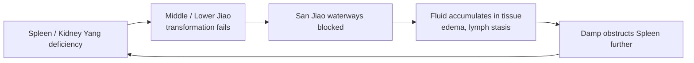

# San Jiao — Triple Burner (三焦 — Sān Jiāo)

## Overview

The **San Jiao** (literally "Three Burners") is the most uniquely TCM of all organs — it has no Western anatomical counterpart and no physical structure at all. The _Huangdi Neijing_ itself acknowledges this openly: the San Jiao has _"a name but no form"_ (有名而無形 — _yǒu míng ér wú xíng_). It is the **invisible thermal-regulation and fluid-coordination network** that runs through the three cavities of the torso: the Upper Burner (chest), the Middle Burner (epigastrium), and the Lower Burner (lower abdomen and pelvis).

This document covers the San Jiao as a TCM system first, then turns to one of its most clinically tangible applications: the TCM view of chronic fluid metabolism disorders — edema, lymphatic stagnation, and the cascade of organ-system consequences that follow when the San Jiao's triple-burner waterway breaks down.

The San Jiao's pairing with the [Pericardium](Pericardium.md) completes the six-organ symmetry that gives the meridian system its 12 channels (see [Jingmai.md](Jingmai.md)). Together they represent **minister fire** (相火 — _xiāng huǒ_) in contrast to the [Heart's](Heart.md) sovereign fire — distributed, warming authority rather than centralized command.

## Primary function

The San Jiao **coordinates Qi and fluid metabolism across all three body cavities**. This is not the job of a single organ but of a system — the San Jiao is the connective logic holding the entire fluid and thermal economy together.

### The three burners (upper, middle, lower)

Each Burner has a classical image that encapsulates its physiology:

**Upper Burner — "like a mist."** The [Lung](Lung.md) and [Heart](Heart.md) reside here, above the diaphragm. The Lung disperses [Qi](Qi.md) and [Jin Ye (body fluids)](JinYe.md) outward and downward like a fine mist, while the Heart circulates [Xue (Blood)](Xue.md). This is where Zong Qi (Gathering Qi) is refined and distributed. Upper Burner dysfunction manifests first as respiratory and circulatory congestion — fluid backing up above the diaphragm.

**Middle Burner — "like a fermenting jar."** The [Spleen](Spleen.md) and [Stomach](Stomach.md) occupy the zone between the diaphragm and the navel. Here food is "ripened and rotted," Gu Qi is extracted, and the pure fraction is lifted upward for transformation into Qi and Blood. The Middle Burner is the central engine of acquired vitality; when it stalls, the other two jiaos starve.

**Lower Burner — "like a drainage ditch."** Below the navel reside the [Kidney](Kidney.md), [Bladder](Bladder.md), [Liver](Liver.md), [Small Intestine](SmallIntestine.md), and [Large Intestine](LargeIntestine.md). The Lower Burner separates clean fluid from turbid waste and routes each to its destination. When the drainage ditch is blocked, the consequence is retained fluid, urinary dysfunction, and constipation.

### The waterway network (governing fluid pathways)

The San Jiao is described in the _Neijing_ as "the official who plans the waterways" — the invisible irrigation and drainage network connecting every organ's fluid function. Without the San Jiao's organizing role, even perfectly healthy individual organs cannot coordinate fluid distribution. [Jin Ye](JinYe.md) is the substance; the San Jiao is the network it travels through. Clinically, any edema, lymphatic congestion, or systemic fluid disorder that does not respond to treating a single organ usually points to San Jiao dysfunction as the coordinating failure.

### Avenue for Yuan Qi distribution

The San Jiao is the principal conduit for **Yuan Qi (元氣 — Original Qi)**, the constitutional energy stored in the [Kidneys](Kidney.md) and inherited from one's parents (see [Qi.md](Qi.md)). Yuan Qi cannot reach the organs and tissues directly from the Kidney storage; it travels _via the San Jiao pathways_ to nourish every organ. This makes the San Jiao not just a fluid coordinator but a constitutional life-support network — it is how the deepest energy of the body gets distributed to the periphery. San Jiao deficiency is therefore often indistinguishable from, or compounded by, Kidney Yuan Qi deficiency.

## Position in the wider system

| Aspect             | San Jiao                                                          |
| ------------------ | ----------------------------------------------------------------- |
| Wu Xing phase      | Fire (minister fire, 6-organ system) — see [WuXing.md](WuXing.md) |
| Paired Zang organ  | [Pericardium](Pericardium.md)                                     |
| Sensory opening    | _(no organ-specific opening)_                                     |
| Tissue             | _(no organ-specific tissue)_                                      |
| Associated emotion | _(no organ-specific emotion)_                                     |
| Organ clock        | 9 PM – 11 PM — see [Jingmai.md](Jingmai.md)                       |
| Season             | _(no independent seasonal correspondence)_                        |
| Flavor             | _(no independent flavor correspondence)_                          |

Surface pathway: the San Jiao channel runs from the ring finger up the outer arm, over the shoulder, around the ear, and to the outer corner of the eye — one of the two **Shaoyang (少陽)** channels.

**The Pericardium–San Jiao axis and minister fire.** The [Pericardium](Pericardium.md) and San Jiao are co-expressions of minister fire in the body. Where the Heart's sovereign fire is the still center of consciousness, minister fire is distributed warmth — the metabolic heat that warms the organs and drives transformation at every level. The San Jiao distributes this warmth through all three burners, while the Pericardium protects the Heart from the turbulence of pathological fire. In clinical practice these two organs are often treated together for patterns of heat dysregulation.

**The Shaoyang pivot.** Together with the [Gallbladder](Gallbladder.md), the San Jiao constitutes the **Shaoyang** layer — the "half-interior, half-exterior" hinge between the body's surface and its interior. Pathogen stalled at this pivot produces the archetypal Shaoyang pattern: alternating chills and fever, bitter taste in the mouth, dry throat, dizziness, flank pain, and a wiry pulse. The canonical classical formula for this pivot disorder is _Xiao Chai Hu Tang_. Because the San Jiao channel covers the flank, ear, and temporal region, Shaoyang disorders may also present with ear pain, tinnitus, and lateral headache. See [BaGang.md](BaGang.md) and [SiZhen.md](SiZhen.md) for the eight-principle and four-examination framing of this presentation.

## Common patterns

These patterns illustrate the San Jiao's organizing role. Damp-Heat disorders are particularly characteristic because the San Jiao governs fluid channels, and Damp-Heat easily obstructs those channels at any level.

### Damp-Heat in the Upper Jiao

Heat and Damp obstruct the Lung's dispersing and descending function. Symptoms: acute chest oppression, productive cough with sticky yellow sputum, fever with no sweating or sweating that does not resolve heat, shortness of breath, and a greasy yellow tongue coating in the upper third. The nose and sinuses may also be affected (rhinitis, sinusitis). The treatment principle is to open the Upper Jiao and clear Damp-Heat — _San Ren Tang_ and _Huo Pu Xia Ling Tang_ are classical references for this stratum.

### Damp-Heat in the Middle Jiao

Spleen-Stomach function is overwhelmed by heat and damp. Symptoms: epigastric fullness and heaviness, nausea, loss of appetite, loose stools with a foul odor, a bitter or greasy taste, a yellow greasy tongue coating at center. This is the presentation associated with _Gan Lu Xiao Du Dan_ (a warm-disease formula addressing all three jiaos, but especially middle-jiao damp-heat) and _Wen Dan Tang_ when phlegm-damp predominates.

### Damp-Heat in the Lower Jiao

Fluid accumulation and heat in the Kidney-Bladder zone. Symptoms: scanty dark or burning urine, urinary urgency, lower abdominal heaviness or pain, leukorrhea or turbid discharge in women, scrotal dampness in men, and a root-level greasy yellow tongue coating. _Zhu Ling Tang_ is the classical formula targeting lower-jiao damp-heat with a component that nourishes Yin to prevent heat from drying out residual fluid.

### San Jiao Qi blockage (fluid stagnation across burners)

When San Jiao Qi is generally blocked — neither heat nor cold, but simple obstruction — fluids fail to transform and move at any level. Presentation is systemic: generalized puffiness and heaviness, reduced urination without burning quality, bloating, fatigue, and a swollen pale tongue with a white greasy coat. This is the pattern most directly linked to chronic water metabolism failure and maps onto the _Wu Ling San_ framework — which addresses fluid stagnation across the burners while supporting Yang transformation.

### Shaoyang disorder (alternating chills and fever)

The pathogen lodges at the Shaoyang pivot, unable to advance inward or be expelled outward. The defining presentation is **alternating chills and fever** — the patient cycles between feeling cold and feeling hot without resolution. Bitter taste, dry throat, no desire to eat, mental restlessness, and a wiry pulse complete the picture. The [Gallbladder](Gallbladder.md) is the co-channel; both are affected. _Xiao Chai Hu Tang_ is the foundational formula; _Chai Hu Gui Zhi Gan Jiang Tang_ is used when there is simultaneous upper-jiao cold and lower-jiao Yin deficiency complicating the Shaoyang picture. See [LiuYin.md](LiuYin.md) for the six-pathogen framing that contextualizes how an external pathogen stalls here.

### Yuan Qi distribution failure (chronic constitutional deficiency)

Because the San Jiao is the avenue for Yuan Qi, a long-standing San Jiao impairment means that Kidney Yuan Qi — however abundant at its root — cannot reach the organs that need it. The presentation mimics global deficiency across multiple organ systems simultaneously: fatigue that does not respond to rest, cold everywhere but especially in the limbs, poor transformation of food, and a general sense of systemic under-nourishment. This is distinguished from simple Kidney deficiency by its breadth: when multiple organs all show deficiency simultaneously, the distributing conduit — the San Jiao — warrants investigation. See [QiQing.md](QiQing.md) for the emotional dimension of prolonged constitutional depletion.

## The TCM view of chronic fluid metabolism disorders

Of all the San Jiao's clinical implications, none is more concrete than fluid metabolism failure. Whether the presentation is chronic pitting edema in the legs, lymphedema following surgery, post-illness swelling that never fully resolves, or the diffuse systemic puffiness of long-term Spleen-Kidney Yang deficiency — the San Jiao is at the center of the picture as the connective failure that prevents individual organ corrections from holding.

### Why the San Jiao is "ground zero"

Western medicine frames edema as a problem of oncotic pressure, sodium balance, capillary permeability, or lymphatic drainage. These are not wrong frameworks — they describe mechanisms well. But they do not explain why the same biomedical markers can accompany very different presentations and respond differently to similar interventions. TCM's contribution is a systems-level organizing model: the San Jiao is the reason fluid disorders are never just about one organ.

When the San Jiao is functioning, fluids move along their routes: the Upper Jiao mists the exterior; the Middle Jiao lifts clean fluid for distribution; the Lower Jiao drains the turbid. When the San Jiao is blocked, each organ tries to compensate independently and cannot — the Spleen drains what it can, the Kidney excretes what it can, but without the coordinating network, the system leaks and backs up at multiple points simultaneously. Chronic fluid accumulation is the consequence not of a single organ failing but of the network logic dissolving.

### The cycle

**Phase 1 — The generating condition.** Chronic overwork, cold and raw diet, constitutional weakness, or post-surgical trauma depletes Spleen Yang (the transformation engine) or Kidney Yang (the "fire under the kettle"). Without adequate Yang-warmth in the Middle and Lower jiaos, fluid fails to transform and begins to stagnate.

**Phase 2 — The San Jiao blockage.** Stagnant fluid obstructs the San Jiao waterways themselves. This is the critical inflection point: once the pathways are clogged, even a recovery of Spleen or Kidney Yang cannot fully resolve the accumulated fluid because the drainage network is compromised.

**Phase 3 — Accumulation and cascade.** Tissue fluid — what TCM reads as pathological Damp, water swelling (水腫 — _shuǐ zhǒng_), or Phlegm — accumulates in the tissues. In the lower body this appears as pitting ankle edema; in the upper body as facial puffiness; systemically as that distinctive heaviness and fatigue that makes patients feel as if they are "carrying water weight." Lymphatic congestion, post-surgical swelling, and chronic inflammatory edema all fall within this spectrum.

**Phase 4 — The feedback loop.** Accumulated Damp obstructs the Spleen further (Damp injures the Earth element), worsening the transformation failure that generated the Damp in the first place. The cycle self-reinforces until the organizing network — the San Jiao — is directly addressed.

### Cross-organ consequences

Because the San Jiao spans all three body cavities, a waterway blockage does not stay localized.

**Upper Jiao consequences.** When fluid backs up past the diaphragm, the [Lung's](Lung.md) dispersing function is impeded. The result: chest oppression, shortness of breath, a tendency to retain fluid above the diaphragm (pleural effusion, pericardial fluid in extreme cases), and persistent cough from fluid pooling. The Lung cannot "open the waterways" (通調水道) as the _Neijing_ describes, because the downstream drainage has failed.

**Middle Jiao consequences.** Stagnant fluid in the Middle Jiao swamps [Spleen](Spleen.md) Earth — the very organ responsible for transforming fluid in the first place. The presentation becomes self-compounding: bloating after meals, loose stools, fatigue, a swollen scalloped tongue. The Spleen cannot dry itself because the San Jiao is not draining the excess. The [Stomach's](Stomach.md) receiving and descending function is also disrupted, producing nausea and loss of appetite.

**Lower Jiao consequences.** The Lower Jiao bears the heaviest burden in chronic water retention. [Kidney](Kidney.md) Yang must warm and transform fluid for excretion via Bladder; [Liver](Liver.md) Qi must keep the channels smooth for downward flow. When both are working against a backed-up San Jiao, lower-body edema is severe — pitting ankle and leg edema, heaviness through the lumbar region, and scanty or difficult urination. In clinical practice, post-surgical lymphedema (axillary or inguinal disruption) maps directly onto this pattern of Lower and Middle Jiao drainage failure.

**Chronic lymphatic stagnation.** The lymphatic system has no dedicated TCM analogue, but TCM's Damp and water-swelling pathologies map functionally onto interstitial fluid accumulation and lymph stasis. Where biomedicine sees disrupted lymphatic pumping and protein leakage, TCM sees San Jiao Qi blockage with Spleen-Kidney Yang deficiency as the root. The TCM approach — warming Yang, transforming Damp, opening San Jiao passages — clinically parallels the biomedical approach of manual lymphatic drainage and decongestive therapy, though operating on different theoretical models.

## TCM treatment of chronic fluid metabolism disorders

Treatment follows the cycle in reverse: restore Yang transformation at root, open the San Jiao waterways, drain accumulated Damp, and prevent reaccumulation through lifestyle correction.

### Acupuncture

The San Jiao channel's own points are the primary tools for opening the waterway network; systemic points address the root deficiency.

| Point              | Location / function                                                                                                |
| ------------------ | ------------------------------------------------------------------------------------------------------------------ |
| SJ 5 (Waiguan)     | Luo-connecting point; opens the Shaoyang; primary point for San Jiao Qi blockage and flank-to-ear channel symptoms |
| SJ 6 (Zhigou)      | Jing-river point; moves San Jiao Qi, strongly indicated for constipation from Qi blockage and lateral costal pain  |
| SJ 4 (Yangchi)     | Yuan-source point of the San Jiao; tonifies Yuan Qi and strengthens the distributing function                      |
| Ren 17 (Shanzhong) | Front-mu of the Pericardium; opens the chest (Upper Jiao), promotes Qi and fluid descent from the thorax           |
| Ren 9 (Shuifen)    | "Water divide" — the key point for fluid metabolism across the three jiaos; separates clear from turbid            |
| SP 9 (Yinlingquan) | He-sea of Spleen; drains Damp from the Middle Jiao; first choice for lower-body edema with Spleen involvement      |
| KD 7 (Fuliu)       | Jing-river point of Kidney; tonifies Kidney Yang and promotes urination in deficiency-pattern edema                |

For full acupuncture theory and additional points, see [Acupuncture.md](Acupuncture.md).

### Herbal medicine

Classical formulas address different strata of the waterway failure.

- **San Ren Tang** (Three Seed Decoction) — the foundational formula for Damp-Heat across all three jiaos, particularly when the Upper Jiao is the entry point (early-stage damp-warmth). Lightly opens the Upper Jiao, transforms Middle Jiao damp, and promotes Lower Jiao excretion simultaneously — making it uniquely suited to the San Jiao's triple-burner span.
- **Wu Ling San** (Five Ingredient Powder with Poria) — the canonical formula for fluid metabolism failure across the burners when the root is Yang deficiency and Qi transformation failure rather than Heat. Promotes urination, warms Yang, and opens fluid passages at all three levels. The prototype for most edema formulas.
- **Zhu Ling Tang** (Polyporus Decoction) — Lower Jiao damp-heat with Yin injury; adds Yin-nourishing components to avoid drying out depleted fluid while clearing heat and draining water. Used when Lower Jiao fluid blockage is complicated by heat damaging the residual Yin.
- **Gan Lu Xiao Du Dan** (Sweet Dew Special Pill to Eliminate Toxin) — a warm-disease formula for damp-heat obstructing all three jiaos; indicated when fever, jaundice, urinary dysfunction, and limb heaviness co-occur. It clears heat and resolves damp simultaneously from all three strata.

For broader herbal strategy and individual herbs, see [Herbs.md](Herbs.md).

### Lifestyle

- **Dietary warmth and dryness.** Cold and raw foods tax the Middle Jiao — the Middle Burner's "fermenting jar" requires warmth to function. Cooked, easily digestible foods, warming spices (ginger, cardamom), and avoidance of ice-cold drinks are foundational. See [Dietary.md](Dietary.md) for a full dietary framework.
- **Qigong and movement.** The San Jiao channel runs along the outer arm, flank, and side of the body. Lateral stretching, rotational qigong forms (twisting at the waist), and practice forms that open the sides of the torso directly mobilize San Jiao Qi. Daily movement prevents Damp stagnation from reestablishing. See [Qigong.md](Qigong.md).
- **Moderate exertion, protect sweat.** Sweating opens the exterior and moves fluid — but excessive sweating or exercise in cold and damp conditions depletes Yang and invites external Damp-Cold into the channels.
- **Manage the Shaoyang hours.** The San Jiao organ clock peaks 9–11 PM; the [Gallbladder](Gallbladder.md) peaks 11 PM – 1 AM. Being asleep by 11 PM supports both Shaoyang channels in their restoration cycle. Chronic late nights are a direct drain on the Shaoyang axis.
- **TuiNa for lymphatic congestion.** Manual therapy along the San Jiao channel and the lateral aspects of the body supports fluid movement in post-surgical lymphedema and chronic Damp patterns. See [TuiNa.md](TuiNa.md).

### The holistic perspective

From a TCM standpoint, a person with chronic fluid retention is not simply experiencing a plumbing problem. Their body's organizing intelligence — the San Jiao's capacity to coordinate the three burners into a coherent fluid and thermal economy — has been disrupted. Restoring that coordination means working at every level: warming the root Yang so transformation restarts, clearing the pathways so accumulated Damp can drain, and nourishing the Spleen and Kidney so the conditions for reaccumulation do not persist. The San Jiao's apparent paradox — "a name but no form," an organ that is everywhere and nowhere — turns out to be a precise clinical insight: fluid disorders are network disorders, and a network requires a network-level intervention.
