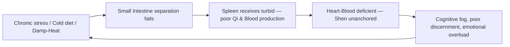

# Small Intestine (小腸 - Xiǎo Cháng)

## Overview

The Small Intestine in Traditional Chinese Medicine is not simply a section of digestive tubing. Capitalized to distinguish it from its anatomical counterpart, the **Small Intestine** is the body's great **Sorter**: the Fu organ that performs the essential act of separation after the [Stomach](Stomach.md) has done its work of receiving and ripening. Pure essence is lifted upward to the [Spleen](Spleen.md) for transformation into [Qi](Qi.md) and [Xue (Blood)](Xue.md); turbid fluid is directed downward to the [Bladder](Bladder.md); turbid solid is passed on to the [Large Intestine](LargeIntestine.md). Without this sorting, the entire downstream system loses its inputs.

The Small Intestine is the Fu organ paired with the [Heart](Heart.md) in the Fire phase. That pairing surprises Western intuition but reflects a shared theme TCM returns to again and again: **discernment**. The Heart discerns on the level of consciousness as the Shen sorts experience, feeling, and meaning. The Small Intestine discerns on the level of substance by separating what nourishes from what must be released. When one half of this Fire pair falters, the other rarely stays untouched.

This page covers the Small Intestine as a TCM organ system first, then turns to a clinically rich modern application: the TCM framing of chronic malabsorption, IBS-D, brain fog, and the inability to "sort signal from noise" that runs from gut to mind along the Heart-SI axis.

## Primary function

The Small Intestine's central charge is **receiving, transforming, and separating** in a three-step process that bridges the Stomach above and the Bladder and Large Intestine below.

### Receiving and transforming (post-Stomach digestion)

After the Stomach ripens what has been eaten, the Small Intestine receives the result and subjects it to a second-stage transformation. It is said to be responsible for **"further digestion"** (_hua_) of the rotted and ripened mass by extracting the last usable nutrients under the warmth and Qi provided by [Kidney Yang](Kidney.md) and the descending Spleen function. The [JinYe (Body Fluids)](JinYe.md) dimension of this process is significant: the Small Intestine separates fluid streams, and when its Qi is deficient or cold, the fluid separation fails before it begins.

### Separating the clear from the turbid

The signature function of the Small Intestine is _fen qing bie zhuo_, which means **"separating the clear (qing) from the turbid (zhuo)."** Three streams emerge from a healthy separation:

1. **Pure essence (qing)** rises to the Spleen, which transforms and transports it throughout the body as Qi and Blood.
2. **Turbid fluid (zhuo ye)** descends to the [Bladder](Bladder.md) for storage and excretion as urine.
3. **Turbid solid (zhuo gu)** passes to the [Large Intestine](LargeIntestine.md) for final desiccation and elimination.

This makes the Small Intestine the gatekeeper for three downstream organs simultaneously. When the separation works well, digestion is efficient, urine is clear and ample, and bowel movements are regular. When the separation fails, the turbid floods the pure. This typically occurs from Deficient-Cold, Damp-Heat, or Qi pain, resulting in diarrhea when fluid mixes with solid, edema or scanty cloudy urine when the fluid stream is obstructed, and malabsorption when the pure fails to rise.

The function is also a **mental metaphor in classical teaching**. Just as the Heart discerns experience at the level of Shen, the Small Intestine discerns at the level of substance. Practitioners observe that patients with chronic Small Intestine patterns (the foggy gut, the unmotivated absorption) often also struggle cognitively with overload, inability to prioritize, or a pervasive sense that "everything feels like noise." The sorting axis is one.

## Position in the wider system

| Aspect             | Small Intestine                                            |
| ------------------ | ---------------------------------------------------------- |
| Wu Xing phase      | Fire (see [WuXing.md](WuXing.md))                          |
| Paired Zang organ  | [Heart](Heart.md)                                          |
| Sensory opening    | _(via paired [Heart](Heart.md): tongue)_                    |
| Tissue             | _(via Heart: vessels)_                                     |
| Associated emotion | _(via Heart: joy/agitation; discernment when imbalanced)_   |
| Organ clock        | 1 PM - 3 PM, see [Jingmai.md](Jingmai.md)                  |
| Season             | _(via Heart: summer)_                                      |
| Flavor             | _(via Heart: bitter)_                                      |

Surface pathway: the Small Intestine channel (SI 1–19) runs from the little finger up the outer arm, across the shoulder and scapula, up the neck, and ends in front of the ear. This anatomical path explains why SI patterns are implicated in **shoulder, scapula, and posterior neck pain**, with locally relevant points including SI 3, SI 9, SI 11, and SI 14.

**The Heart-Small Intestine Fire axis.** The interior-exterior pairing of Heart and Small Intestine is one of the most clinically important Zang-Fu relationships. Heart Fire, generated by emotional agitation, Yin deficiency, or Liver Fire traveling upward along the Wood-feeds-Fire pathway, can **transfer downward** through the Heart-SI channel connection into the Small Intestine. The result is not upper-body heat symptoms but lower-body: scanty dark urine, burning urination, mouth sores, and a tongue with a red tip. This is the pattern TCM calls "Heart Fire transferring to the Small Intestine," and it reframes what Western medicine might label a simple UTI as a downstream expression of emotional or cardiac heat. The axis is documented more fully in [ZangFu.md](ZangFu.md).

## Common patterns

These are the canonical Small Intestine pathologies a practitioner screens for and differentiates. They are not mutually exclusive and often compound. For example, Deficient-Cold can generate incomplete separation that results in both diarrhea and scanty urine simultaneously.

### Small Intestine Qi pain

Acute spasmodic pain in the lower abdomen, often radiating to the testes or groin. Cold invasion from chilled food, damp cold environments, or constitutional Cold contracts the Small Intestine channel. The pain is severe, cramping, and relieved by warmth; there may be lower back pain and a tight, knotted sensation. Tongue is pale; pulse is wiry and tight. The formula Tian Tai Wu Yao San (Lindera Powder from the Top of Mount Tiantai) warms the channel and moves Qi to relieve the spasm.

### Small Intestine Deficient-Cold

Chronic Cold weakness of the Small Intestine. The separation of clear and turbid fails because there is insufficient warmth to drive the process. Symptoms: chronic loose or watery stools, abundant clear urine, lower abdominal discomfort relieved by warmth and pressure, fatigue, poor appetite. This pattern often develops from prolonged Spleen Yang deficiency (the Earth-Fire relationship) or from excess Cold food and drink over years. Tongue is pale with a white coat; pulse is deep and weak. Si Shen Wan (Four-Miracle Pill) warms the Kidney-Spleen axis that underlies this failure and consolidates the intestines.

### Small Intestine Damp-Heat

Heat and Dampness accumulate in the Small Intestine, often from dietary excess (spicy, rich, alcohol) or from a prolonged Deficient-Cold turning to Heat as secondary pathogen. Symptoms include loose stools with urgency and a burning sensation, scanty dark or cloudy urine, lower abdominal fullness and discomfort, possible mucus in stool, and a bitter taste. Tongue has a yellow greasy coat; pulse is slippery and rapid. Treatment clears Damp-Heat from the lower Jiao and separates clear from turbid. Wu Ling San (Five-Ingredient Powder with Poria) addresses the fluid regulation dimension; Ba Zheng San targets the urinary Damp-Heat presentation.

### Heart Fire transferring to the Small Intestine

This paired-axis pattern emerges when emotional agitation, insomnia, chronic stress, or Kidney Yin deficiency allows [Heart Fire](Heart.md#heart-fire-blazing) to descend through the Heart-SI channel into the Small Intestine. The Heat follows the turbid fluid stream into the Bladder, creating **mouth sores** and a **red tongue tip** (Heart Fire above) alongside **scanty, dark, burning urine** (Heat transferred below). Additional symptoms include palpitations, restlessness, insomnia, and a rapid and forceful pulse. Dao Chi San (Guide Out the Red Powder) is the classical formula, with bitter cold ingredients (raw Rehmannia, Mu Tong or Akebia, bamboo leaf, licorice) that directly clear Heart Fire and guide it downward out through the urine, relieving both the upper and lower presentations at once.

### Small Intestine Qi tied (partial obstruction)

The most urgent Small Intestine pattern. Severe, sustained abdominal pain with distension, vomiting, and cessation of gas and stool resembles Western partial bowel obstruction. In TCM this is Qi and stagnation obstructing the intestine beyond the functional-pain level of Qi pain. Treatment is acupuncture-forward (ST 36, ST 37, ST 39, LI 4, Ren 6) to move the obstruction and restore peristaltic Qi; severe cases require emergency medical evaluation.

## The TCM view of chronic malabsorption and digestive-cognitive decline

In the modern clinic, a cluster of complaints is becoming increasingly common: chronic loose stools or alternating stool consistency, post-meal fatigue, abdominal bloating, brain fog, and a pervasive difficulty concentrating or making decisions. Western medicine reaches for IBS-D (irritable bowel syndrome, diarrhea-predominant), dysbiosis, and functional dyspepsia. TCM frames the same picture as a chronic failure of the Small Intestine's separation function that, through the Heart-SI axis, eventually clouds the Shen itself.

### Why the Small Intestine is "ground zero"

The Small Intestine sits at the center of the digestive-cognitive loop because it is the organ that determines what gets absorbed. When its function is compromised by Cold, Damp-Heat, Qi deficiency, or relentless emotional stress conducted down from the Heart, the quality of post-natal Qi production collapses. The [Spleen](Spleen.md) receives inferior inputs and produces less Qi and Blood; a [Qi](Qi.md) and Blood-deficient Heart cannot anchor the [Shen (mind)](Shen.md); and the Shen, unmoored, loses its own sorting capacity. The patient feels foggy, indecisive, and emotionally noisy, "unable to separate signal from signal," as one classical metaphor puts it. The outer manifestation is poor digestion; the inner manifestation is a muddled mind.

### The cycle

**Phase 1: The trigger.** Chronic emotional stress conducts Heart Fire down into the Small Intestine (the [QiQing (Seven Emotions)](QiQing.md) pathway) or sustained Cold diet, damp living conditions, or dysbiosis generate internal Damp-Cold or Damp-Heat. Either way, the warmth and Qi that drive the separation process are disrupted.

**Phase 2: Sorting failure.** The Small Intestine can no longer cleanly separate the three streams. Turbid fluid mixes with solid, resulting in diarrhea and loose stools. The pure that should rise to the Spleen arrives compromised, leading to malabsorption. Fluid turbidity overwhelms the Bladder, producing cloudy or scanty urine. The output of post-natal Qi production shrinks.

**Phase 3: The Shen goes cloudy.** The Spleen, working with inferior inputs, produces less [Xue](Xue.md) and Qi. The [Heart](Heart.md), which depends on Blood to anchor the Shen, begins to run on deficiency. The Shen loses its clarity. In the clinic this shows as cognitive fatigue after meals, difficulty concentrating in the afternoon (precisely the 1–3 PM Small Intestine organ-clock window), emotional overwhelm, and a felt inability to make decisions. Worry ([Spleen's emotion](QiQing.md)) accumulates and feeds back to suppress Spleen function further.

### Cross-organ consequences

Because [WuXing (Five Phases)](WuXing.md) propagates dysfunction through interconnected pairs, a chronically failing Small Intestine rarely stays local.

**Small Intestine → Heart (upstream pollution).** Poor separation means the Heart-SI Fire axis carries turbid Qi upward alongside the clear. Heart-Blood becomes deficient and somewhat "turbid" itself, causing the Shen to grow foggy, palpitations to occur without obvious exertion, and anxiety to take on a diffuse, unobjectified quality. Patients describe feeling "like static," unable to tune into a clear channel. This is the cognitive dimension of "clear from turbid" failing at the psychic level. See [Shen.md](Shen.md) for the full Five-Shen framework.

**Small Intestine → Spleen (Earth starved).** The Spleen receives the separated pure from the Small Intestine. In chronic separation failure, the Spleen's inputs are quantity-deficient and quality-poor. Spleen Qi sags, producing bloating, heavy limbs, and further diarrhea. The Spleen's lifting function weakens, causing what little Qi is produced to sink rather than ascend, leading to fatigue after meals, organ heaviness, and eventually the early signs of prolapse.

**Small Intestine → Bladder (turbid flooding downward).** When the Small Intestine's fluid-sorting fails, the [Bladder](Bladder.md) receives fluid that is already turbid, resulting in cloudy or dark urine, a sensation of incomplete emptying, and in Damp-Heat presentations, the burning urination that is so easily misread as a primary urinary tract infection. The distinction matters clinically: treating the Bladder alone (without clearing the Heart-SI axis) will not resolve a pattern that is generated upstream.

**Small Intestine → Large Intestine (turbid cascade).** Failing to adequately sort solid also affects what the [Large Intestine](LargeIntestine.md) receives. When excess fluid remains mixed with the solid, diarrhea and urgency result; when too little fluid passes, dryness and constipation alternate in the classic IBS pattern. The Large Intestine cannot fix what arrived already poorly sorted.

### The clouded-discernment cycle

In advanced or chronic presentations, the cognitive dimension becomes self-reinforcing. A Shen clouded by Blood deficiency and Damp accumulation loses the very clarity needed to make the lifestyle choices that would resolve the Damp: the patient cannot consistently choose warming foods over cold, or prioritize sleep, or reduce the emotional reactivity that keeps Heart Fire descending. The sorting organ has failed; the sorting mind has followed. Treatment must address both simultaneously, as clearing the gut and calming the Shen are not sequential steps but concurrent ones.

## TCM treatment of chronic malabsorption and digestive-cognitive decline

Because the Small Intestine's separation function is the root of the imbalance, treatment focuses on restoring that sorting capacity by warming or clearing as the pattern requires, while simultaneously supporting the Heart-SI axis and nourishing the Spleen that receives from below.

### Acupuncture

Key acupoints for the Small Intestine pattern cluster, selected and combined according to the individual pattern differentiation via [SiZhen (Four Examinations)](SiZhen.md) and [BaGang (Eight Principles)](BaGang.md):

| Point                | Location / channel              | Primary function                                                           |
| -------------------- | ------------------------------- | -------------------------------------------------------------------------- |
| SI 3 - Houxi         | 5th MCP joint, little finger    | Opening point of the Du Mai; used for neck, shoulder, back SI channel pain |
| SI 6 - Yanglao       | Dorsal wrist, ulnar styloid     | Xi-cleft point; acute SI Qi pain, shoulder/scapula pain                    |
| SI 8 - Xiaohai       | Medial elbow, He-sea point      | He-sea (Sea of the organ); directly tonifies SI function, damp conditions  |
| BL 27 - Xiaochangshu | 1st sacral foramen level        | Back Shu of Small Intestine; directly regulates SI function                |
| Ren 4 - Guanyuan     | 3 cun below the navel           | Front Mu of Small Intestine; tonifies SI Qi, warms deficient-cold          |
| ST 37 - Shangjuxu    | Lower He-sea of Small Intestine | Key distal point for all intestinal disorders via the Lower Sea            |
| HT 7 - Shen Men      | Ulnar wrist crease              | Calms the Shen; essential in the Heart-SI axis to address cognitive fog    |
| SP 9 - Yinlingquan   | Medial tibia, He-sea            | Drains Damp from the lower Jiao; separates fluid streams                   |

The combination of Ren 4 (Front Mu) and BL 27 (Back Shu) is a classic "front-back" pairing that directly regulates Small Intestine function for both Deficient-Cold and Damp-Heat presentations. ST 37, the Lower He-sea of the Small Intestine, is the single most reliable distal point for intestinal patterns. See [Acupuncture.md](Acupuncture.md) for the broader theoretical framework.

### Herbal medicine

Classical formulas are selected according to the presenting pattern. TCM practitioners do not apply a single formula to all Small Intestine conditions; the root differentiation of Hot/Cold, Excess/Deficiency, and the presence or absence of Damp drives selection.

- **Dao Chi San** (Guide Out the Red Powder) is the canonical formula for **Heart Fire transferring to the Small Intestine**. Raw Rehmannia clears Heart Heat and nourishes Yin; bamboo leaf clears Heat from the Heart channel; Mu Tong (or Tong Cao) opens the water passages and guides Heat downward. Licorice harmonizes. The formula treats mouth sores and burning urination from the same root. See [Herbs.md](Herbs.md) for ingredient-level discussion.
- **Wu Ling San** (Five-Ingredient Powder with Poria) addresses the **fluid-separation failure** dimension of Small Intestine Qi deficiency with Damp accumulation. It separates clear from turbid in water metabolism, draining excess fluid through the urine. Use when the presentation includes edema, watery diarrhea with concurrent scanty urine, or the "separation failure" pattern where fluid and solid are not cleanly dividing.
- **Si Shen Wan** (Four-Miracle Pill) treats **Deficient-Cold** of the Small Intestine and Kidney Yang, presenting as chronic early-morning diarrhea (the "fifth watch diarrhea"), watery stools, and lower abdominal cold pain. It warms the Kidney-Spleen axis and astringes the intestines.
- **Tian Tai Wu Yao San** (Lindera Powder from the Top of Mount Tiantai) treats **Small Intestine Qi pain**, the cold-induced spasmodic pain radiating to the groin. It warms the Liver and Small Intestine channels, moves Qi, and dispels Cold from the channel.

### Lifestyle

Lifestyle changes that directly support the Small Intestine's sorting function and reduce the Heart-Fire burden on the axis:

- **Warm, cooked foods.** Cold and raw foods require extra Qi to warm before digestion can proceed. Chronically burdening the Small Intestine with cold input is the most common dietary cause of Deficient-Cold. Congee, soups, lightly cooked vegetables, and warm drinks (especially around the 1–3 PM Small Intestine organ-clock window) give the organ the warmth it needs to sort effectively. See [Dietary.md](Dietary.md).
- **Reduce inflammatory inputs.** Spicy, greasy, alcohol-heavy diets generate Damp-Heat in the Small Intestine, functioning as the internal equivalent of a sorting machine running too hot. Cooling foods (mung bean, coix seed, bitter melon) reduce the Heat load.
- **Emotional regulation.** Because the Heart-SI axis means emotional agitation directly pressurizes the Small Intestine, stress management is genuinely digestive medicine here. [Qigong.md](Qigong.md) practices, especially those that open the Ren Mai, warm the lower Jiao, or address the Heart-Small Intestine meridian along the arm, are particularly appropriate.
- **Sleep before the late-Yin hours.** Heart-Blood is replenished during sleep; a Heart chronically depleted by late nights transfers Fire downward into the Small Intestine. The inverse is also true: good sleep gradually reduces the Heat load on the lower digestive axis. See [Jingmai.md](Jingmai.md) for the organ-clock context.
- **Tuina and abdominal massage.** Gentle clockwise abdominal [TuiNa](TuiNa.md) in the navel region directly stimulates the Small Intestine, promotes peristalsis, and helps physically restore the separation and downward-propulsion functions.

### The holistic perspective

From a TCM standpoint, a person living with IBS-D, chronic malabsorption, and brain fog is not experiencing three unrelated complaints that happen to co-occur. They are experiencing a single failure of the body's sorting system: a Small Intestine that can no longer cleanly separate what nourishes from what must be released. That failure cascades: the Spleen produces less, the Heart-Blood thins, and the Shen that should be discerning and clear becomes foggy and overwhelmed. Healing the gut in this framework is also calming the mind. The Small Intestine's classical function of separating the clear from the turbid is, in the deepest TCM reading, the physiological correlate of wisdom itself: knowing what to keep and what to let go.
