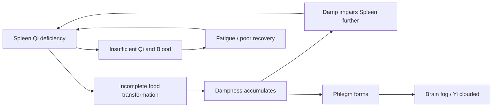

# Spleen (脾 - Pí)

## Overview

The Spleen in Traditional Chinese Medicine is not the small filtering organ of Western anatomy. Capitalized to mark the distinction, the **Spleen** is the **central digestive engine** and the **post-natal root of Qi and Blood**. It is the organ that generates and distributes the Qi and Blood that sustain the body after birth. Together with its paired Fu organ, the [Stomach](Stomach.md), it forms the Earth phase pair and constitutes the middle axis around which all other organ systems depend.

This page covers the Spleen as a TCM organ system first, then turns to one of its most consequential clinical applications: the TCM view of chronic fatigue and the "tired-and-foggy" syndrome - a pattern Western medicine increasingly recognizes as overlapping with post-viral fatigue, functional GI disorders, and metabolic burnout. In TCM, this presentation reflects Spleen Qi deficiency cascading into Damp accumulation, Phlegm, and a body that can no longer produce enough Qi and [Xue (Blood)](Xue.md) to sustain clear thinking and sustained effort.

## Primary function

The Spleen's central job is **transforming and transporting** (_yun hua_). This means extracting the nutritive essence from food and drink and delivering it upward and outward to every part of the body. When the Spleen functions well:

- Food is efficiently converted into Gu Qi (穀氣, grain Qi), the raw material for [Qi](Qi.md), Xue, and [Jin Ye (body fluids)](JinYe.md).
- Muscles and limbs are well-nourished, and the mind is clear and focused.
- A person feels energized, can sustain concentration, and has a healthy, predictable appetite.

When the Spleen fails at this job, the first casualty is energy itself. The consequences cascade outward into every organ system that depends on a steady supply of Qi and Blood.

### Transforming and transporting (food and fluids)

The Spleen _transforms_ (hua) food and drink into usable substances and _transports_ (yun) them upward to the Lung and Heart, where they are refined into Zong Qi (pectoral Qi), Ying Qi (nutritive Qi), and ultimately Xue. Spleen Qi naturally moves **upward** by lifting the clear nutritive essence toward the chest and head. When Spleen Qi is deficient and sinking, the "clear" fails to rise: the result is brain fog, a heavy head, and post-meal fatigue rather than post-meal energy.

The Spleen also governs the metabolism of fluids (see [JinYe.md](JinYe.md)). Healthy Spleen Qi separates clean fluid from food residue; failed Qi transformation leaves unmetabolized fluid behind as **Dampness** (_shi_), the most common Spleen-generated pathological product. Dampness accumulates, impairs digestion further, and eventually congeals into Phlegm (_tan_). The classical teaching: **"the Spleen produces Phlegm; the [Lung](Lung.md) stores it."**

### Holding Blood in the vessels

Beyond transformation, the Spleen **holds Blood within its vessels** (_tong xue_). This is one of TCM's most distinctive organ-function attributions: holding Blood is a mechanical-sounding task assigned not to the Heart but to the Spleen. When Spleen Qi is strong, Blood stays in its channels. When Spleen Qi is deficient, Blood loses its governance and escapes: the clinical picture includes easy bruising without trauma, prolonged or heavy menstrual bleeding (menorrhagia), blood in the stool, and petechiae. Treatment targets Spleen Qi, not the bleeding directly.

### Housing the Yi

Every Zang organ houses a specific aspect of the psyche. The Spleen houses the **Yi** (意 - intellect, intent, or "ideation"), which is the capacity for sustained study, focused concentration, and "settled" thinking. A person with healthy Spleen Qi can study without tiring, hold a train of thought, memorize material, and apply deliberate intention. When the Spleen is depleted or overwhelmed by Damp:

- Concentration evaporates; rereading the same paragraph yields nothing.
- Mental fatigue sets in long before physical fatigue does.
- The student or knowledge worker who "hits a wall" by early afternoon is often showing the Spleen's limits, not willpower failure.

Excessive worry and overthinking, which are the Spleen's associated emotion, are both a cause and consequence of Spleen depletion. The [Yi](Shen.md) keeps spinning, but it spins in place rather than forward.

## Position in the wider system

| Aspect             | Spleen                                                      |
| ------------------ | ----------------------------------------------------------- |
| Wu Xing phase      | Earth (see [WuXing.md](WuXing.md))                          |
| Paired Fu organ    | [Stomach](Stomach.md)                                       |
| Sensory opening    | Mouth (manifests on the lips)                               |
| Tissue             | Muscles / flesh                                             |
| Associated emotion | Worry / pensiveness - see [QiQing.md](QiQing.md)            |
| Organ clock        | 9 AM – 11 AM - see [Jingmai.md](Jingmai.md)                 |
| Season             | Late summer                                                 |
| Flavor             | Sweet (mildly sweet foods strengthen; excess sweet weakens) |

**The Spleen-Stomach pivot.** The Spleen and Stomach form the central axis of the body, known as the **middle burner** (zhong jiao) in the San Jiao framework. Their directionality is opposite and complementary: Stomach Qi descends (sending ripened food downward to the Small Intestine); Spleen Qi ascends (sending nutritive essence upward to Heart and Lung). When both are healthy, a smooth rotational dynamic keeps digestion moving. When one stalls, the other follows. Stomach Yin is consumed rapidly by hot food, alcohol, and stress; Spleen Yang is damaged most by cold food, raw foods, and prolonged overwork.

**The Liver overacting on the Spleen (Gan Pi Bu He).** In [Wu Xing](WuXing.md) terms, Wood controls Earth. A healthy Liver (Wood) gently regulates Spleen (Earth) through controlling restraint. A stagnant or hyperactive Liver instead attacks the Spleen: stress and suppressed emotion cause bowel urgency, alternating loose and bound stools, abdominal cramping that worsens with emotional tension, and loss of appetite. This is the TCM pattern that most closely maps to irritable bowel syndrome (IBS). See [Liver.md](Liver.md) for the Wood-side dynamics and [ZangFu.md](ZangFu.md) for the combined pattern.

**The Spleen-Kidney Yang axis.** Spleen Yang, the warming, activating energy that powers transformation, depends ultimately on [Kidney](Kidney.md) Yang as its source. The Kidneys are described as the "fire under the cauldron"; without that fire, the Spleen's pot cannot cook. Chronic Spleen Yang deficiency therefore almost always eventually implicates the Kidneys, and Kidney Yang deficiency will eventually impair Spleen digestion.

## Common patterns

### Spleen Qi deficiency

The most common deficiency pattern in TCM functions as a baseline for a significant fraction of modern clinical presentations. Fatigue disproportionate to activity, loose or unformed stools, abdominal bloating after eating, weak or tired limbs, poor appetite, and a pale tongue with scalloped (tooth-marked) edges caused by the swollen, Damp-laden organ body pressing against teeth. Pulse is weak, especially in the right middle position.

### Spleen Yang deficiency

A colder, deeper form of Qi deficiency. In addition to all Qi deficiency features, the patient has **cold limbs**, a marked aversion to cold food and beverages, watery or undigested-food stools, and a pale-wet tongue. Develops from prolonged Qi deficiency, excessive raw or cold diet, or failing Kidney Yang that can no longer warm the middle burner. Often presents in long-term dieters who have eaten primarily salads and smoothies.

### Damp-Cold invading the Spleen

External or dietary Dampness combined with Cold obstructs the Spleen's transforming function. Symptoms: nausea, heavy sensation in limbs, thick white greasy tongue coat, absent appetite, a sense that the body is wrapped in wet cloth. Common in humid climates, after rainy-season exposure (see [LiuYin.md](LiuYin.md)), or from overconsumption of cold, greasy, or dairy-heavy food.

### Damp-Heat in the Spleen

When Dampness combines with Heat, whether from a hot constitution, febrile illness, or inflammatory diet, the presentation shifts: bitter taste in the mouth, foul-smelling loose stools, burning sensation after defecation, scanty dark urine, jaundice in severe cases, and a yellow greasy tongue coat. Clinically this pattern overlaps with conditions like Crohn's disease, UC, or liver inflammation in biomedicine. See [BaGang.md](BaGang.md) for the Cold/Hot differentiation framework.

### Spleen failing to hold Blood

Spleen Qi is so depleted it can no longer govern Blood within the vessels (see [Xue.md](Xue.md)). Presents as: easy bruising, heavy or prolonged menstrual flow, blood in stools (especially dark), or generalized petechiae. Tongue is pale; pulse is thin and weak. This pattern differs from Heat-driven bleeding, where Blood is "reckless": in Spleen-failing patterns the blood is pale, copious, and associated with fatigue rather than Heat signs.

### Spleen Qi sinking (prolapse patterns)

An extension of Spleen Qi deficiency in which the upward-lifting function collapses entirely. Spleen Qi is supposed to hold organs in position; when it sinks, so do the organs: uterine or rectal prolapse, chronic diarrhea, hemorrhoids, a sensation of bearing-down in the pelvis, and persistent fatigue with a desire to lie down. [BaGang.md](BaGang.md) diagnosis: this is a deficiency pattern, and treatment must tonify and lift. The formula Bu Zhong Yi Qi Tang is canonical precisely because its structure (Huang Qi, Chai Hu, Sheng Ma) tonifies Qi while raising Yang.

## The TCM view of chronic fatigue and the "tired-and-foggy" syndrome

Modern clinics are saturated with a presentation that resists clean biomedical labeling: fatigue not resolved by rest, brain fog, digestive instability, a tendency to feel worse after meals, and a generalized heaviness that makes every task feel like moving through wet cement. TCM has a coherent framework for this constellation: it is primarily a Spleen Qi deficiency picture, and the Spleen is "ground zero."

### Why the Spleen is "ground zero"

The Spleen's job is to convert food into energy. When Spleen Qi falters - from overwork, irregular eating, excessive worry, cold-raw diet, or post-illness depletion - the conversion efficiency drops. Food consumed is not fully transformed; it sits as an energetic debt and simultaneously generates Dampness. The person eats but does not recover. Rest is also not restorative, because rest requires Blood and Yin for genuine repair, and a deficient Spleen has produced too little of both. This pattern appears in post-viral fatigue syndromes, fibromyalgia, and functional exhaustion, and is resistant to the conventional advice of "eat well and rest."

The second layer is cognitive: the Yi (housed in the Spleen) is among the first casualties of Damp accumulation. Damp "mists" the clear Yang from rising to the head, producing the cognitive heaviness, word-retrieval lapses, and inability to concentrate that patients describe as "brain fog."

### The cycle

**Stage 1 - The Deficient Engine.** An initial insult, whether prolonged stress, post-illness depletion, years of irregular diet, or constitutional weakness, reduces Spleen Qi below the threshold needed for efficient transformation. The person feels unusually tired after meals rather than nourished by them.

**Stage 2 - Damp Accumulation.** Unmetabolized food and fluid collect as internal Dampness. The hallmarks appear: heavy limbs, sluggish thinking, loose stools with undigested food, bloating that persists hours after meals, a thick greasy tongue coat. The patient has not yet "gotten sick" in the conventional sense, yet they are simply never fully well.

**Stage 3 - Phlegm and the Feedback Loop.** Chronic Dampness congeals into Phlegm. This is where the "fog" becomes entrenched: Phlegm obstructs the rising of clear Yang to the head (a function the Spleen is supposed to facilitate), producing persistent cognitive dullness, poor memory, and a disproportionate mental fatigue. Simultaneously, Phlegm further burdens the Spleen, completing the reciprocal cycle: Damp impairs Spleen; Spleen fails to resolve Damp; Damp becomes Phlegm; Phlegm deepens the fatigue.

### Cross-organ consequences

The Spleen sits at the center of the organ web. Its failure does not stay local.

**Spleen → Lung (Earth generating Metal; and the Phlegm conduit).** Earth generates Metal in the [Wu Xing](WuXing.md) cycle, so the Spleen (Earth) is the Lung's "mother." A chronically deficient mother fails to nourish the child: Lung Qi falters, Wei Qi (defensive Qi) weakens, and the person catches frequent colds and takes longer to recover. But the more direct pathway is Phlegm: "**the Spleen produces Phlegm; the [Lung](Lung.md) stores it.**" Spleen-generated Phlegm ascends to the Lung, producing chronic productive cough, chest heaviness, postnasal drip, and recurrent respiratory infections that resist simple treatment.

**Liver → Spleen (Wood Overacting on Earth).** The fatigued, fog-brained person is often also under chronic stress, a condition that creates [Liver](Liver.md) Qi stagnation. A stagnant Liver "attacks" the adjacent Spleen (Wood overacting on Earth), worsening the very digestive dysfunction the Spleen is already struggling with. The result is a pattern that swings between the emotional (irritability, anxiety) and the digestive (cramping, alternating bowel habits, appetite loss). Because stress worsens digestion, and poor digestion worsens energy, and poor energy worsens the capacity to handle stress, the patient can feel trapped in a loop that lifestyle advice alone cannot break.

**Spleen → Heart (the Blood Axis).** The [Heart](Heart.md) houses the Shen within the Blood it circulates; Blood is the Shen's physical home. A Spleen that consistently under-produces Blood leaves the Heart with insufficient substrate: the Shen is restless, poorly anchored, producing insomnia, dream-disturbed sleep, low-grade anxiety, and a tendency to ruminate. The classical combined pattern is **Heart-Spleen Blood deficiency**, which presents as insomnia, palpitations, poor appetite, and a pale tongue in an interlocked cluster. The canonical formula is Gui Pi Tang, which simultaneously tonifies Spleen Qi and nourishes Heart Blood.

**Spleen → Kidney (the Post-natal/Pre-natal Axis).** In TCM cosmology, the [Kidneys](Kidney.md) hold the body's constitutional reserve (Jing, or Essence). The Kidneys are **pre-natal** Jing: what you are born with. The Spleen continuously replenishes this reserve through post-natal nourishment, the Qi and Blood it generates from food. A chronically deficient Spleen stops replenishing the reserve; the Kidneys begin drawing down on Jing to compensate. The result is accelerated aging: deep fatigue, low back weakness, diminished reproductive vitality, and cognitive decline that outpace the calendar. This dynamic is why TCM practitioners in chronic fatigue cases nearly always eventually support both Spleen (post-natal) and Kidney (pre-natal) simultaneously.

### Late-stage Damp-Phlegm entrenchment

In long-standing cases such as post-viral fatigue syndromes and years-long functional exhaustion, the Phlegm has become deeply lodged. Clinically the patient presents with cognitive symptoms dominating over digestive ones: persistent brain fog, word-finding difficulty, depression, and a flat affect that masquerades as a psychiatric condition. The tongue is typically pale or dusky with a thick, greasy coat; the pulse is slippery and weak. Treatment at this stage must simultaneously transform Phlegm (to lift the fog) and build Spleen Qi (to cut off the Phlegm supply), a pairing that requires careful formula construction to avoid the tonic herbs worsening the stagnation. This stage is slow to resolve, requiring months rather than weeks.

## TCM treatment of chronic fatigue and the foggy syndrome

Because the Spleen is the root of the imbalance, recovery protocols focus on rebuilding Spleen Qi, resolving Damp and Phlegm, and restoring the steady production of Qi and Blood.

### Acupuncture

Key acupoints for Spleen Qi deficiency and Damp accumulation:

| Point              | Location                                                | Function                                                                                            |
| ------------------ | ------------------------------------------------------- | --------------------------------------------------------------------------------------------------- |
| ST 36 (Zusanli)    | 3 cun below the knee, lateral tibialis                  | The premier Qi and Blood tonic point of the entire body; directly strengthens Spleen and Stomach.   |
| SP 6 (Sanyinjiao)  | 3 cun above the medial malleolus                        | Crossing point of Spleen, Liver, and Kidney channels; nourishes Blood, drains Damp, calms the Shen. |
| SP 3 (Taibai)      | On the medial foot, at the base of the first metatarsal | Source point of the Spleen channel; directly tonifies Spleen Qi and resolves Damp.                  |
| SP 9 (Yinlingquan) | In the depression below the medial condyle of the tibia | The primary point for draining Damp from the middle and lower burner.                               |
| Ren 12 (Zhongwan)  | Midway between the navel and the sternum                | Front-Mu point of the Stomach; regulates the middle burner, tonifies Spleen and Stomach Qi.         |

For the Heart-Spleen axis and insomnia: add HT 7 (Shenmen) and Yin Tang. For Liver-Spleen disharmony: add LV 3 (Taichong) to smooth Liver Qi alongside the above. For prolapse patterns: add Du 20 (Baihui) with moxa to raise sinking Qi. See [Acupuncture.md](Acupuncture.md) for full needling context.

### Herbal medicine

Classical formulas are matched to the presenting pattern layer:

- **Si Jun Zi Tang** (Four Gentlemen Decoction - Ren Shen, Bai Zhu, Fu Ling, Gan Cao) - The foundational Spleen Qi tonic. Gentle and broad-action; the base from which most Spleen formulas are built.
- **Liu Jun Zi Tang** (Six Gentlemen Decoction) - Si Jun Zi Tang plus Ban Xia and Chen Pi; adds Phlegm-transforming and Damp-drying to the tonic base. The standard choice when Qi deficiency has already generated Damp-Phlegm.
- **Bu Zhong Yi Qi Tang** (Tonify the Middle and Raise Qi Decoction) - The canonical formula for Spleen Qi sinking; uses Huang Qi, Chai Hu, and Sheng Ma to lift Yang while building Qi. Indicated for prolapse, chronic diarrhea, and severe post-meal fatigue with a desire to lie down.
- **Gui Pi Tang** (Restore the Spleen Decoction) - Addresses the Heart-Spleen Blood deficiency axis: tonifies Spleen Qi and Heart Blood simultaneously. Canonical for insomnia, palpitations, poor appetite, and anxiety presenting together.
- **Shen Ling Bai Zhu San** (Ginseng, Poria, and White Atractylodes Powder) - Spleen Qi tonic that simultaneously and directly resolves Damp; suited for the Damp-heavy variant with loose stools and poor appetite. Often the formula of choice in post-viral fatigue presentations where Damp is prominent.

For [herbal medicine](Herbs.md) context and classical formula frameworks, see [Herbs.md](Herbs.md).

### Lifestyle

Diet matters more for the Spleen than for any other organ in TCM. The Spleen is the one organ for which dietary therapy alone can produce clinically meaningful change.

- **Eat warm, cooked foods.** Raw vegetables, smoothies, cold drinks, and salads require the Spleen to spend extra Yang Qi "cooking" them before transformation can begin. Lightly cooked, warm, and easy-to-digest meals are the single most impactful change for Spleen Qi deficiency. See [Dietary.md](Dietary.md).
- **Eat regular, unhurried meals.** Irregular eating, skipping meals, and eating at a desk while working fracture the Spleen's rhythm. The Spleen peaks from 9–11 AM and benefits from a substantial, warm breakfast in that window.
- **Reduce sweet, greasy, and dairy-heavy foods.** Mildly sweet foods (grains, sweet potato, carrots) tonify the Spleen; excess sweetness (refined sugar, alcohol, rich dairy) generates Damp and overwhelms the transforming function.
- **Gentle movement after meals.** A 10-minute walk following meals aids Spleen Qi in moving the transformation process forward; lying down immediately after eating congests the middle burner.
- **Qigong for Earth.** Practices emphasizing centered, grounded, circular movement, particularly those working the lower dantian and abdominal region, directly support Spleen and Stomach function. See [Qigong.md](Qigong.md). [Tui Na](TuiNa.md) abdominal massage (clockwise around the navel) is a classical adjunct.

### The holistic perspective

From a TCM standpoint, a person struggling with chronic fatigue and cognitive fog is not simply "tired" and is certainly not failing at self-care through lack of discipline. They are experiencing a systemic failure of transformation: the body's capacity to convert input (food, rest, experience) into output (energy, clarity, Blood) has dropped below the threshold of daily demand. The Spleen is the organ of nourishment in the deepest sense. It is what allows a human being to be truly nourished by the life they are living. Healing it requires the same patient, consistent, warm, and nourishing approach the Spleen itself embodies: steadiness over intensity, warmth over rawness, regularity over heroic effort.
