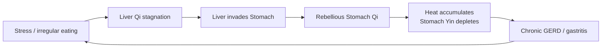

# Stomach (胃 - Wèi)

## Overview

The Stomach in Traditional Chinese Medicine is not the anatomical stomach of Western physiology. Capitalized to distinguish it from its biological counterpart, the **Stomach** is the **Rotting and Ripening Pot** (_fu shou_), a functional network that receives food and drink, breaks them down into a usable form, and hands the resulting "mash" downward to the [Small Intestine](SmallIntestine.md) for further sorting. It is the first great gate of digestion and the most direct point of contact between the external environment and the body's interior.

The Stomach is paired with the [Spleen](Spleen.md) in the Earth phase, forming the **Spleen-Stomach axis**, the body's post-natal source of Qi and Blood. Where the Spleen transforms and lifts the pure essence upward, the Stomach receives raw material and sends the turbid residue downward. Together they are called the **Sea of Grain and Water** (水谷之海), and their health is the foundation of every other organ's nourishment.

This document covers the Stomach as a TCM organ system, then turns to one of its most prevalent clinical applications: the TCM view of chronic acid disorders, including GERD, gastritis, peptic ulcers, and the rebellious-Qi syndrome family that maps onto these Western diagnoses. These conditions are among the most common presentations in modern integrative practice, and the Stomach is ground zero.

## Primary function

The Stomach's defining charge is to **receive and ripen** (_shou na_, _fu shu_) food and drink. Everything ingested must pass through the Stomach's transformative process before it can nourish the body. In health, the Stomach takes in food without complaint, breaks it down steadily, and passes the result downward.

### Receiving and ripening (the "Sea of Grain and Water")

The Stomach is sometimes called the **Minister of the Granaries**, an organ-official responsible for taking in raw supplies and making them available to the realm. Food and drink are "rotted and ripened" (fermented and pre-digested in a functional sense) so that the Spleen can extract the pure _Gu Qi_ (grain Qi) and distribute it upward to the Lungs and Heart, where it combines with air to form the Qi and Blood that sustain life.

When the Stomach is healthy, appetite is good, food is tolerated easily, and digestion proceeds without discomfort. Stomach _Yin_ (cool, moistening fluids) keeps the rotting-and-ripening process gentle: not too hot, not too dry. When Stomach Yin runs low, the process becomes harsh and overheated, producing the hallmark signs of Stomach dryness and Fire.

### Descending of Stomach Qi

The Stomach's directional movement is **downward descent**, the complement and opposite of the Spleen's upward ascent. After ripening, the Stomach sends its contents downward through the pylorus toward the Small Intestine. This descent is the structural engine of digestion: without it, food sits, ferments pathologically, and turns back on itself.

When Stomach Qi **rebels upward** instead of descending, the canonical Stomach symptom cluster emerges: nausea, vomiting, hiccups, acid reflux, belching, and GERD. This "rebellious Stomach Qi" pattern (胃氣上逆, Wèi Qì shàng nì) appears across dozens of Western diagnoses, ranging from morning sickness to gastroparesis. Restoring the downward direction of Stomach Qi is the central therapeutic goal in nearly all Stomach pathology.

## Position in the wider system

| Aspect             | Stomach                                                           |
| ------------------ | ----------------------------------------------------------------- |
| Wu Xing phase      | Earth (see [WuXing.md](WuXing.md))                                |
| Paired Zang organ  | [Spleen](Spleen.md)                                               |
| Sensory opening    | Mouth (via paired Spleen, manifests on the lips)                  |
| Tissue             | Muscles / flesh (via Spleen)                                      |
| Associated emotion | Worry / pensiveness - see [QiQing.md](QiQing.md)                  |
| Organ clock        | 7 AM – 9 AM (Spleen: 9 AM – 11 AM) - see [Jingmai.md](Jingmai.md) |
| Season             | Late summer                                                       |
| Flavor             | Sweet                                                             |

Surface pathway: the Stomach channel (Yangming, ST) runs from below the eye down the front of the face, across the clavicle, down through the abdomen (passing ST 25 at the navel level), and down the front of the leg to the second toe. It is the longest channel on the front of the body and a major source of Qi and Blood for the face and the entire anterior surface.

**The Spleen-Stomach pivot.** In [Earth-phase](WuXing.md) physiology, the Spleen-Stomach pair is the **post-natal root**, the source of all Qi and Blood acquired after birth. This distinguishes it from the [Kidney's](Kidney.md) pre-natal Jing (inherited constitutional essence). In practical terms, every other organ depends on the Spleen-Stomach pair for its daily supply of nourishment: a weak Spleen-Stomach means every organ is slowly underfed. The Stomach's directional imperative (descend) and the Spleen's imperative (ascend) create a circular current at the body's center, forming the foundation of the [Zang-Fu](ZangFu.md) system. Disrupting either direction disturbs the whole.

## Common patterns

### Stomach Fire blazing

The most dramatic Stomach pattern stems from excessive heat in the Stomach, arising from overeating spicy, rich, or fried food; chronic emotional stress converting to Fire; or Yin deficiency allowing Yang to run unchecked. This produces intense, burning epigastric pain, an insatiable or voracious appetite, halitosis (foul breath), bleeding or swollen gums, dry hard stools, and a yellow, thick tongue coat. The patient often craves cold food and drink. In severe cases, Stomach Fire scorches the [Xue (Blood)](Xue.md) in the vessels of the stomach wall, producing epigastric ulceration or upper GI bleeding. See [BaGang.md](BaGang.md) for the Heat pattern framework.

### Stomach Yin deficiency

A major chronic pattern in modern practice, especially in people who eat irregularly, skip meals, eat dry or processed food, or chronically take acid-suppressing drugs. Stomach Yin (the cool, moistening fluid that tempers the digestive process) becomes depleted. Symptoms include a persistent dry mouth and mild thirst, especially in the afternoon; hunger without appetite (the stomach wants food but cannot tolerate it); scanty or no tongue coat, or in severe cases a "mirror tongue" (red, smooth, and coat-free); dry stools; and a fine, rapid pulse. Unlike Stomach Fire, Stomach Yin deficiency is quieter, slower, and more chronic. It may coexist with mild Fire signs (hollow-heat) or progress toward them. Left untreated, it underlies recurrent chronic gastritis and slow atrophy of the gastric mucosa.

### Cold invading the Stomach (acute)

Sudden cold, from ice water, raw food, cold weather, or acute exposure to exterior Cold, invades the Stomach. This causes sudden, cramping, or stabbing epigastric pain that is dramatically relieved by warmth (a hot water bottle, warm food, or pressure). Nausea and watery vomit without foul odor are typical. The tongue coat is thin and white; the pulse is tight. This is an acute, excess Cold pattern, distinct from the deeper deficiency-cold of Stomach Yang deficiency. See [LiuYin.md](LiuYin.md) for the Six Pathogenic Factors framework.

### Stomach Qi deficiency

The Stomach lacks the Qi (force) to rotate its ripening function. Symptoms overlap heavily with [Spleen Qi deficiency](Spleen.md): poor appetite, a bloated sensation after eating, fatigue after meals, and a tendency toward loose stools. Stomach Qi deficiency is often the entry-level presentation before a full Spleen-Stomach deficiency picture develops. The tongue is pale with a thin coat; the pulse is weak and soft in the right middle position, the Spleen-Stomach pulse position in TCM radial pulse diagnosis (see [SiZhen.md](SiZhen.md)).

### Food stagnation in the Stomach

Overeating, especially of rich, oily, or indigestible food, overwhelms the Stomach's ripening capacity, and undigested food accumulates. Symptoms: epigastric fullness and distension worse after meals, sour or foul-smelling belching, nausea, a thick greasy tongue coat, and a slippery pulse. In children, food stagnation presenting as colic, vomiting, and poor sleep is extremely common. Chronically, food stagnation generates Heat and contributes to Stomach Fire.

### Rebellious Stomach Qi (nausea, vomiting, GERD)

When the descending direction of Stomach Qi reverses, the result is **rebellious Qi** (逆氣), which can stem from many causes: Cold, Heat, Food stagnation, and Phlegm. The symptom cluster is consistent across causes: nausea, vomiting of any kind, hiccups, belching, acid reflux, and regurgitation. Chronic rebellious Stomach Qi with Heat is the TCM archetype for GERD. [Body Fluids](JinYe.md) play a crucial role: a Stomach deprived of its Yin produces insufficient mucosal protection, and the acid environment rises unchecked.

### Liver Qi invading the Stomach

A key cross-organ axis pattern arises when [Liver Qi](Liver.md) stagnates under emotional stress. Wood overacts on Earth, so the Liver imposes its constraint on the Stomach, disrupting the descending function. Symptoms include epigastric pain that worsens with emotional stress or anger, distension that moves through the flanks and abdomen, hypochondriac tension, sighing, belching, acid regurgitation, and alternating bowel habits. This pattern is the TCM equivalent of stress-driven functional dyspepsia and stress-exacerbated GERD. Because Liver-Stomach disharmony is so common in modern life, it is rarely absent in chronic digestive presentations.

## The TCM view of GERD and chronic acid disorders

GERD (gastroesophageal reflux disease), chronic gastritis, and peptic ulceration are among the most prevalent digestive complaints in modern clinical practice, and the Stomach is their obvious TCM center of gravity. Seen through the TCM lens, these are not primarily problems of excess hydrochloric acid requiring lifelong suppression. Instead, they are problems of **disrupted Stomach Qi direction**, **Stomach Yin depletion**, **Stomach Fire**, and almost always an underlying [Liver-Stomach disharmony](Liver.md) driven by chronic stress.

### Why the Stomach is "ground zero"

The acid reflux clinic patient is often living the TCM Stomach pathology playbook: eating quickly, eating irregularly, eating while stressed, consuming spicy or greasy food, drinking coffee and alcohol, working late, and experiencing high emotional pressure. Each of these erodes Stomach Yin, generates Stomach Heat, or disrupts the Liver's ability to leave the Stomach alone. The descending direction of Stomach Qi is the first casualty.

Conventional treatment relies on proton-pump inhibitors (PPIs) to suppress acid, which addresses the symptom without the pattern. From a TCM standpoint, prolonged acid suppression further depletes Stomach Yin (by disrupting the Stomach's fluid environment) and often compounds deficiency patterns over years of use.

### The cycle

**Phase 1 - The stress trigger.** Chronic stress stagnates Liver Qi. The Liver's imperative is smooth flow; frustration, overwork, and suppressed emotion block it. Stagnant Liver Qi generates internal pressure.

**Phase 2 - Liver invades Stomach.** Stagnant Liver Qi (Wood overacting on Earth) disrupts the Stomach's descending function. The constrained Stomach cannot move its contents downward. Qi rebels upward.

**Phase 3 - Heat accumulates.** Stagnant Qi, held in the Stomach long enough, generates Heat. Irregular eating, spicy food, alcohol, and coffee all add fuel. Stomach Yin, the buffering and moistening substance, is progressively consumed.

**Phase 4 - The chronic state.** Once Stomach Yin is depleted and Heat is established, the pattern self-sustains. Even small amounts of food or stress trigger reflux or burning pain. The Stomach is now "too dry and too hot to descend."

### Cross-organ consequences

**Liver → Stomach (the primary axis).** The stress → Liver Qi stagnation → Stomach disruption sequence is the most clinically important axis in digestive disease. [Liver](Liver.md) constraint is almost always present in chronic gastric complaints, even when the patient does not identify stress as a trigger.

**Stomach → Spleen.** A chronically malfunctioning Stomach leaves the [Spleen](Spleen.md) without adequate ripened material to transform. Spleen Qi deficiency develops downstream, including fatigue, loose stools, poor concentration, and Blood deficiency. The patient with chronic GERD and Stomach Fire often also develops Spleen deficiency because the digestive axis as a whole is impaired.

**Stomach Fire → Heart.** Intense or prolonged Stomach Fire can generate Heat that rises along the channel pathway to disturb the [Heart](Heart.md), producing palpitations, a red tongue tip, anxiety at mealtimes, and difficulty sleeping after eating. The [Shen](Shen.md) becomes unsettled by the heat below it.

**Stomach → Large Intestine.** The Stomach's descending Qi is the upstream driver for the [Large Intestine's](LargeIntestine.md) transit function. When Stomach Qi rebels instead of descending, or when Stomach Fire generates dry heat throughout the digestive tract, constipation with hard, difficult-to-pass stools results.

### Chronic ulcer cascade

In peptic ulcer disease, the TCM progression typically reads: Liver Qi invading Stomach → prolonged Stomach Fire → Fire scorching the Stomach's Luo (network) vessels → local Blood stasis → ulceration. The tongue in advanced presentations shows purple or dark spots on the sides or tip; the pulse becomes choppy (indicating Blood stasis). [Xue stagnation](Xue.md) at the site of ulceration is what produces the fixed, stabbing, worse-on-pressure epigastric pain that distinguishes an ulcer from functional dyspepsia. At this stage, treatment must address both the pattern driving the Heat and the resulting stasis.

## TCM treatment of GERD and chronic acid disorders

Chronic acid disorders almost always involve multiple patterns: Stomach Fire, Stomach Yin deficiency, Liver-Stomach disharmony, and some degree of Spleen deficiency. Effective treatment is therefore layered. The acute phase clears Fire and restores descent; the chronic phase nourishes Yin and harmonizes the Liver.

### Acupuncture

Key acupoints in Stomach pathology:

| Point             | Name              | Primary action in Stomach disorders                                                                                                                                 |
| ----------------- | ----------------- | ------------------------------------------------------------------------------------------------------------------------------------------------------------------- |
| ST 36 (Zusanli)   | "Leg Three Li"    | The master tonification point for the entire Spleen-Stomach axis; builds Qi and Blood; regulates digestion in any direction.                                        |
| ST 21 (Liangmen)  | "Beam Gate"       | Directly over the epigastrium; disperses Food stagnation and descends rebellious Qi.                                                                                |
| ST 25 (Tianshu)   | "Heaven's Pivot"  | Regulates the Large Intestine; clears Heat from the Stomach-intestinal axis; useful in constipation from Stomach Fire.                                              |
| Ren 12 (Zhongwan) | "Central Stomach" | The Front-Mu (alarm) point of the Stomach; regulates Stomach Qi, descends rebellion, tonifies deficiency.                                                           |
| PC 6 (Neiguan)    | "Inner Gate"      | The classic anti-nausea point; opens the chest, calms Liver Qi, descends Stomach Qi; used in all rebellious-Qi presentations including chemotherapy-induced nausea. |

Additional points for pattern-specific treatment: LV 3 (Taichong) to smooth [Liver Qi](Liver.md) and release Liver-Stomach constraint; SP 4 (Gongsun, paired with PC 6 as a master-couple for the Chong Mai) for epigastric pain; ST 44 (Neiting) to clear Stomach Fire and Heat from the channel. See [Acupuncture.md](Acupuncture.md) for point location and needling principles.

### Herbal medicine

Classical formulas are selected by the dominant pattern:

- **Bao He Wan** (Preserve Harmony Pill) - The canonical formula for Food stagnation. Disperses undigested food accumulation, reduces epigastric fullness, clears the greasy tongue coat, and stops sour belching. Ingredients include Shan Zha (hawthorn), Shen Qu (medicated leaven), Lai Fu Zi (radish seed), and Ban Xia (pinellia).
- **Qing Wei San** (Clear the Stomach Powder) - Clears Stomach Fire. Indicated for burning epigastric pain, halitosis, bleeding gums, thirst for cold drinks, and a red tongue with yellow coat. Contains Huang Lian (coptis) and Sheng Di to simultaneously clear Heat and protect the beginning of Yin depletion.
- **Sha Shen Mai Men Dong Tang** (Glehnia and Ophiopogon Decoction) - The principle formula for Stomach Yin deficiency. Nourishes the cool, moistening aspect of the Stomach and [JinYe (Body Fluids)](JinYe.md), relieves dry mouth, quiets the "empty hunger" of Yin depletion, and restores a thin tongue coat. Used in the chronic, post-Fire recovery phase.
- **Ban Xia Xie Xin Tang** (Pinellia Drain the Heart Decoction) - The principal formula for rebellious Stomach Qi, especially when cold and heat are mixed (a cold Stomach rebelling due to constrained heat above). Regulates the Stomach, descends rebellion, and harmonizes the middle Jiao. Indicated for nausea, vomiting, epigastric fullness, and the characteristic presentation of GERD with both heat signs (bitter taste) and cold signs (watery fluid). One of the most important Stomach formulas in the classical canon.
- **Zuo Jin Wan** (Left Metal Pill) - A two-herb formula (Huang Lian and Wu Zhu Yu) that targets Liver Fire invading the Stomach specifically. Used when acid reflux, epigastric burning, and bitter taste are clearly stress-triggered and accompanied by Liver Fire signs (irritability, red eyes, headache).

See [Herbs.md](Herbs.md) for formula structure and modification principles.

### Lifestyle

Diet is more central to Stomach health than to any other organ, because the Stomach is literally what processes food. [Dietary.md](Dietary.md) covers Earth-phase nutrition in detail. The key Stomach-specific principles follow:

- **Eat warm, cooked food.** Cold, raw, and iced food and drink damage Stomach Yang and contribute to Cold-invasion and stagnation patterns. The Stomach does its work best at body temperature.
- **Eat at regular intervals and without distraction.** Skipping meals depletes Stomach Qi and Yin; eating while working or stressed activates the Liver-invades-Stomach pattern immediately.
- **Avoid late-night eating.** The Stomach's organ-clock window is 7–9 AM; its energy is at its lowest after dark. Heavy food late at night sits undigested, generates stagnation, and contributes to rebellious-Qi overnight symptoms.
- **Reduce spicy, greasy, fried, and heavily processed food.** These are the primary diet-based generators of Stomach Fire and Stomach Yin depletion in modern practice.
- **Manage stress as a digestive intervention.** If the Liver-Stomach disharmony axis is active, no dietary change fully resolves the pattern. [Qigong.md](Qigong.md) and [TuiNa.md](TuiNa.md) abdominal massage (Mo Fu) directly address Stomach Qi descent.

### The holistic perspective

The epidemic of chronic gastric disease in modern society is not primarily a problem of acid production, but rather a problem of lifestyle conditions that create Stomach Fire, deplete Stomach Yin, and chronically impose Liver constraint on the digestive axis. Eating irregularly while stressed, consuming food that is too hot and too processed, and suppressing emotions all converge on the same pattern: a Stomach that cannot descend, cannot cool, and cannot nourish itself. The TCM approach of clearing Fire, nourishing Yin, freeing the Liver, and restoring the downward direction of Stomach Qi addresses the pattern at its root rather than suppressing the symptom at its surface.
