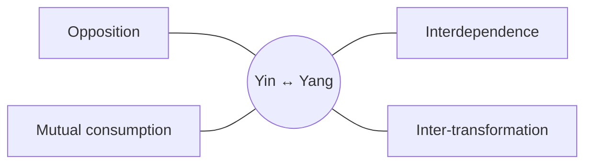

# Yin and Yang

## Overview

Yin and Yang is the first polarity to emerge from undifferentiated wholeness. The _Daodejing_ compresses this cosmology in chapter 42: _"Dao gives birth to One, One to Two, Two to Three, Three to the ten thousand things."_ Yin and Yang are the Two, and every later concept in this primer chains back through this foundational pair to the one.

Codified into medicine by _The Yellow Emperor's Inner Classic_ (Huangdi Neijing), Yin and Yang becomes the foundation of physiology, pathology, diagnosis, and treatment. The therapeutic logic rests on three Daoist concepts: every body has a natural grain (_ziran_) that the practitioner reads rather than overrides; the practitioner's posture is _wu wei_, effortless action along that grain rather than against it; and the body carries its own _de_, the intrinsic potency to heal once obstacles are removed. Diagnosis names which pole has drifted; treatment corrects the relationship.

Yin/yang has older usages in Shang-era oracle bones and _Yi Jing_ hexagrams, but the Warring States _Yinyang jia_ (Naturalist school) systematized it as a universal principle. The Daodejing later transformed this into cosmology and the Neijing into medicine. The [primer index](index.md) covers the Neijing's broader scope.

## Reading the Taijitu

The _Taijitu_ ("diagram of the supreme ultimate") is the familiar swirling circle of black and white, with each curve flowing into the other. Formalized during the Song Dynasty by the philosopher Zhou Dunyi (1017–1073 CE), it encodes several ideas at once:

- **Opposition** - The two halves are maximally different. Yin is dark, receptive, and descending; Yang is light, active, and ascending. The S-curve dividing line encodes gradual transition: winter does not snap into summer, fever does not snap into health.
- **Interpenetration** - Each half holds a small circle of the opposite color. Pure absolute Yin or Yang does not exist. Every Yang organ contains a Yin seed, and every Yin fluid carries the potential for Yang activation. This is the most clinically significant element.
- **Dynamic equilibrium** - As the symbol rotates, the areas remain equal, a balance that shifts constantly. The Taijitu is a diagram of process, not a snapshot.

## Infinite Divisibility

Any Yin or Yang category can itself be subdivided into a Yin and a Yang aspect, without limit. The upper body is Yang relative to the lower; the head is Yang within that upper half. A day is Yang relative to night; noon is Yang within the day, dawn is Yin within that Yang.

The clinical payoff is at the organ level. The Kidney is a Yin organ (solid, storing, deep; see [ZangFu.md](ZangFu.md)), yet within it TCM distinguishes **Kidney Yin** (moist, cooling stored substance; root of all Yin in the body) from **Kidney Yang** (the warming vital flame housed in the same organ, also called Ming Men; root of all Yang). These can fail independently: Kidney Yin deficiency produces empty-heat (night sweats, five-palm heat); Kidney Yang deficiency produces empty-cold (cold limbs, exhaustion, weak lower back). Long-standing deficiency of one weakens the other. The Neijing calls this condition "Yin damage reaching Yang." For Kidney as Jing storehouse, see [Jing.md](Jing.md); for Yin-Yang as the scaffold for Five Phases, see [WuXing.md](WuXing.md).

The same logic applies across all organs: the Lungs are a Yin organ (solid, storing; see [ZangFu.md](ZangFu.md)), yet **Lung Qi** is their Yang aspect, the active, dispersing function that depends on the Yin structure for a substrate. Deficiency of one does not automatically mean deficiency of the other. This structure/function split is the bridge into both [Qi.md](Qi.md) and [ZangFu.md](ZangFu.md).

## The four core relationships

Yin and Yang interact in four fundamental ways:

- **Opposition.** They are inherently contrary qualities. If Yang is fire, light, and movement, Yin is water, darkness, and stillness.
- **Interdependence.** One cannot exist without the other. "Cold" (Yin) is undefinable without a concept of "warmth" (Yang). In the body, Yang (functional activity) relies on Yin (physical substance) for fuel.
- **Mutual consumption.** They are in constant flux, adjusting to keep each other in check. During exercise, Yang energy rises and consumes Yin fluids (sweat).
- **Inter-transformation.** At extreme poles, one turns into the other. Winter (extreme Yin) gives way to spring (growing Yang). An acute high fever (extreme Yang) can collapse into exhaustion and a cold drop in temperature (Yin collapse).

These four relationships are the grammar TCM uses to read the body: every diagnosis below names which one has drifted, and every treatment names how it is being restored.

## In human anatomy and physiology

TCM maps these cosmic principles directly onto the body. Every organ, fluid, and symptom is categorized as either Yin or Yang.

### Structure vs. function

- **Yin** represents substance, structure, and cooling. Blood, body fluids, tissues, and the physical architecture of the organs embody Yin. It anchors, moistens, and cools.
- **Yang** represents energy, function, and warming. Qi (vital energy), metabolic heat, circulation, and the physiological work the organs perform embody Yang. It transforms, warms, and activates.

### The organ systems (Zang-Fu)

Organs are divided by whether their job is to store substance (Yin) or to transmit and digest (Yang):

| Category   | Organ type             | Characteristics                                   | Examples                                                                |
| ---------- | ---------------------- | ------------------------------------------------- | ----------------------------------------------------------------------- |
| Yin (Zang) | Solid, dense organs    | Store essence, fluids, and vital energy; internal | Heart, Liver, Spleen, Lungs, Kidneys                                    |
| Yang (Fu)  | Hollow, dynamic organs | Digest, transform, and excrete; external-facing   | Stomach, Small Intestine, Large Intestine, Gallbladder, Urinary Bladder |

## Pathology: the root of disease

Health is the harmonious, dynamic equilibrium of Yin and Yang. Disease occurs when that balance is disrupted, generally in one of four ways.

Yin and Yang form the summary pair of the Eight Principles (Ba Gang), the foundational diagnostic framework that classifies all patterns along four axes: Yin/Yang, Interior/Exterior, Cold/Heat, and Excess/Deficiency. Every substance disharmony and organ pattern ultimately resolves to a Yin or Yang imbalance, which is why the Eight Principles begin and end with this pair. See [BaGang.md](BaGang.md) for the full framework; the clinical significance appears throughout the substance pages that follow.

### Yang excess (full-heat)

An overabundance of hyperactive Yang energy. Symptoms: acute high fever, red face, thirst for cold drinks, loud voice, irritability, rapid pulse. _The fire is burning too hot._

### Yin excess (full-cold)

An accumulation of pathogenic Yin (cold or dampness). Symptoms: sharp abdominal pain, chills, pale complexion, fluid retention, loose stools, slow pulse. _The water has frozen over._

### Yin deficiency (empty-heat)

Yin fluid is depleted, leaving insufficient cooling to restrain normal Yang and producing a false or "empty" heat. Symptoms: chronic low-grade afternoon fevers, night sweats, hot flashes, dry throat, "five-palm heat" (burning in the palms, soles, and chest). _The engine is overheating because the coolant is low._

### Yang deficiency (empty-cold)

Yang energy is depleted, leaving the body without the vital fire to warm itself and allowing normal Yin to dominate. Symptoms: chronic cold limbs, fatigue, weak lower back, pale tongue, frequent urination. _The pilot light in the furnace is dying out._

## Yin and Yang in time

TCM treats time as Yin and Yang in motion. The day has an energetic texture that should shape behavior: _ziran_ applied to the clock. The four daily phases echo the seasons within a single rotation:

| Time window     | Yin-Yang quality           | Prescription                           |
| --------------- | -------------------------- | -------------------------------------- |
| Dawn – noon     | Yang rising                | Exercise, heavy meals, demanding work  |
| Noon – dusk     | Yang declining, Yin rising | Lighter tasks; brief midday rest       |
| Dusk – midnight | Yin deepening              | Wind down; warm, light food            |
| Midnight – dawn | Yin peak, Yang germinating | Deep sleep; body restores Yin and Jing |

The classical Horary Cycle (_Zǐwǔ Liúzhù_, "midnight-noon flow") assigns each organ a two-hour peak: Heart at noon, Gallbladder at midnight. The full Organ Clock is in [Jingmai.md](Jingmai.md). Seasons scale identically: spring and summer are Yang (growth, later sleep); autumn and winter are Yin (consolidation, warming food). The Neijing states that living against this rhythm depletes reserves faster than normal aging.

## Dietary principles

In TCM, each food carries a thermal nature: an inherent tendency to warm or cool the body's interior, independent of its actual temperature when eaten.

| Direction      | Key foods                                           | Action                                                |
| -------------- | --------------------------------------------------- | ----------------------------------------------------- |
| Yang-tonifying | Ginger, cinnamon bark, lamb, leeks, garlic, walnuts | Warm the interior; support Kidney Yang; disperse cold |
| Yin-nourishing | Pear, tofu, black sesame, white fungus, lily bulb   | Moisten dryness; generate fluids; cool empty-heat     |

**Cooking method is a modifier.** Raw vegetables are cooling (Yin-leaning); roasting or long-simmering shifts them toward warmth. Adding warming spices to a cooling ingredient partially offsets its Yin quality. A Yin-deficient patient eating lamb should balance it with cooling herbs to avoid fanning empty-heat. The working rule: match food's thermal quality to the patient's thermal pattern.

## Clinical application

A TCM practitioner's primary diagnostic goal is to determine where the Yin-Yang balance has defaulted. The Four Diagnostic Methods are looking, listening/smelling, asking, and touching, with special attention to tongue inspection and radial pulse reading.

Once the imbalance is identified, the treatment strategy is to reduce the excess or tonify (replenish) the deficiency:

- **For Yang excess** - Use cooling herbs (e.g., Huang Lian) and acupuncture points to "clear heat."
- **For Yin deficiency** - "Nourish Yin" with heavy, moistening herbs (e.g., Rehmannia root) and acupuncture points that promote fluid retention and rest.
- **For Yang deficiency** - "Warm the Yang" with moxibustion (burning mugwort near the skin) and warming herbs like ginger or cinnamon root.

Diet, sleep, and exercise prescriptions are all framed around the same goal: keeping internal Yin and Yang in fluid harmony with the natural world.

## Modern parallels

Biomedical research occasionally uses Yin-Yang as an organizing metaphor. Three pairings recur with varying fit:

- **Sympathetic vs parasympathetic** _(tight, with a caveat)._ Sympathetic activation maps to Yang, parasympathetic to Yin. Modern physiology has abandoned strict reciprocal control. Many reflexes co-activate both branches, a reality the Taijitu's interpenetrating dots already encode.
- **Anabolic vs catabolic** _(moderate)._ Anabolism (building, repair) → Yin; catabolism (energy release, exertion) → Yang. Useful for communication; not a basis for treatment derivation, since biochemistry is enzyme-specific while TCM categories are functional.
  These parallels are pedagogically useful but not mechanistic equivalences; the two systems operate at different resolutions.
